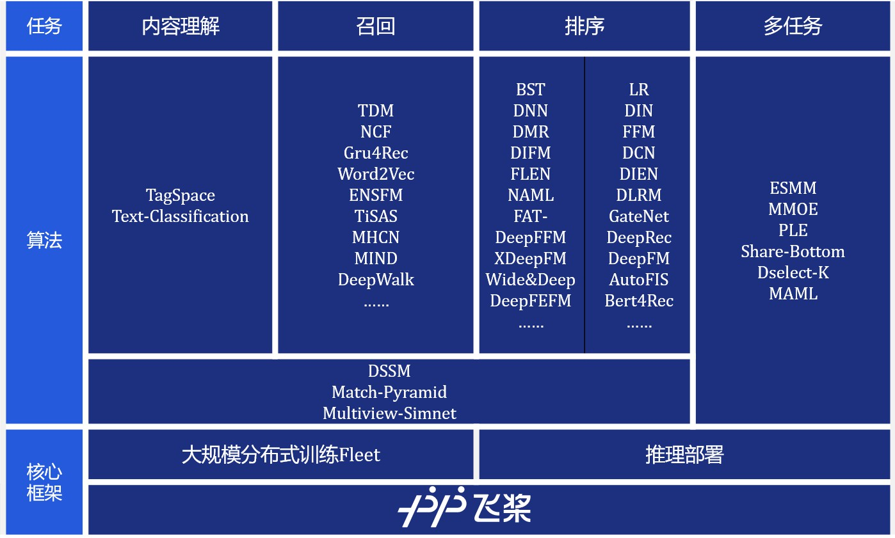

<p align="center">

<p>

<p align="center">
    <br>
    
    
    
    <br>
<p>


<h2 align="center">什么是PaddleRec</h2>

<p align="center">

<p>

- 源于飞桨生态的搜索推荐模型**一站式开箱即用工具** 
- 适合初学者，开发者，研究者从调研，训练到预测部署的全流程解决方案
- 包含语义理解、召回、粗排、精排、多任务学习、融合等多个任务的推荐搜索算法库
- 配置**yaml**自定义选项，即可快速上手使用单机训练、大规模分布式训练、离线预测、在线部署


<h2 align="center">PadlleRec概览</h2>

<p align="center">

<p>


<h2 align="center">推荐系统-流程概览</h2>

<p align="center">

<p>

<h2 align="center">便捷安装</h2>

### 环境要求
* Python 2.7/ 3.5 / 3.6 / 3.7
* PaddlePaddle  >= 1.7.2
* 操作系统: Windows/Mac/Linux

  > Windows下目前仅提供单机训练，建议使用Linux
  
### 安装命令

- 安装方法一<PIP源直接安装>：
  ```bash
  python -m pip install paddle-rec
  ```

- 安装方法二

  源码编译安装
  1. 安装飞桨  **注：需要用户安装版本 >1.7.2 的飞桨**

    ```shell
    python -m pip install paddlepaddle -i https://mirror.baidu.com/pypi/simple
    ```

  2. 源码安装PaddleRec

    ```
    git clone https://github.com/PaddlePaddle/PaddleRec/
    cd PaddleRec
    python setup.py install
    ```


<h2 align="center">快速启动</h2>

### 启动内置模型的默认配置

目前框架内置了多个模型，一行命令即可使用内置模型开始单机训练和本地模拟分布式训练。
  > 本地模拟分布式(`local_cluster`)为`1个server + 1个trainer`的参数服务器模式


我们以排序模型中的`dnn`模型为例介绍PaddleRec的简单使用。训练数据来源为[Criteo数据集](https://www.kaggle.com/c/criteo-display-ad-challenge/)，我们从中截取了100条方便您快速上手体验完整的PaddleRec流程。

```bash
# 使用CPU进行单机训练
python -m paddlerec.run -m paddlerec.models.rank.dnn  
```

### 启动内置模型的自定配置

若您复用内置模型，对**yaml**配置文件进行了修改，如更改超参，重新配置数据后，可以直接使用paddlerec运行该yaml文件。

我们以dnn模型为例，在paddlerec代码目录下:
```bash
cd paddlerec
```

修改dnn模型的[超参配置](./models/rank/dnn/config.yaml)，例如将迭代训练轮数从10轮修改为5轮:
```yaml
train:
  # epochs: 10
  epochs: 5
```

在Linux环境下，可以使用`vim`等文本编辑工具修改yaml文件：

```bash
vim ./models/rank/dnn/config.yaml
# 键入 i, 进入编辑模式
# 修改yaml文件配置
# 完成修改后，点击esc，退出编辑模式
# 键入 :wq 保存文件并退出 
```

完成dnn模型`models/rank/dnn/config.yaml`的配置修改后，运行`dnn`模型：
```bash
# 使用自定配置进行训练
python -m paddlerec.run -m ./models/rank/dnn/config.yaml 
```

### 分布式训练

分布式训练需要配置`config.yaml`，加入或修改`engine`选项为`cluster`或`local_cluster`，以进行分布式训练，或本地模拟分布式训练。

#### 本地模拟分布式训练

我们以dnn模型为例，在paddlerec代码目录下，修改dnn模型的`config.yaml`文件:

```yaml
train:
  #engine: single
  engine: local_cluster
```
然后启动paddlerec训练：

```bash
# 进行本地模拟分布式训练
python -m paddlerec.run -m ./models/rank/dnn/config.yaml  
```

#### 集群分布式训练

我们以dnn模型为例，在paddlerec代码目录下，首先修改dnn模型`config.yaml`文件:

```yaml
train:
  #engine: single
  engine: cluster
```
再添加分布式启动配置文件`backend.yaml`，具体配置规则在[分布式训练](doc/distributed_train.md)教程中介绍。最后启动paddlerec训练：

```bash
# 配置好 mpi/k8s/paddlecloud集群环境后
python -m paddlerec.run -m ./models/rank/dnn/config.yaml -b backend.yaml
```


<h2 align="center">支持模型列表</h2>


|   方向   |                                   模型                                    | 单机CPU训练 | 单机GPU训练 | 分布式CPU训练 |
| :------: | :-----------------------------------------------------------------------: | :---------: | :---------: | :-----------: |
| 内容理解 | [Text-Classifcation](models/contentunderstanding/classification/model.py) |      ✓      |      x      |       ✓       |
| 内容理解 |         [TagSpace](models/contentunderstanding/tagspace/model.py)         |      ✓      |      x      |       ✓       |
|   召回   |                    [DSSM](models/match/dssm/model.py)                     |      ✓      |      x      |       ✓       |
|   召回   |        [MultiView-Simnet](models/match/multiview-simnet/model.py)         |      ✓      |      x      |       ✓       |
|   召回   |                   [TDM](models/treebased/tdm/model.py)                    |      ✓      |      x      |       ✓       |
|   召回   |                [Word2Vec](models/recall/word2vec/model.py)                |      ✓      |      x      |       ✓       |
|   召回   |                     [SSR](models/recall/ssr/model.py)                     |      ✓      |      ✓      |       ✓       |
|   召回   |                 [Gru4Rec](models/recall/gru4rec/model.py)                 |      ✓      |      ✓      |       ✓       |
|   排序   |                      [Dnn](models/rank/dnn/model.py)                      |      ✓      |      x      |       ✓       |
|   排序   |                   [DeepFM](models/rank/deepfm/model.py)                   |      ✓      |      x      |       ✓       |
|   排序   |                  [xDeepFM](models/rank/xdeepfm/model.py)                  |      ✓      |      x      |       ✓       |
|   排序   |                      [DIN](models/rank/din/model.py)                      |      ✓      |      x      |       ✓       |
|   排序   |                [Wide&Deep](models/rank/wide_deep/model.py)                |      ✓      |      x      |       ✓       |
|  多任务  |                  [ESMM](models/multitask/esmm/model.py)                   |      ✓      |      ✓      |       ✓       |
|  多任务  |                  [MMOE](models/multitask/mmoe/model.py)                   |      ✓      |      ✓      |       ✓       |
|  多任务  |           [ShareBottom](models/multitask/share-bottom/model.py)           |      ✓      |      ✓      |       ✓       |


<h2 align="center">文档</h2>

### 背景介绍
* [推荐系统介绍](doc/rec_background.md)
* [分布式深度学习介绍](doc/ps_background.md)

### 新手教程
* [环境要求](#环境要求)
* [安装命令](#安装命令)
* [快速开始](#启动内置模型的默认配置)

### 进阶教程
* [自定义数据集及Reader](doc/custom_dataset_reader.md)
* [分布式训练](doc/distributed_train.md)

### 开发者教程
* [PaddleRec设计文档](doc/design.md)

### 关于PaddleRec性能
* [Benchmark](doc/benchmark.md)

### FAQ
* [常见问题FAQ](doc/faq.md)


<h2 align="center">社区</h2>

### 反馈
如有意见、建议及使用中的BUG，欢迎在`GitHub Issue`提交

### 版本历史
- 2020.5.14 - PaddleRec v0.1
  
### 许可证书
本项目的发布受[Apache 2.0 license](LICENSE)许可认证。
  
