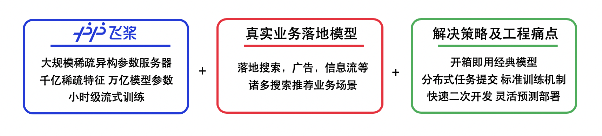
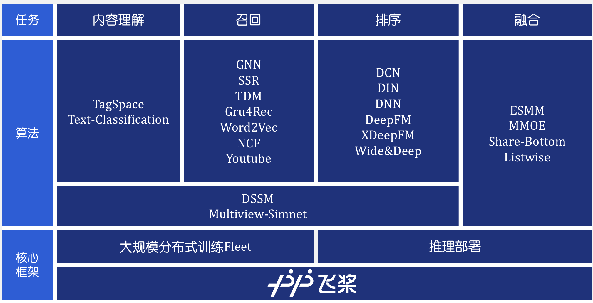
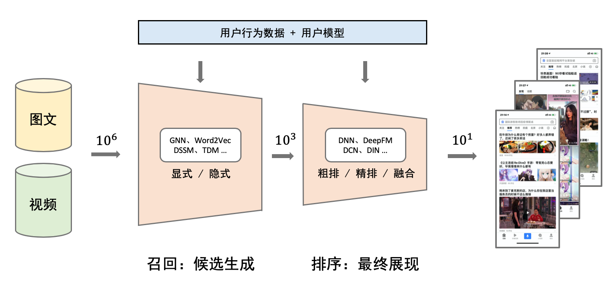

([中文文档](https://paddlerec.readthedocs.io/en/latest/)|简体中文|[English](./README_EN.md))

<p align="center">

<p>
<p align="center">

<p>
<p align="center">

<p>

<h2 align="center">最新动态</h2>

* [2022/3/21] 新增[paper](./paper)目录，发布我们对21年的推荐顶会论文的分析，以及工业界的推荐论文列表，供大家参考。  
* [2022/3/10] 新增5个前沿算法: [DCN_V2](models/rank/dcn_v2), [MHCN](models/recall/mhcn), [FLEN](models/rank/flen), [Dselect_K](models/multitask/dselect_k), [AutoFIS](models/rank/autofis)。  
* [2022/1/12] 新增AI Studio一键[在线运行](https://aistudio.baidu.com/aistudio/projectdetail/3240640)功能，可以方便快捷的在AI Studio平台上在线体验我们的模型.  


<h2 align="center">什么是推荐系统?</h2>
<p align="center">

<p>

- 推荐系统是在互联网信息爆炸式增长的时代背景下，帮助用户高效获得感兴趣信息的关键；

- 推荐系统也是帮助产品最大限度吸引用户、留存用户、增加用户粘性、提高用户转化率的银弹。

- 有无数优秀的产品依靠用户可感知的推荐系统建立了良好的口碑，也有无数的公司依靠直击用户痛点的推荐系统在行业中占领了一席之地。

  > 可以说，谁能掌握和利用好推荐系统，谁就能在信息分发的激烈竞争中抢得先机。
  > 但与此同时，有着许多问题困扰着推荐系统的开发者，比如：庞大的数据量，复杂的模型结构，低效的分布式训练环境，波动的在离线一致性，苛刻的上线部署要求，以上种种，不胜枚举。

<h2 align="center">什么是PaddleRec?</h2>

- 源于飞桨生态的搜索推荐模型 **一站式开箱即用工具** 
- 适合初学者，开发者，研究者的推荐系统全流程解决方案
- 包含内容理解、匹配、召回、排序、 多任务、重排序等多个任务的完整推荐搜索算法库。[支持模型列表](#支持模型列表)

<h2 align="center">快速使用</h2>

### 在线运行  

- **[AI Studio在线运行示例](https://aistudio.baidu.com/aistudio/projectdetail/3240640)**  

### 环境要求
* Python 2.7.15 / 3.5 / 3.6 / 3.7, 推荐使用python3.7，示例中的python默认表示python3.7
* PaddlePaddle >=2.0 
* 操作系统: Windows/Mac/Linux


  > Windows下PaddleRec目前仅支持单机训练，分布式训练建议使用Linux环境
  
### 安装Paddle

- gpu环境pip安装
  ```bash
  python -m pip install paddlepaddle-gpu==2.0.0 
  ```
- cpu环境pip安装
  ```bash
  python -m pip install paddlepaddle # gcc8 
  ```
更多版本下载可参考paddle官网[下载安装](https://www.paddlepaddle.org.cn/documentation/docs/zh/develop/install/index_cn.html)

### 下载PaddleRec

注意：官方维护github版本地址：  
https://github.com/PaddlePaddle/PaddleRec  

```bash
git clone https://github.com/PaddlePaddle/PaddleRec/
cd PaddleRec
```

### 快速运行

我们以排序模型中的`dnn`模型为例介绍PaddleRec的一键启动。训练数据来源为[Criteo数据集](https://www.kaggle.com/c/criteo-display-ad-challenge/)，我们从中截取了100条数据：

```bash
python -u tools/trainer.py -m models/rank/dnn/config.yaml # 动态图训练 
python -u tools/static_trainer.py -m models/rank/dnn/config.yaml #  静态图训练
```

<h2 align="center">帮助文档</h2>

### 项目背景
* [推荐系统介绍](doc/rec_background.md)
* [分布式深度学习介绍](doc/ps_background.md)


### 入门教程
* [PaddleRec功能介绍](doc/introduction.md)
* [动态图训练](doc/dygraph_mode.md)
* [静态图训练](doc/static_mode.md)
* [分布式训练](doc/fleet_mode.md)

### 进阶教程
* [提交规范](doc/contribute.md)
* [自定义Reader](doc/custom_reader.md)
* [自定义模型](doc/model_develop.md)
* [yaml配置说明](doc/yaml.md)
* [训练可视化](doc/visualization.md)
* [在线Serving部署](doc/serving.md)
* [python端预测库推理](doc/inference.md)
* [Benchmark](doc/benchmark.md)
* [推荐全流程](doc/whole_process.md)
* [最新工业界算法动态](paper/readme.md)

### FAQ
* [常见问题FAQ](doc/faq.md)

### 致谢
* [外部开发者贡献列表](contributor.md)

### 支持模型列表

<h2 align="center">支持模型列表</h2>


  |   方向   |                                   模型                                    | 在线环境 | 分布式CPU | 分布式GPU | 支持版本| 论文                                                                                                                                                                                                        |
  | :------: | :-----------------------------------------------------------------------: | :-----: | :-------: | :-------: |:-------: | :---------------------------------------------------------------------------------------------------------------------------------------------------------------------------------------------------------- |
  | 内容理解 |         [TextCnn](models/contentunderstanding/textcnn/)([文档](https://paddlerec.readthedocs.io/en/latest/models/contentunderstanding/textcnn.html))         |  [Python CPU/GPU](https://aistudio.baidu.com/aistudio/projectdetail/3238415)  |       ✓     |     x     | >=2.1.0 | [EMNLP 2014][Convolutional neural networks for sentence classication](https://www.aclweb.org/anthology/D14-1181.pdf)                                                                                                    |
  | 内容理解 |         [TagSpace](models/contentunderstanding/tagspace/)([文档](https://paddlerec.readthedocs.io/en/latest/models/contentunderstanding/tagspace.html))         |  [Python CPU/GPU](https://aistudio.baidu.com/aistudio/projectdetail/3238891)  |       ✓     |     x     | >=2.1.0 | [EMNLP 2014][TagSpace: Semantic Embeddings from Hashtags](https://www.aclweb.org/anthology/D14-1194.pdf)                                                                                                    |
  |   匹配   |                    [DSSM](models/match/dssm/)([文档](https://paddlerec.readthedocs.io/en/latest/models/match/dssm.html))                     |  [Python CPU/GPU](https://aistudio.baidu.com/aistudio/projectdetail/3238124)  |       ✓     |     x     | >=2.1.0 | [CIKM 2013][Learning Deep Structured Semantic Models for Web Search using Clickthrough Data](https://www.microsoft.com/en-us/research/wp-content/uploads/2016/02/cikm2013_DSSM_fullversion.pdf)             |
  |   匹配   |                    [Match-Pyramid](models/match/match-pyramid/)([文档](https://paddlerec.readthedocs.io/en/latest/models/match/match-pyramid.html))                     |  [Python CPU/GPU](https://aistudio.baidu.com/aistudio/projectdetail/3238192)  |       ✓     |     x     | >=2.1.0 | [AAAI 2016][Text Matching as Image Recognition](https://arxiv.org/pdf/1602.06359.pdf)             |
  |   匹配   |        [MultiView-Simnet](models/match/multiview-simnet/)([文档](https://paddlerec.readthedocs.io/en/latest/models/match/multiview-simnet.html))         |  [Python CPU/GPU](https://aistudio.baidu.com/aistudio/projectdetail/3238206)  |       ✓     |     x     | >=2.1.0 | [WWW 2015][A Multi-View Deep Learning Approach for Cross Domain User Modeling in Recommendation Systems](https://www.microsoft.com/en-us/research/wp-content/uploads/2016/02/frp1159-songA.pdf)             |
  |   召回   |                   [TDM](https://github.com/PaddlePaddle/PaddleRec/tree/release/1.8.5/models/treebased/tdm/)                    |  -  |     ✓     |  >=1.8.0  | [1.8.5](https://github.com/PaddlePaddle/PaddleRec/tree/release/1.8.5) | [KDD 2018][Learning Tree-based Deep Model for Recommender Systems](https://arxiv.org/pdf/1801.02294.pdf)                                                                                                    |
  |   召回   |                [FastText](https://github.com/PaddlePaddle/PaddleRec/tree/release/1.8.5/models/recall/fasttext/)                |  -  |       x     |     x     | [1.8.5](https://github.com/PaddlePaddle/PaddleRec/tree/release/1.8.5) | [EACL 2017][Bag of Tricks for Efficient Text Classification](https://www.aclweb.org/anthology/E17-2068.pdf)                                                                                                 |
  |   召回   |                [MIND](models/recall/mind/)([文档](https://paddlerec.readthedocs.io/en/latest/models/recall/mind.html))                | [Python CPU/GPU](https://aistudio.baidu.com/aistudio/projectdetail/3239088)   |       x     |     x     |  >=2.1.0 | [2019][Multi-Interest Network with Dynamic Routing for Recommendation at Tmall](https://arxiv.org/pdf/1904.08030.pdf)                                                                                                 |
  |   召回   |                [Word2Vec](models/recall/word2vec/)([文档](https://paddlerec.readthedocs.io/en/latest/models/recall/word2vec.html))                |  [Python CPU/GPU](https://aistudio.baidu.com/aistudio/projectdetail/3240153)  |       ✓     |     x     | >=2.1.0 | [NIPS 2013][Distributed Representations of Words and Phrases and their Compositionality](https://papers.nips.cc/paper/5021-distributed-representations-of-words-and-phrases-and-their-compositionality.pdf) |
  |   召回   |                [DeepWalk](models/recall/deepwalk/)([文档](https://paddlerec.readthedocs.io/en/latest/models/recall/deepwalk.html))                |  [Python CPU/GPU](https://aistudio.baidu.com/aistudio/projectdetail/3239086)  |      x     |     x     | >=2.1.0 | [SIGKDD 2014][DeepWalk: Online Learning of Social Representations](https://arxiv.org/pdf/1403.6652.pdf) |
  |   召回   |                     [SSR](https://github.com/PaddlePaddle/PaddleRec/tree/release/1.8.5/models/recall/ssr/)                     |  -  |       ✓     |     ✓     | [1.8.5](https://github.com/PaddlePaddle/PaddleRec/tree/release/1.8.5) | [SIGIR 2016][Multtti-Rate Deep Learning for Temporal Recommendation](http://sonyis.me/paperpdf/spr209-song_sigir16.pdf)                                                                                       |
  |   召回   |                 [Gru4Rec](https://github.com/PaddlePaddle/PaddleRec/tree/release/1.8.5/models/recall/gru4rec/)([文档](https://paddlerec.readthedocs.io/en/latest/models/recall/gru4rec.html))                |  -  |       ✓     |     ✓     | [1.8.5](https://github.com/PaddlePaddle/PaddleRec/tree/release/1.8.5) | [2015][Session-based Recommendations with Recurrent Neural Networks](https://arxiv.org/abs/1511.06939)                                                                                                      |
  |   召回   |             [Youtube_dnn](https://github.com/PaddlePaddle/PaddleRec/tree/release/1.8.5/models/recall/youtube_dnn/)             |  -  |       ✓     |     ✓     | [1.8.5](https://github.com/PaddlePaddle/PaddleRec/tree/release/1.8.5) | [RecSys 2016][Deep Neural Networks for YouTube Recommendations](https://static.googleusercontent.com/media/research.google.com/zh-CN//pubs/archive/45530.pdf)                                               |
  |   召回   |                     [NCF](models/recall/ncf/)([文档](https://paddlerec.readthedocs.io/en/latest/models/recall/ncf.html))                     |  [Python CPU/GPU](https://aistudio.baidu.com/aistudio/projectdetail/3240152)  |       ✓     |     ✓     | >=2.1.0 | [WWW 2017][Neural Collaborative Filtering](https://arxiv.org/pdf/1708.05031.pdf)                                                                                                                            |
  |   召回   |                     [TiSAS](models/recall/tisas/)            |   -   |    ✓    |     ✓     | >=2.1.0 | [WSDM 2020][Time Interval Aware Self-Attention for Sequential Recommendation](https://cseweb.ucsd.edu/~jmcauley/pdfs/wsdm20b.pdf)                                                                                               |
  |   召回   |                     [ENSFM](models/recall/ensfm/)                     |  -  |     ✓     |     ✓     | >=2.1.0 | [IW3C2 2020][Eicient Non-Sampling Factorization Machines for Optimal Context-Aware Recommendation](http://www.thuir.cn/group/~mzhang/publications/TheWebConf2020-Chenchong.pdf)                                                               |
  |   召回   |                     [MHCN](models/recall/mhcn/)                     |  -  |     ✓     |     ✓     | >=2.1.0 | [WWW 2021][Self-Supervised Multi-Channel Hypergraph Convolutional Network for Social Recommendation](https://arxiv.org/pdf/2101.06448v3.pdf)                                                               |
  |   召回   |                     [GNN](https://github.com/PaddlePaddle/PaddleRec/tree/release/1.8.5/models/recall/gnn/)                     |  -  |       ✓     |     ✓     | [1.8.5](https://github.com/PaddlePaddle/PaddleRec/tree/release/1.8.5) | [AAAI 2019][Session-based Recommendation with Graph Neural Networks](https://arxiv.org/abs/1811.00855)                                                                                                      |
  |   召回   |                     [RALM](https://github.com/PaddlePaddle/PaddleRec/tree/release/1.8.5/models/recall/look-alike_recall/)                     |  -  |       ✓     |     ✓     | [1.8.5](https://github.com/PaddlePaddle/PaddleRec/tree/release/1.8.5) | [KDD 2019][Real-time Attention Based Look-alike Model for Recommender System](https://arxiv.org/pdf/1906.05022.pdf)                                                                                                      |
  |   排序   |      [Logistic Regression](models/rank/logistic_regression/)([文档](https://paddlerec.readthedocs.io/en/latest/models/rank/logistic_regression.html))      |  [Python CPU/GPU](https://aistudio.baidu.com/aistudio/projectdetail/3240481)  |       ✓     |     x     | >=2.1.0 | /                                                                                                                                                                                                           |
  |   排序   |                      [Dnn](models/rank/dnn/)([文档](https://paddlerec.readthedocs.io/en/latest/models/rank/dnn.html))                      |  [Python CPU/GPU](https://aistudio.baidu.com/aistudio/projectdetail/3240347)  |       ✓     |     ✓     | >=2.1.0  | /                                                                                                                                                                                                           |
  |   排序   |                       [FM](models/rank/fm/)([文档](https://paddlerec.readthedocs.io/en/latest/models/rank/fm.html))                       |  [Python CPU/GPU](https://aistudio.baidu.com/aistudio/projectdetail/3240371)  |       ✓     |     x     | >=2.1.0 | [IEEE Data Mining 2010][Factorization machines](https://analyticsconsultores.com.mx/wp-content/uploads/2019/03/Factorization-Machines-Steffen-Rendle-Osaka-University-2010.pdf)                             |
  |   排序   |                       [BERT4REC](models/rank/bert4rec/)                       |  -  |       ✓     |     x     | >=2.1.0 | [CIKM 2019][BERT4Rec: Sequential Recommendation with Bidirectional Encoder Representations from Transformer](https://arxiv.org/pdf/1904.06690.pdf)                             |
  |   排序   |                       [FAT_DeepFFM](models/rank/fat_deepffm/)                       |  -  |       ✓     |     x     | >=2.1.0 | [2019][FAT-DeepFFM: Field Attentive Deep Field-aware Factorization Machine](https://arxiv.org/pdf/1905.06336.pdf)                             |
  |   排序   |                      [FFM](models/rank/ffm/)([文档](https://paddlerec.readthedocs.io/en/latest/models/rank/ffm.html))                     |  [Python CPU/GPU](https://aistudio.baidu.com/aistudio/projectdetail/3240369)  |       ✓     |     x     | >=2.1.0 | [RECSYS 2016][Field-aware Factorization Machines for CTR Prediction](https://dl.acm.org/doi/pdf/10.1145/2959100.2959134)                                                                                    |
  |   排序   |                      [FNN](https://github.com/PaddlePaddle/PaddleRec/tree/release/1.8.5/models/rank/fnn/)                      |  -  |       ✓     |     x     | [1.8.5](https://github.com/PaddlePaddle/PaddleRec/tree/release/1.8.5) | [ECIR 2016][Deep Learning over Multi-field Categorical Data](https://arxiv.org/pdf/1601.02376.pdf)                                                                                                          |
  |   排序   |            [Deep Crossing](https://github.com/PaddlePaddle/PaddleRec/tree/release/1.8.5/models/rank/deep_crossing/)            |  -  |       ✓     |     x     | [1.8.5](https://github.com/PaddlePaddle/PaddleRec/tree/release/1.8.5) | [ACM 2016][Deep Crossing: Web-Scale Modeling without Manually Crafted Combinatorial Features](https://www.kdd.org/kdd2016/papers/files/adf0975-shanA.pdf)                                                   |
  |   排序   |                      [Pnn](https://github.com/PaddlePaddle/PaddleRec/tree/release/1.8.5/models/rank/pnn/)                      |  -  |       ✓     |     x     | [1.8.5](https://github.com/PaddlePaddle/PaddleRec/tree/release/1.8.5) | [ICDM 2016][Product-based Neural Networks for User Response Prediction](https://arxiv.org/pdf/1611.00144.pdf)                                                                                               |
  |   排序   |                      [DCN](models/rank/dcn/)([文档](https://paddlerec.readthedocs.io/en/latest/models/rank/dcn.html))                      |  [Python CPU/GPU](https://aistudio.baidu.com/aistudio/projectdetail/3240207)  |       ✓     |     x     | >=2.1.0 | [KDD 2017][Deep & Cross Network for Ad Click Predictions](https://dl.acm.org/doi/pdf/10.1145/3124749.3124754)                                                                                               |
  |   排序   |                      [NFM](https://github.com/PaddlePaddle/PaddleRec/tree/release/1.8.5/models/rank/nfm/)                      |  -  |       ✓     |     x     | [1.8.5](https://github.com/PaddlePaddle/PaddleRec/tree/release/1.8.5) | [SIGIR 2017][Neural Factorization Machines for Sparse Predictive Analytics](https://dl.acm.org/doi/pdf/10.1145/3077136.3080777)                                                                             |
  |   排序   |                      [AFM](https://github.com/PaddlePaddle/PaddleRec/tree/release/1.8.5/models/rank/afm/)                      |  -  |       ✓     |     x     | [1.8.5](https://github.com/PaddlePaddle/PaddleRec/tree/release/1.8.5) | [IJCAI 2017][Attentional Factorization Machines: Learning the Weight of Feature Interactions via Attention Networks](https://arxiv.org/pdf/1708.04617.pdf)                                                  |
  |   排序   |                   [DMR](models/rank/dmr/)([文档](https://paddlerec.readthedocs.io/en/latest/models/rank/dmr.html))                   |  [Python CPU/GPU](https://aistudio.baidu.com/aistudio/projectdetail/3240346)  |       x     |     x     | >=2.1.0 | [AAAI 2020][Deep Match to Rank Model for Personalized Click-Through Rate Prediction](https://github.com/lvze92/DMR/blob/master/%5BDMR%5D%20Deep%20Match%20to%20Rank%20Model%20for%20Personalized%20Click-Through%20Rate%20Prediction-AAAI20.pdf)                                                                                 |
  |   排序   |                   [DeepFM](models/rank/deepfm/)([文档](https://paddlerec.readthedocs.io/en/latest/models/rank/deepfm.html))                   |  [Python CPU/GPU](https://aistudio.baidu.com/aistudio/projectdetail/3238581)  |       ✓     |     x     | >=2.1.0 | [IJCAI 2017][DeepFM: A Factorization-Machine based Neural Network for CTR Prediction](https://arxiv.org/pdf/1703.04247.pdf)                                                                                 |
  |   排序   |                  [xDeepFM](models/rank/xdeepfm/)([文档](https://paddlerec.readthedocs.io/en/latest/models/rank/xdeepfm.html))                  |  [Python CPU/GPU](https://aistudio.baidu.com/aistudio/projectdetail/3240533)  |     ✓     |     x     | >=2.1.0 | [KDD 2018][xDeepFM: Combining Explicit and Implicit Feature Interactions for Recommender Systems](https://dl.acm.org/doi/pdf/10.1145/3219819.3220023)                                                       |
  |   排序   |                      [DIN](models/rank/din/)([文档](https://paddlerec.readthedocs.io/en/latest/models/rank/din.html))                      |  [Python CPU/GPU](https://aistudio.baidu.com/aistudio/projectdetail/3240307)  |       ✓     |     x     | >=2.1.0 | [KDD 2018][Deep Interest Network for Click-Through Rate Prediction](https://dl.acm.org/doi/pdf/10.1145/3219819.3219823)                                                                                     |
  |   排序   |                     [DIEN](models/rank/dien/)([文档](https://paddlerec.readthedocs.io/en/latest/models/rank/dien.html))                     |  [Python CPU/GPU](https://aistudio.baidu.com/aistudio/projectdetail/3240212)  |       ✓     |     x     | >=2.1.0 | [AAAI 2019][Deep Interest Evolution Network for Click-Through Rate Prediction](https://www.aaai.org/ojs/index.php/AAAI/article/view/4545/4423)                                                              |
  |   排序   |                     [GateNet](models/rank/gatenet/)([文档](https://paddlerec.readthedocs.io/en/latest/models/rank/gatenet.html))               |  [Python CPU/GPU](https://aistudio.baidu.com/aistudio/projectdetail/3240375)  |       ✓     |     x     | >=2.1.0 | [SIGIR 2020][GateNet: Gating-Enhanced Deep Network for Click-Through Rate Prediction](https://arxiv.org/pdf/2007.03519.pdf)                                                              |
  |   排序   |                     [DLRM](models/rank/dlrm/)([文档](https://paddlerec.readthedocs.io/en/latest/models/rank/dlrm.html))                     |  [Python CPU/GPU](https://aistudio.baidu.com/aistudio/projectdetail/3240343)  |       ✓     |     x     | >=2.1.0 | [CoRR 2019][Deep Learning Recommendation Model for Personalization and Recommendation Systems](https://arxiv.org/abs/1906.00091)                                                              |
  |   排序   |                     [NAML](models/rank/naml/)([文档](https://paddlerec.readthedocs.io/en/latest/models/rank/naml.html))                     |  [Python CPU/GPU](https://aistudio.baidu.com/aistudio/projectdetail/3240529)  |       ✓     |     x     | >=2.1.0 | [IJCAI 2019][Neural News Recommendation with Attentive Multi-View Learning](https://www.ijcai.org/proceedings/2019/0536.pdf)                                                              |
  |   排序   |                     [DIFM](models/rank/difm/)([文档](https://paddlerec.readthedocs.io/en/latest/models/rank/difm.html))                     |  [Python CPU/GPU](https://aistudio.baidu.com/aistudio/projectdetail/3240286)  |       ✓     |     x     | >=2.1.0 | [IJCAI 2020][A Dual Input-aware Factorization Machine for CTR Prediction](https://www.ijcai.org/proceedings/2020/0434.pdf)                                                              |
  |   排序   |                     [DeepFEFM](models/rank/deepfefm/)([文档](https://paddlerec.readthedocs.io/en/latest/models/rank/deepfefm.html))                     |  [Python CPU/GPU](https://aistudio.baidu.com/aistudio/projectdetail/3240209)  |       ✓     |     x     | >=2.1.0 | [arXiv 2020][Field-Embedded Factorization Machines for Click-through rate prediction](https://arxiv.org/abs/2009.09931)                                                              |
  |   排序   |                      [BST](models/rank/bst/)([文档](https://paddlerec.readthedocs.io/en/latest/models/rank/bst.html))                      |  [Python CPU/GPU](https://aistudio.baidu.com/aistudio/projectdetail/3240205)  |       ✓     |     x     |  >=2.1.0 | [DLP_KDD 2019][Behavior Sequence Transformer for E-commerce Recommendation in Alibaba](https://arxiv.org/pdf/1905.06874v1.pdf)                                                                              |
  |   排序   |                  [AutoInt](https://github.com/PaddlePaddle/PaddleRec/tree/release/1.8.5/models/rank/AutoInt/)                  |  -  |       ✓     |     x     |  [1.8.5](https://github.com/PaddlePaddle/PaddleRec/tree/release/1.8.5) | [CIKM 2019][AutoInt: Automatic Feature Interaction Learning via Self-Attentive Neural Networks](https://arxiv.org/pdf/1810.11921.pdf)                                                                       |
  |   排序   |                [Wide&Deep](models/rank/wide_deep/)([文档](https://paddlerec.readthedocs.io/en/latest/models/rank/wide_deep.html))                |  [Python CPU/GPU](https://aistudio.baidu.com/aistudio/projectdetail/3238421)  |       ✓     |     x     | >=2.1.0 | [DLRS 2016][Wide & Deep Learning for Recommender Systems](https://dl.acm.org/doi/pdf/10.1145/2988450.2988454)                                                                                               |
  |   排序   |                    [FGCNN](https://github.com/PaddlePaddle/PaddleRec/tree/release/1.8.5/models/rank/fgcnn/)                    |  -  |       ✓     |     ✓     | [1.8.5](https://github.com/PaddlePaddle/PaddleRec/tree/release/1.8.5) | [WWW 2019][Feature Generation by Convolutional Neural Network for Click-Through Rate Prediction](https://arxiv.org/pdf/1904.04447.pdf)                                                                      |
  |   排序   |                  [Fibinet](https://github.com/PaddlePaddle/PaddleRec/tree/release/1.8.5/models/rank/fibinet/)                  |  -  |       ✓     |     ✓     | [1.8.5](https://github.com/PaddlePaddle/PaddleRec/tree/release/1.8.5) | [RecSys19][FiBiNET: Combining Feature Importance and Bilinear feature Interaction for Click-Through Rate Prediction]( https://arxiv.org/pdf/1905.09433.pdf)                                                 |
  |   排序   |                     [FLEN](models/rank/flen/)                     |  -  |       ✓     |     ✓     | >=2.1.0 | [2019][FLEN: Leveraging Field for Scalable CTR Prediction]( https://arxiv.org/pdf/1911.04690.pdf)                                                                                                           |
  |   排序   |                     [DeepRec](models/rank/deeprec/)                     |  -  |       ✓     |     ✓     | >=2.1.0 | [2017][Training Deep AutoEncoders for Collaborative Filtering](https://arxiv.org/pdf/1708.01715v3.pdf)                                                                                                          |
  |   排序   |                     [AutoFIS](models/rank/autofis/)                     |  -  |       ✓     |     ✓     | >=2.1.0 | [KDD 2020][AutoFIS: Automatic Feature Interaction Selection in Factorization Models for Click-Through Rate Prediction](https://arxiv.org/pdf/2003.11235v3.pdf)
  |  多任务  |                  [PLE](models/multitask/ple/)([文档](https://paddlerec.readthedocs.io/en/latest/models/multitask/ple.html))                   |  [Python CPU/GPU](https://aistudio.baidu.com/aistudio/projectdetail/3238938)  |       ✓     |     ✓     |  >=2.1.0 | [RecSys 2020][Progressive Layered Extraction (PLE): A Novel Multi-Task Learning (MTL) Model for Personalized Recommendations](https://dl.acm.org/doi/abs/10.1145/3383313.3412236)                                                              |
  |  多任务  |                  [ESMM](models/multitask/esmm/)([文档](https://paddlerec.readthedocs.io/en/latest/models/multitask/esmm.html))                   |  [Python CPU/GPU](https://aistudio.baidu.com/aistudio/projectdetail/3238583)  |       ✓     |     ✓     | >=2.1.0 | [SIGIR 2018][Entire Space Multi-Task Model: An Effective Approach for Estimating Post-Click Conversion Rate](https://arxiv.org/abs/1804.07931)                                                              |
  |  多任务  |                  [MMOE](models/multitask/mmoe/)([文档](https://paddlerec.readthedocs.io/en/latest/models/multitask/mmoe.html))                   |  [Python CPU/GPU](https://aistudio.baidu.com/aistudio/projectdetail/3238934)  |       ✓     |     ✓     | >=2.1.0 | [KDD 2018][Modeling Task Relationships in Multi-task Learning with Multi-gate Mixture-of-Experts](https://dl.acm.org/doi/abs/10.1145/3219819.3220007)                                                       |
  |  多任务  |           [ShareBottom](models/multitask/share_bottom/)([文档](https://paddlerec.readthedocs.io/en/latest/models/multitask/share_bottom.html))           |  [Python CPU/GPU](https://aistudio.baidu.com/aistudio/projectdetail/3238943)  |       ✓     |     ✓     | >=2.1.0 | [1998][Multitask learning](http://reports-archive.adm.cs.cmu.edu/anon/1997/CMU-CS-97-203.pdf)                                                                                                               |
  |  多任务  |           [Maml](models/multitask/maml/)([文档](https://paddlerec.readthedocs.io/en/latest/models/multitask/maml.html))           |  [Python CPU/GPU](https://aistudio.baidu.com/aistudio/projectdetail/3238412)  |      x      |     x     | >=2.1.0 | [PMLR 2017][Model-agnostic meta-learning for fast adaptation of deep networks](https://arxiv.org/pdf/1703.03400.pdf)                                                                                                               |
  |  多任务  |           [DSelect_K](models/multitask/dselect_k/)([文档](https://paddlerec.readthedocs.io/en/latest/models/multitask/dselect_k.html))           |  -  |      x      |     x     | >=2.1.0 | [NeurIPS 2021][DSelect-k: Differentiable Selection in the Mixture of Experts with Applications to Multi-Task Learning](https://arxiv.org/pdf/2106.03760v3.pdf)                                                                                                               |
  |  重排序  |                [Listwise](https://github.com/PaddlePaddle/PaddleRec/tree/release/1.8.5/models/rerank/listwise/)                |  -  |       ✓     |     x     | [1.8.5](https://github.com/PaddlePaddle/PaddleRec/tree/release/1.8.5) | [2019][Sequential Evaluation and Generation Framework for Combinatorial Recommender System](https://arxiv.org/pdf/1902.00245.pdf)                                                                           |


<h2 align="center">社区</h2>

<p align="center">
    <br>
    
    
    
    <br>
<p>

### 版本历史
- 2021.11.19 - PaddleRec v2.2.0
- 2021.05.19 - PaddleRec v2.1.0
- 2021.01.29 - PaddleRec v2.0.0
- 2020.10.12 - PaddleRec v1.8.5
- 2020.06.17 - PaddleRec v0.1.0
- 2020.06.03 - PaddleRec v0.0.2
- 2020.05.14 - PaddleRec v0.0.1
  
### 许可证书
本项目的发布受[Apache 2.0 license](LICENSE)许可认证。

### 联系我们

如有意见、建议及使用中的BUG，欢迎在[GitHub Issue](https://github.com/PaddlePaddle/PaddleRec/issues)提交

亦可通过以下方式与我们沟通交流：

- QQ群号码：`861717190`
- 微信小助手微信号：`wxid_0xksppzk5p7f22`
- 备注`REC`自动加群

<p align="center">&#8194;&#8194;&#8194;&#8194;&#8194</p>
<p align="center">PaddleRec交流QQ群&#8194;&#8194;&#8194;&#8194;&#8194;&#8194;&#8194;&#8194;&#8194;&#8194;&#8194;&#8194;&#8194;&#8194;&#8194;PaddleRec微信小助手</p>
