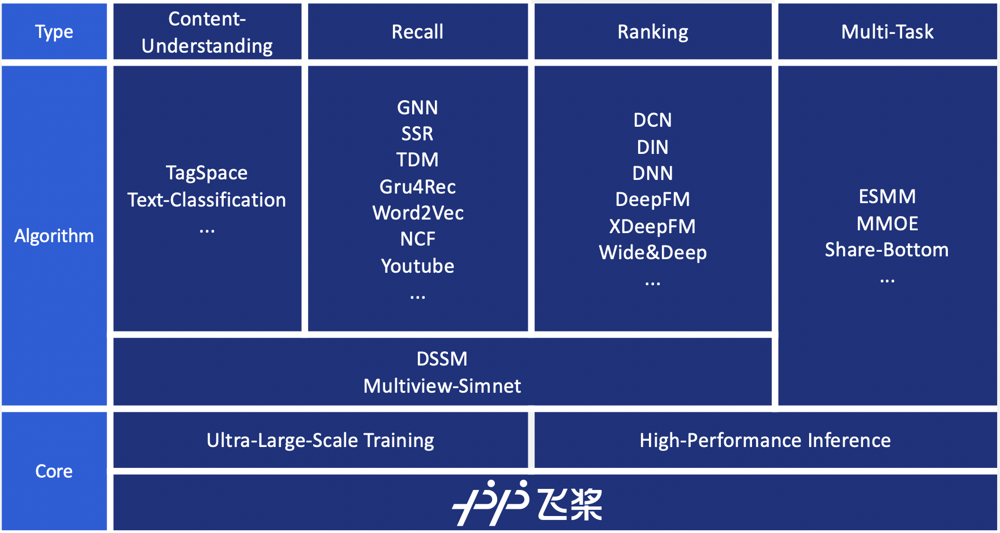
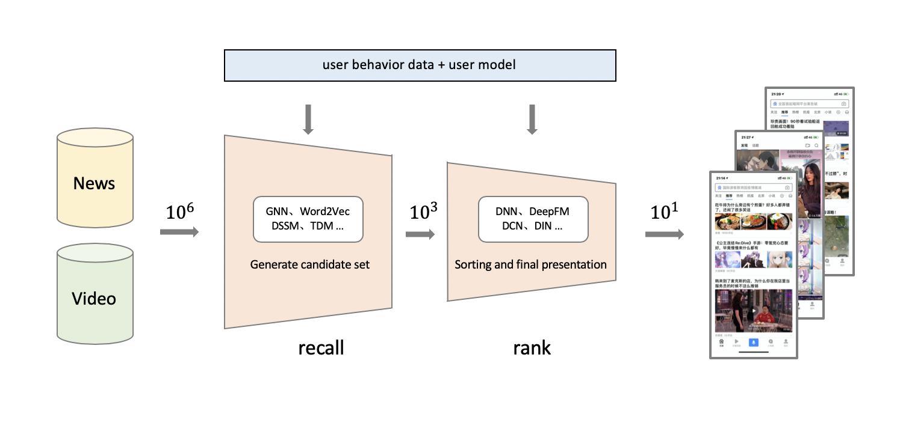

([简体中文](./README.md)|English)
<p align="center">

<p>
<p align="center">

<p>


<h2 align="center">What is recommendation system ?</h2>
<p align="center">

<p>

- Recommendation system helps users quickly find useful and interesting information from massive data.

- Recommendation system is also a silver bullet to attract users, retain users, increase users' stickness or conversionn.

  > Who can better use the recommendation system, who can gain more advantage in the fierce competition.
  >
  > At the same time, there are many problems in the process of using the recommendation system, such as: huge data, complex model, inefficient distributed training, and so on.

<h2 align="center">What is PaddleRec ?</h2>


- A quick start tool of search & recommendation algorithm based on [PaddlePaddle](https://www.paddlepaddle.org.cn/documentation/docs/en/beginners_guide/index_en.html)
- A complete solution of recommendation system for beginners, developers and researchers.
- Recommendation algorithm library including content-understanding, match, recall, rank, multi-task, re-rank etc.

<h2 align="center">Getting Started</h2>

### Environmental requirements
* Python 2.7/ 3.5 / 3.6 / 3.7 , Python 3.7 is recommended ,Python in example represents Python 3.7 by default
* PaddlePaddle >=2.0 
* operating system: Windows/Mac/Linux

  > Linux is recommended for distributed training
  
### Installation

- Install by pip in GPU environment
  ```bash
  python -m pip install paddlepaddle-gpu==2.0.0 
  ```
- Install by pip in CPU environment
  ```bash
  python -m pip install paddlepaddle # gcc8 
  ```
For download more versions, please refer to the installation tutorial [Installation Manuals](https://www.paddlepaddle.org.cn/documentation/docs/en/install/index_en.html)

### Download PaddleRec

```bash
git clone https://github.com/PaddlePaddle/PaddleRec/
cd PaddleRec
```

### Quick Start

We take the `dnn` algorithm as an example to get start of `PaddleRec`, and we take 100 pieces of training data from [Criteo Dataset](https://www.kaggle.com/c/criteo-display-ad-challenge/):

```bash
python -u tools/trainer.py -m models/rank/dnn/config.yaml # Training with dygraph model
python -u tools/static_trainer.py -m models/rank/dnn/config.yaml #  Training with static model
```


<h2 align="center">Documentation</h2>

### Background
* [Recommendation System](doc/rec_background.md)
* [Distributed deep learning](doc/ps_background.md)

### Introductory tutorial
* [PaddleRec function introduction](doc/introduction.md)
* [Dygraph Train](doc/dygraph_mode.md)
* [Static Train](doc/static_mode.md)
* [Distributed Train](doc/fleet_mode.md)


### Advanced tutorial
* [Custom Reader](doc/custom_reader.md)
* [Custom Model](doc/model_develop.md)
* [Configuration description of yaml](doc/yaml.md)
* [Training visualization](doc/visualization.md)
* [Serving](doc/serving.md)
* [Python inference](doc/inference.md)
* [Benchmark](doc/benchmark.md)

### FAQ
* [Common Problem FAQ](doc/faq.md)

<h2 align="center">Support model list</h2>


  |         Type          |                                 Algorithm                                 |  CPU  |   GPU   | Parameter-Server | Multi-GPU | version | Paper                                                                                                                                                                                                       |
  | :-------------------: | :-----------------------------------------------------------------------: | :---: | :-----: | :--------------: | :-------: | :-------: | :---------------------------------------------------------------------------------------------------------------------------------------------------------------------------------------------------------- |
  | Content-Understanding | [TextCnn](models/contentunderstanding/textcnn/) |   ✓   |    ✓    |        ✓         |     x     |      >=2.1.0     | [EMNLP 2014][Convolutional neural networks for sentence classication](https://www.aclweb.org/anthology/D14-1181.pdf)                                                                                        |
  | Content-Understanding |         [TagSpace](models/contentunderstanding/tagspace/)         |   ✓   |    ✓    |        ✓         |     x     |      >=2.1.0     | [EMNLP 2014][TagSpace: Semantic Embeddings from Hashtags](https://www.aclweb.org/anthology/D14-1194.pdf)                                                                                                    |
  |         Match         |                    [DSSM](models/match/dssm/)                     |   ✓   |    ✓    |        ✓         |     x     |      >=2.1.0     | [CIKM 2013][Learning Deep Structured Semantic Models for Web Search using Clickthrough Data](https://www.microsoft.com/en-us/research/wp-content/uploads/2016/02/cikm2013_DSSM_fullversion.pdf)             |
  |         Match         |        [MultiView-Simnet](models/match/multiview-simnet/)         |   ✓   |    ✓    |        ✓         |     x     |      >=2.1.0     | [WWW 2015][A Multi-View Deep Learning Approach for Cross Domain User Modeling in Recommendation Systems](https://www.microsoft.com/en-us/research/wp-content/uploads/2016/02/frp1159-songA.pdf)             |
  |         Match         |        [Match-Pyramid](models/match/match-pyramid/)         |   ✓   |    ✓    |        ✓         |     x     |      >=2.1.0     | [2016][Text Matching as Image Recognition](https://arxiv.org/pdf/1602.06359.pdf)             |
  |        Recall         |                   [TDM](https://github.com/PaddlePaddle/PaddleRec/tree/release/1.8.5/models/treebased/tdm/)                    |   ✓   | >=1.8.0 |        ✓         |  >=1.8.0  | [1.8.5](https://github.com/PaddlePaddle/PaddleRec/tree/release/1.8.5) | [KDD 2018][Learning Tree-based Deep Model for Recommender Systems](https://arxiv.org/pdf/1801.02294.pdf)                                                                                                    |
  |        Recall         |                [fasttext](https://github.com/PaddlePaddle/PaddleRec/tree/release/1.8.5/models/recall/fasttext/)                |   ✓   |    ✓    |        x         |     x     |[1.8.5](https://github.com/PaddlePaddle/PaddleRec/tree/release/1.8.5) | [EACL 2017][Bag of Tricks for Efficient Text Classification](https://www.aclweb.org/anthology/E17-2068.pdf)                                                                                                 |
  |        Recall         |                [MIND](models/recall/mind/)                |    ✓    |    ✓    |     x     |     x     | >=2.1.0 | [2019][Multi-Interest Network with Dynamic Routing for Recommendation at Tmall](https://arxiv.org/pdf/1904.08030.pdf)                                                                                                 |
  |        Recall         |                [Word2Vec](models/recall/word2vec/)                |   ✓   |    ✓    |        ✓         |     x     |      >=2.1.0     | [NIPS 2013][Distributed Representations of Words and Phrases and their Compositionality](https://papers.nips.cc/paper/5021-distributed-representations-of-words-and-phrases-and-their-compositionality.pdf) |
  |        Recall         |                [DeepWalk](models/recall/deepwalk/)                |    ✓    |    ✓    |    x     |     x     | >=2.1.0 | [SIGKDD 2014][DeepWalk: Online Learning of Social Representations](https://arxiv.org/pdf/1403.6652.pdf) |
  |        Recall         |                     [SSR](https://github.com/PaddlePaddle/PaddleRec/tree/release/1.8.5/models/recall/ssr/)                     |   ✓   |    ✓    |        ✓         |     ✓     | [1.8.5](https://github.com/PaddlePaddle/PaddleRec/tree/release/1.8.5) | [SIGIR 2016][Multi-Rate Deep Learning for Temporal Recommendation](http://sonyis.me/paperpdf/spr209-song_sigir16.pdf)                                                                                       |
  |        Recall         |                 [Gru4Rec](https://github.com/PaddlePaddle/PaddleRec/tree/release/1.8.5/models/recall/gru4rec/)                 |   ✓   |    ✓    |        ✓         |     ✓     | [1.8.5](https://github.com/PaddlePaddle/PaddleRec/tree/release/1.8.5) | [2015][Session-based Recommendations with Recurrent Neural Networks](https://arxiv.org/abs/1511.06939)                                                                                                      |
  |        Recall         |             [Youtube_dnn](https://github.com/PaddlePaddle/PaddleRec/tree/release/1.8.5/models/recall/youtube_dnn/)             |   ✓   |    ✓    |        ✓         |     ✓     | [1.8.5](https://github.com/PaddlePaddle/PaddleRec/tree/release/1.8.5) | [RecSys 2016][Deep Neural Networks for YouTube Recommendations](https://static.googleusercontent.com/media/research.google.com/zh-CN//pubs/archive/45530.pdf)                                               |
  |        Recall         |                     [NCF](models/recall/ncf/)                     |   ✓   |    ✓    |        ✓         |     ✓     | >=2.1.0 | [WWW 2017][Neural Collaborative Filtering](https://arxiv.org/pdf/1708.05031.pdf)                                                                                                                            |
  |        Recall         |                     [GNN](https://github.com/PaddlePaddle/PaddleRec/tree/release/1.8.5/models/recall/gnn/)                     |   ✓   |    ✓    |        ✓         |     ✓     | [1.8.5](https://github.com/PaddlePaddle/PaddleRec/tree/release/1.8.5) | [AAAI 2019][Session-based Recommendation with Graph Neural Networks](https://arxiv.org/abs/1811.00855)                                                                                                      |
  |        Recall         |                     [RALM](https://github.com/PaddlePaddle/PaddleRec/tree/release/1.8.5/models/recall/look-alike_recall/)                     |   ✓   |    ✓    |        ✓         |     ✓     | [1.8.5](https://github.com/PaddlePaddle/PaddleRec/tree/release/1.8.5) | [KDD 2019][Real-time Attention Based Look-alike Model for Recommender System](https://arxiv.org/pdf/1906.05022.pdf)                                                                                                      |
  |         Rank          |      [Logistic Regression](models/rank/logistic_regression/)      |   ✓   |    ✓    |        ✓         |     x     |      >=2.1.0     | /                                                                                                                                                                                                           |
  |         Rank          |                      [Dnn](models/rank/dnn/)                      |   ✓   |    ✓    |        ✓         |     ✓     |      >=2.1.0     | /                                                                                                                                                                                                           |
  |         Rank          |                       [FM](models/rank/fm/)                       |   ✓   |    ✓    |        ✓         |     x     |      >=2.1.0     | [IEEE Data Mining 2010][Factorization machines](https://analyticsconsultores.com.mx/wp-content/uploads/2019/03/Factorization-Machines-Steffen-Rendle-Osaka-University-2010.pdf)                             |
  |         Rank          |                      [FFM](models/rank/ffm/)                      |   ✓   |    ✓    |        ✓         |     x     | >=2.1.0 | [RECSYS 2016][Field-aware Factorization Machines for CTR Prediction](https://dl.acm.org/doi/pdf/10.1145/2959100.2959134)                                                                                    |
  |         Rank          |                      [FNN](https://github.com/PaddlePaddle/PaddleRec/tree/release/1.8.5/models/rank/fnn/)                      |   ✓   |    ✓    |        ✓         |     x     | [1.8.5](https://github.com/PaddlePaddle/PaddleRec/tree/release/1.8.5) | [ECIR 2016][Deep Learning over Multi-field Categorical Data](https://arxiv.org/pdf/1601.02376.pdf)                                                                                                          |
  |         Rank          |            [Deep Crossing](https://github.com/PaddlePaddle/PaddleRec/tree/release/1.8.5/models/rank/deep_crossing/)            |   ✓   |    ✓    |        ✓         |     x     | [1.8.5](https://github.com/PaddlePaddle/PaddleRec/tree/release/1.8.5) | [ACM 2016][Deep Crossing: Web-Scale Modeling without Manually Crafted Combinatorial Features](https://www.kdd.org/kdd2016/papers/files/adf0975-shanA.pdf)                                                   |
  |         Rank          |                      [Pnn](https://github.com/PaddlePaddle/PaddleRec/tree/release/1.8.5/models/rank/pnn/)                      |   ✓   |    ✓    |        ✓         |     x     | [1.8.5](https://github.com/PaddlePaddle/PaddleRec/tree/release/1.8.5) | [ICDM 2016][Product-based Neural Networks for User Response Prediction](https://arxiv.org/pdf/1611.00144.pdf)                                                                                               |
  |         Rank          |                      [DCN](models/rank/dcn/)                      |   ✓   |    ✓    |        ✓         |     x     | >=2.1.0 | [KDD 2017][Deep & Cross Network for Ad Click Predictions](https://dl.acm.org/doi/pdf/10.1145/3124749.3124754)                                                                                               |
  |         Rank          |                      [NFM](https://github.com/PaddlePaddle/PaddleRec/tree/release/1.8.5/models/rank/nfm/)                      |   ✓   |    ✓    |        ✓         |     x     | [1.8.5](https://github.com/PaddlePaddle/PaddleRec/tree/release/1.8.5) | [SIGIR 2017][Neural Factorization Machines for Sparse Predictive Analytics](https://dl.acm.org/doi/pdf/10.1145/3077136.3080777)                                                                             |
  |         Rank          |                      [AFM](https://github.com/PaddlePaddle/PaddleRec/tree/release/1.8.5/models/rank/afm/)                      |   ✓   |    ✓    |        ✓         |     x     | [1.8.5](https://github.com/PaddlePaddle/PaddleRec/tree/release/1.8.5) | [IJCAI 2017][Attentional Factorization Machines: Learning the Weight of Feature Interactions via Attention Networks](https://arxiv.org/pdf/1708.04617.pdf)                                                  |
  |         Rank          |                   [DMR](models/rank/dmr/)                   |    ✓    |    ✓    |     x     |     x     | >=2.1.0 | [AAAI 2020][Deep Match to Rank Model for Personalized Click-Through Rate Prediction](https://github.com/lvze92/DMR/blob/master/%5BDMR%5D%20Deep%20Match%20to%20Rank%20Model%20for%20Personalized%20Click-Through%20Rate%20Prediction-AAAI20.pdf)                                                                                 |
  |         Rank          |                   [DeepFM](models/rank/deepfm/)                   |   ✓   |    ✓    |        ✓         |     x     |      >=2.1.0     | [IJCAI 2017][DeepFM: A Factorization-Machine based Neural Network for CTR Prediction](https://arxiv.org/pdf/1703.04247.pdf)                                                                                 |
  |         Rank          |                  [xDeepFM](models/rank/xdeepfm/)                  |   ✓   |    ✓    |        ✓         |     x     | >=2.1.0 | [KDD 2018][xDeepFM: Combining Explicit and Implicit Feature Interactions for Recommender Systems](https://dl.acm.org/doi/pdf/10.1145/3219819.3220023)                                                       |
  |         Rank          |                      [DIN](models/rank/din/)                      |   ✓   |    ✓    |        ✓         |     x     | >=2.1.0 | [KDD 2018][Deep Interest Network for Click-Through Rate Prediction](https://dl.acm.org/doi/pdf/10.1145/3219819.3219823)                                                                                     |
  |         Rank          |                     [DIEN](models/rank/dien/)                     |   ✓   |    ✓    |        ✓         |     x     | >=2.1.0 | [AAAI 2019][Deep Interest Evolution Network for Click-Through Rate Prediction](https://www.aaai.org/ojs/index.php/AAAI/article/view/4545/4423)                                                              |
  |         Rank          |                     [dlrm](models/rank/dlrm/)                     |   ✓   |    ✓    |        ✓         |     x     | >=2.1.0 | [CoRR 2019][Deep Learning Recommendation Model for Personalization and Recommendation Systems](https://arxiv.org/abs/1906.00091)                                                              |
  |         Rank          |                     [DeepFEFM](models/rank/deepfefm/)                     |   ✓   |    ✓    |        ✓         |     x     | >=2.1.0 | [arXiv 2020][Field-Embedded Factorization Machines for Click-through rate prediction](https://arxiv.org/abs/2009.09931)                                                              |
  |         Rank          |                      [BST](https://github.com/PaddlePaddle/PaddleRec/tree/release/1.8.5/models/rank/BST/)                      |   ✓   |    ✓    |        ✓         |     x     | [1.8.5](https://github.com/PaddlePaddle/PaddleRec/tree/release/1.8.5) | [DLP-KDD 2019][Behavior Sequence Transformer for E-commerce Recommendation in Alibaba](https://arxiv.org/pdf/1905.06874v1.pdf)                                                                              |
  |         Rank          |                  [AutoInt](https://github.com/PaddlePaddle/PaddleRec/tree/release/1.8.5/models/rank/AutoInt/)                  |   ✓   |    ✓    |        ✓         |     x     | [1.8.5](https://github.com/PaddlePaddle/PaddleRec/tree/release/1.8.5) | [CIKM 2019][AutoInt: Automatic Feature Interaction Learning via Self-Attentive Neural Networks](https://arxiv.org/pdf/1810.11921.pdf)                                                                       |
  |         Rank          |                [Wide&Deep](models/rank/wide_deep/)                |   ✓   |    ✓    |        ✓         |     x     |      >=2.1.0     | [DLRS 2016][Wide & Deep Learning for Recommender Systems](https://dl.acm.org/doi/pdf/10.1145/2988450.2988454)                                                                                               |
  |         Rank          |                    [FGCNN](https://github.com/PaddlePaddle/PaddleRec/tree/release/1.8.5/models/rank/fgcnn/)                    |   ✓   |    ✓    |        ✓         |     ✓     |  [1.8.5](https://github.com/PaddlePaddle/PaddleRec/tree/release/1.8.5) | [WWW 2019][Feature Generation by Convolutional Neural Network for Click-Through Rate Prediction](https://arxiv.org/pdf/1904.04447.pdf)                                                                      |
  |         Rank          |                  [Fibinet](https://github.com/PaddlePaddle/PaddleRec/tree/release/1.8.5/models/rank/fibinet/)                  |   ✓   |    ✓    |        ✓         |     ✓     |  [1.8.5](https://github.com/PaddlePaddle/PaddleRec/tree/release/1.8.5) | [RecSys19][FiBiNET: Combining Feature Importance and Bilinear feature Interaction for Click-Through Rate Prediction]( https://arxiv.org/pdf/1905.09433.pdf)                                                 |
  |         Rank          |                     [Flen](https://github.com/PaddlePaddle/PaddleRec/tree/release/1.8.5/models/rank/flen/)                     |   ✓   |    ✓    |        ✓         |     ✓     |  [1.8.5](https://github.com/PaddlePaddle/PaddleRec/tree/release/1.8.5) | [2019][FLEN: Leveraging Field for Scalable CTR Prediction]( https://arxiv.org/pdf/1911.04690.pdf)                                                                                                           |
  |      Multi-Task       |                  [PLE](models/multitask/ple/)                   |    ✓    |    ✓    |     ✓     |     ✓     |  >=2.1.0 | [RecSys 2020][Progressive Layered Extraction (PLE): A Novel Multi-Task Learning (MTL) Model for Personalized Recommendations](https://dl.acm.org/doi/abs/10.1145/3383313.3412236)                                                              |
  |      Multi-Task       |                  [ESMM](models/multitask/esmm/)                   |   ✓   |    ✓    |        ✓         |     ✓     |      >=2.1.0     | [SIGIR 2018][Entire Space Multi-Task Model: An Effective Approach for Estimating Post-Click Conversion Rate](https://arxiv.org/abs/1804.07931)                                                              |
  |      Multi-Task       |                  [MMOE](models/multitask/mmoe/)                   |   ✓   |    ✓    |        ✓         |     ✓     |      >=2.1.0     | [KDD 2018][Modeling Task Relationships in Multi-task Learning with Multi-gate Mixture-of-Experts](https://dl.acm.org/doi/abs/10.1145/3219819.3220007)                                                       |
  |      Multi-Task       |           [ShareBottom](models/multitask/share_bottom/)           |   ✓   |    ✓    |        ✓         |     ✓     |  >=2.1.0 | [1998][Multitask learning](http://reports-archive.adm.cs.cmu.edu/anon/1997/CMU-CS-97-203.pdf)                                                                                                               |
  |      Multi-Task       |           [Maml](models/multitask/maml/)           |    ✓    |    ✓    |    x      |     x     | >=2.1.0 | [PMLR 2017][Model-agnostic meta-learning for fast adaptation of deep networks](https://arxiv.org/pdf/1703.03400.pdf)                                                                                                               |
  |        Re-Rank        |                [Listwise](https://github.com/PaddlePaddle/PaddleRec/tree/release/1.8.5/models/rerank/listwise/)                |   ✓   |    ✓    |        ✓         |     x     |  [1.8.5](https://github.com/PaddlePaddle/PaddleRec/tree/release/1.8.5) | [2019][Sequential Evaluation and Generation Framework for Combinatorial Recommender System](https://arxiv.org/pdf/1902.00245.pdf)                                                                           |

<h2 align="center">Community</h2>

<p align="center">
    <br>
    
    
    
    <br>
<p>

### Version history
- 2021.11.19 - PaddleRec v2.2.0
- 2021.05.19 - PaddleRec v2.1.0
- 2021.01.29 - PaddleRec v2.0.0
- 2020.10.12 - PaddleRec v1.8.5
- 2020.06.17 - PaddleRec v0.1.0
- 2020.06.03 - PaddleRec v0.0.2
- 2020.05.14 - PaddleRec v0.0.1
  
### License
[Apache 2.0 license](LICENSE)

### Contact us

For any feedback, please propose a [GitHub Issue](https://github.com/PaddlePaddle/PaddleRec/issues)

You can also communicate with us in the following ways：

- QQ group id：`861717190`
- Wechat account：`wxid_0xksppzk5p7f22`
- Remarks `REC` add group automatically

<p align="center">&#8194;&#8194;&#8194;&#8194;&#8194</p>
<p align="center">PaddleRec QQ Group&#8194;&#8194;&#8194;&#8194;&#8194;&#8194;&#8194;&#8194;&#8194;&#8194;&#8194;&#8194;&#8194;&#8194;&#8194;PaddleRec Wechat account</p>
