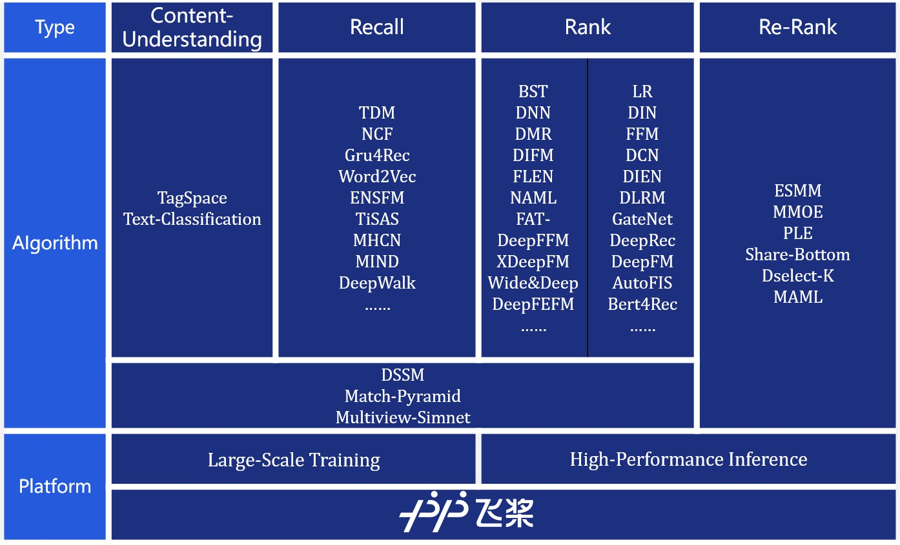

<p align="center">

<p>
<p align="center">

<p>


<h2 align="center">What is recommendation system ?</h2>
<p align="center">

<p>

- Recommendation system is the key to help users get information of interest efficiently in the era of explosive growth of Internet information

- The recommendation system is also a silver bullet to help the product attract users, retain users, increase user stickiness and improve user conversion.

- Excellent recommendation system can help the product establish a good reputation, and help the product gain market share

  > It can be said that who can master and make good use of the recommendation system, who can get the first chance in the fierce competition of information distribution.
  >
  > At the same time, there are many problems that perplex the developers of the recommendation system, such as: huge data volume, complex model structure, inefficient distributed training environment, demanding online deployment requirements, all of which are too numerous to enumerate.

<h2 align="center">What is PaddleRec ?</h2>


- A quick start tool of search & recommendation model based on [PaddlePaddle](https://www.paddlepaddle.org.cn/documentation/docs/en/beginners_guide/index_en.html)
- The whole process solution of recommendation system for beginners, developers and researchers
- Complete recommendation algorithm library including content understanding, matching, recall, ranking, multi-task, re-rank etc.


    |         Type          |                                 Algorithm                                 |  CPU  |   GPU   | Parameter-Server | Multi-GPU | Paper                                                                                                                                                                                                       |
    | :-------------------: | :-----------------------------------------------------------------------: | :---: | :-----: | :--------------: | :-------: | :---------------------------------------------------------------------------------------------------------------------------------------------------------------------------------------------------------- |
    | Content-Understanding | [Text-Classifcation](models/contentunderstanding/classification/model.py) |   ✓   |    ✓    |        ✓         |     x     | [EMNLP 2014][Convolutional neural networks for sentence classication](https://www.aclweb.org/anthology/D14-1181.pdf)                                                                                        |
    | Content-Understanding |         [TagSpace](models/contentunderstanding/tagspace/model.py)         |   ✓   |    ✓    |        ✓         |     x     | [EMNLP 2014][TagSpace: Semantic Embeddings from Hashtags](https://www.aclweb.org/anthology/D14-1194.pdf)                                                                                                    |
    |       Matching        |                    [DSSM](models/match/dssm/model.py)                     |   ✓   |    ✓    |        ✓         |     x     | [CIKM 2013][Learning Deep Structured Semantic Models for Web Search using Clickthrough Data](https://www.microsoft.com/en-us/research/wp-content/uploads/2016/02/cikm2013_DSSM_fullversion.pdf)             |
    |       Matching        |        [MultiView-Simnet](models/match/multiview-simnet/model.py)         |   ✓   |    ✓    |        ✓         |     x     | [WWW 2015][A Multi-View Deep Learning Approach for Cross Domain User Modeling in Recommendation Systems](https://www.microsoft.com/en-us/research/wp-content/uploads/2016/02/frp1159-songA.pdf)             |
    |        Recall         |                   [TDM](models/treebased/tdm/model.py)                    |   ✓   | >=1.8.0 |        ✓         |  >=1.8.0  | [KDD 2018][Learning Tree-based Deep Model for Recommender Systems](https://arxiv.org/pdf/1801.02294.pdf)                                                                                                    |
    |        Recall         |                [fasttext](models/recall/fasttext/model.py)                |   ✓   |    ✓    |        x         |     x     | [EACL 2017][Bag of Tricks for Efficient Text Classification](https://www.aclweb.org/anthology/E17-2068.pdf)                                                                                                 |
    |        Recall         |                [Word2Vec](models/recall/word2vec/model.py)                |   ✓   |    ✓    |        ✓         |     x     | [NIPS 2013][Distributed Representations of Words and Phrases and their Compositionality](https://papers.nips.cc/paper/5021-distributed-representations-of-words-and-phrases-and-their-compositionality.pdf) |
    |        Recall         |                     [SSR](models/recall/ssr/model.py)                     |   ✓   |    ✓    |        ✓         |     ✓     | [SIGIR 2016][Multi-Rate Deep Learning for Temporal Recommendation](http://sonyis.me/paperpdf/spr209-song_sigir16.pdf)                                                                                       |
    |        Recall         |                 [Gru4Rec](models/recall/gru4rec/model.py)                 |   ✓   |    ✓    |        ✓         |     ✓     | [2015][Session-based Recommendations with Recurrent Neural Networks](https://arxiv.org/abs/1511.06939)                                                                                                      |
    |        Recall         |             [Youtube_dnn](models/recall/youtube_dnn/model.py)             |   ✓   |    ✓    |        ✓         |     ✓     | [RecSys 2016][Deep Neural Networks for YouTube Recommendations](https://static.googleusercontent.com/media/research.google.com/zh-CN//pubs/archive/45530.pdf)                                               |
    |        Recall         |                     [NCF](models/recall/ncf/model.py)                     |   ✓   |    ✓    |        ✓         |     ✓     | [WWW 2017][Neural Collaborative Filtering](https://arxiv.org/pdf/1708.05031.pdf)                                                                                                                            |
    |        Recall         |                     [GNN](models/recall/gnn/model.py)                     |   ✓   |    ✓    |        ✓         |     ✓     | [AAAI 2019][Session-based Recommendation with Graph Neural Networks](https://arxiv.org/abs/1811.00855)                                                                                                      |
    |        Ranking        |      [Logistic Regression](models/rank/logistic_regression/model.py)      |   ✓   |    x    |        ✓         |     x     | /                                                                                                                                                                                                           |
    |        Ranking        |                      [Dnn](models/rank/dnn/model.py)                      |   ✓   |    ✓    |        ✓         |     ✓     | /                                                                                                                                                                                                           |
    |        Ranking        |                       [FM](models/rank/fm/model.py)                       |   ✓   |    x    |        ✓         |     x     | [IEEE Data Mining 2010][Factorization machines](https://analyticsconsultores.com.mx/wp-content/uploads/2019/03/Factorization-Machines-Steffen-Rendle-Osaka-University-2010.pdf)                             |
    |        Ranking        |                      [FFM](models/rank/ffm/model.py)                      |   ✓   |    x    |        ✓         |     x     | [RECSYS 2016][Field-aware Factorization Machines for CTR Prediction](https://dl.acm.org/doi/pdf/10.1145/2959100.2959134)                                                                                    |
    |        Ranking        |                      [FNN](models/rank/fnn/model.py)                      |   ✓   |    x    |        ✓         |     x     | [ECIR 2016][Deep Learning over Multi-field Categorical Data](https://arxiv.org/pdf/1601.02376.pdf)                                                                                                          |
    |        Ranking        |            [Deep Crossing](models/rank/deep_crossing/model.py)            |   ✓   |    x    |        ✓         |     x     | [ACM 2016][Deep Crossing: Web-Scale Modeling without Manually Crafted Combinatorial Features](https://www.kdd.org/kdd2016/papers/files/adf0975-shanA.pdf)                                                   |
    |        Ranking        |                      [Pnn](models/rank/pnn/model.py)                      |   ✓   |    x    |        ✓         |     x     | [ICDM 2016][Product-based Neural Networks for User Response Prediction](https://arxiv.org/pdf/1611.00144.pdf)                                                                                               |
    |        Ranking        |                      [DCN](models/rank/dcn/model.py)                      |   ✓   |    x    |        ✓         |     x     | [KDD 2017][Deep & Cross Network for Ad Click Predictions](https://dl.acm.org/doi/pdf/10.1145/3124749.3124754)                                                                                               |
    |        Ranking        |                      [NFM](models/rank/nfm/model.py)                      |   ✓   |    x    |        ✓         |     x     | [SIGIR 2017][Neural Factorization Machines for Sparse Predictive Analytics](https://dl.acm.org/doi/pdf/10.1145/3077136.3080777)                                                                             |
    |        Ranking        |                      [AFM](models/rank/afm/model.py)                      |   ✓   |    x    |        ✓         |     x     | [IJCAI 2017][Attentional Factorization Machines: Learning the Weight of Feature Interactions via Attention Networks](https://arxiv.org/pdf/1708.04617.pdf)                                                  |
    |        Ranking        |                   [DeepFM](models/rank/deepfm/model.py)                   |   ✓   |    x    |        ✓         |     x     | [IJCAI 2017][DeepFM: A Factorization-Machine based Neural Network for CTR Prediction](https://arxiv.org/pdf/1703.04247.pdf)                                                                                 |
    |        Ranking        |                  [xDeepFM](models/rank/xdeepfm/model.py)                  |   ✓   |    x    |        ✓         |     x     | [KDD 2018][xDeepFM: Combining Explicit and Implicit Feature Interactions for Recommender Systems](https://dl.acm.org/doi/pdf/10.1145/3219819.3220023)                                                       |
    |        Ranking        |                      [DIN](models/rank/din/model.py)                      |   ✓   |    x    |        ✓         |     x     | [KDD 2018][Deep Interest Network for Click-Through Rate Prediction](https://dl.acm.org/doi/pdf/10.1145/3219819.3219823)                                                                                     |
    |        Ranking        |                [Wide&Deep](models/rank/wide_deep/model.py)                |   ✓   |    x    |        ✓         |     x     | [DLRS 2016][Wide & Deep Learning for Recommender Systems](https://dl.acm.org/doi/pdf/10.1145/2988450.2988454)                                                                                               |
    |        Ranking        |                    [FGCNN](models/rank/fgcnn/model.py)                    |   ✓   |    ✓    |        ✓         |     ✓     | [WWW 2019][Feature Generation by Convolutional Neural Network for Click-Through Rate Prediction](https://arxiv.org/pdf/1904.04447.pdf)                                                                      |
    |        Ranking        |                  [Fibinet](models/rank/fibinet/model.py)                  |   ✓   |    ✓    |        ✓         |     ✓     | [RecSys19][FiBiNET: Combining Feature Importance and Bilinear feature Interaction for Click-Through Rate Prediction]( https://arxiv.org/pdf/1905.09433.pdf)                                                 |
    |      Multi-Task       |                  [ESMM](models/multitask/esmm/model.py)                   |   ✓   |    ✓    |        ✓         |     ✓     | [SIGIR 2018][Entire Space Multi-Task Model: An Effective Approach for Estimating Post-Click Conversion Rate](https://arxiv.org/abs/1804.07931)                                                              |
    |      Multi-Task       |                  [MMOE](models/multitask/mmoe/model.py)                   |   ✓   |    ✓    |        ✓         |     ✓     | [KDD 2018][Modeling Task Relationships in Multi-task Learning with Multi-gate Mixture-of-Experts](https://dl.acm.org/doi/abs/10.1145/3219819.3220007)                                                       |
    |      Multi-Task       |           [ShareBottom](models/multitask/share-bottom/model.py)           |   ✓   |    ✓    |        ✓         |     ✓     | [1998][Multitask learning](http://reports-archive.adm.cs.cmu.edu/anon/1997/CMU-CS-97-203.pdf)                                                                                                               |
    |        Re-Rank        |                [Listwise](models/rerank/listwise/model.py)                |   ✓   |    ✓    |        ✓         |     x     | [2019][Sequential Evaluation and Generation Framework for Combinatorial Recommender System](https://arxiv.org/pdf/1902.00245.pdf)                                                                           |


<h2 align="center">Getting Started</h2>

### Environmental requirements
* Python 2.7/ 3.5 / 3.6 / 3.7
* PaddlePaddle  >= 1.7.2
* operating system: Windows/Mac/Linux

  > Linux is recommended for distributed training
  
### Installation

1. **Install by pip**
  ```bash
  python -m pip install paddle-rec
  ```
  > This method will download and install`paddlepaddle-v1.7.2-cpu`，if you are prompted that `PaddlePaddle` can not be installed automatically，You need to install `PaddlePaddle` manually，and then install `Paddlerec` again：
  > - Download PaddlePaddle whl from [address](https://pypi.org/project/paddlepaddle/1.7.2/#files) and install by pip.
  > - Directly install `PaddlePaddle` by pip，`python -m pip install paddlepaddle==1.7.2 -i https://mirror.baidu.com/pypi/simple`
  > - Other installation problems can be raised in [Paddle Issue](https://github.com/PaddlePaddle/Paddle/issues) or [PaddleRec Issue](https://github.com/PaddlePaddle/PaddleRec/issues)

2. **Install by source code**
  
  - Install PaddlePaddle  

    ```shell
    python -m pip install paddlepaddle==1.7.2 -i https://mirror.baidu.com/pypi/simple
    ```

  - Install PaddleRec by source code

    ```
    git clone https://github.com/PaddlePaddle/PaddleRec/
    cd PaddleRec
    python setup.py install
    ```

- Install PaddleRec-GPU  

  After installing `PaddleRec`，You need to manually install `paddlepaddle-gpu`，select the appropriate version according to your environment (CUDA / cudnn)，please refer to the installation tutorial[Installation Manuals](https://www.paddlepaddle.org.cn/documentation/docs/en/install/index_en.html)


<h2 align="center">Quick Start</h2>

We take the `dnn` algorithm as an example to introduce the quick start of `PaddleRec`, and we took 100 pieces of training data from [Criteo Dataset](https://www.kaggle.com/c/criteo-display-ad-challenge/):

```bash
# Training with cpu
python -m paddlerec.run -m paddlerec.models.rank.dnn  
```


<h2 align="center">Documentation</h2>

### Background
* [Recommendation System](doc/rec_background.md)
* [Distributed deep learning](doc/ps_background.md)

### Introductory Project
* [Ten minutes to learn PaddleRec](https://aistudio.baidu.com/aistudio/projectdetail/559336)

### Introductory tutorial
* [Prepare Data](doc/slot_reader.md)
* [HyperParameter of model](doc/model.md)
* [Start Training](doc/train.md)
* [Start Predicting](doc/predict.md)
* [Serving](doc/serving.md)


### Advanced tutorial
* [Custom Reader](doc/custom_reader.md)
* [Custom Model](doc/model_develop.md)
* [Custom Training Process](doc/trainer_develop.md)
* [Configuration description of yaml](doc/yaml.md)
* [Design document of PaddleRec](doc/design.md)

### Benchmark
* [Benchmark](doc/benchmark.md)

### FAQ
* [Common Problem FAQ](doc/faq.md)


<h2 align="center">Community</h2>

<p align="center">
    <br>
    
    
    
    <br>
<p>

### Version history
- 2020.06.17 - PaddleRec v0.1.0
- 2020.06.03 - PaddleRec v0.0.2
- 2020.05.14 - PaddleRec v0.0.1
  
### License
[Apache 2.0 license](LICENSE)

### Contack us

For any feedback or to report a bug, please propose a [GitHub Issue](https://github.com/PaddlePaddle/PaddleRec/issues)

You can also communicate with us in the following ways：

- QQ group id：`861717190`
- Wechat account：`paddlerec2020`

<p align="center">&#8194;&#8194;&#8194;&#8194;&#8194</p>
<p align="center">PaddleRec QQ Group&#8194;&#8194;&#8194;&#8194;&#8194;&#8194;&#8194;&#8194;&#8194;&#8194;&#8194;&#8194;&#8194;&#8194;&#8194;PaddleRec Wechat account</p>
