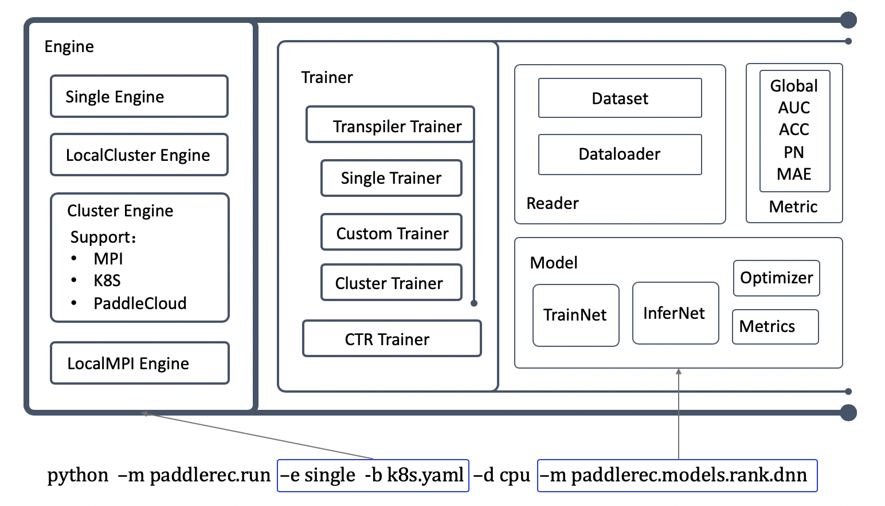

# PaddleRec 设计


## PaddleRec 整体设计概览
PaddleRec将推荐模型的训练与预测流程，整体抽象为了五个大模块：

* [Engine 流程执行引擎](#engine)
* [Trainer 流程具体定义](#trainer)
* [Model 模型组网定义](#model)
* [Reader 数据读取定义](#reader)
* [Metric 精度指标打印](#metric)

层级结构，以及一键启动训练时的调用关系如下图所示：

<p align="center">

<p>

core的文件结构如下，后续分别对各个模块进行介绍。
```
.core
├── engine/            运行引擎实现
├── metrics/           全局指标实现
├── modules/           自定义op实现
├── trainers/          运行流程实现
├── utils/             辅助工具
├── factory.py         运行流程的注册
├── layer.py           自定义op基类定义
├── metric.py          Metric基类定义
├── model.py           Model基类定义
├── reader.py          Reader基类定义
└── trainer.py         Trainer基类定义
```


## Engine

Engine是整体训练的执行引擎，与组网逻辑及数据无关，只与当前运行模式、运行环境及运行设备有关。

运行模式具体是指：
- 单机运行
- 分布式运行
- 本地模拟分布式

运行环境是指：
- Linux
- Windows
- Mac

运行设备是指：
- CPU
- GPU
- AI芯片

在用户调用`python -m paddlerec.run`时，首先会根据`yaml`文件中的配置信息选择合适的执行引擎， 以下代码位于[run.py](../run.py)：
```python
engine_registry()
which_engine = get_engine(args)
engine = which_engine(args)
engine.run()
```

我们以`single engine`为例，概览engine的行为：
```python
def single_engine(args):
    trainer = get_trainer_prefix(args) + "SingleTrainer"
    single_envs = {}
    single_envs["train.trainer.trainer"] = trainer
    single_envs["train.trainer.threads"] = "2"
    single_envs["train.trainer.engine"] = "single"
    single_envs["train.trainer.device"] = args.device
    single_envs["train.trainer.platform"] = envs.get_platform()
    print("use {} engine to run model: {}".format(trainer, args.model))

    set_runtime_envs(single_envs, args.model)
    trainer = TrainerFactory.create(args.model)
    return trainer
```
single_engine被调用后，主要进行了以下两个工作：

1. 根据`yaml`配置文件，设置了**当前进程的环境变量**，后续的所有流程都依赖于环境变量。
2. 根据模型及环境，指定并初始化了运行流程所用的`Trainer`

进一步细化第一步工作
- 本地模拟分布式引擎会在单机环境变量的基础上，额外设置本地模拟分布式的环境变量，比如：为各个进程设置不同通信端口，分配ID。最后会启动多个`Trainer`完成本地模拟分布式的工作。
- 分布式引擎会在单机环境变量的基础上，基于运行参数`-b --backend`所指定的脚本或配置文件，完成分布式任务的文件打包，上传，提交等操作。该脚本格式与分布式任务运行的集群有关，如MPI/K8S/PaddleCloud等，用户可以自定义分布式运行逻辑。

Engine的自定义实现，可以参考[local_cluster.py](../core/engine/local_cluster.py)

## Trainer

`Trainer`是训练与预测流程的具体实现，会run模型中定义的各个流程，与model、reader、metric紧密相关。PaddleRec以有限状态机的逻辑定义了训练中的各个阶段，不同的Trainer子类会分别实现阶段中的特殊需求。有限状态机的流程在`def processor_register()`中注册。

我们以SingleTrainer为例，概览Trainer行为：

```python 
class SingleTrainer(TranspileTrainer):
    def processor_register(self):
        self.regist_context_processor('uninit', self.instance)
        self.regist_context_processor('init_pass', self.init)
        self.regist_context_processor('startup_pass', self.startup)
        if envs.get_platform() == "LINUX" and envs.get_global_env("dataset_class", None, "train.reader") != "DataLoader":
            self.regist_context_processor('train_pass', self.dataset_train)
        else:
            self.regist_context_processor('train_pass', self.dataloader_train)

        self.regist_context_processor('infer_pass', self.infer)
        self.regist_context_processor('terminal_pass', self.terminal)
```

SingleTrainer首先注册了完成任务所需的步骤，各步骤首先按照注册顺序加入`Trainer`基类中名为`status_processor`的字典，运行的先后顺序，可以在每个执行步骤中改变`context['status']`的值，指定下一步运行哪个步骤。

SingleTrainer指定了以下6个步骤：
1. uninit：默认排在首位，通过环境变量决定model的对象
1. init_pass：调用model_的接口，生成模型的组网，初始化fetch及metric的变量
2. startup_pass：初始化模型组网中的各个参数，run(fluid.default_startup_program)
3. train_pass：会根据环境分别调用`dataset`与`dataloader`进行训练的流程。
4. infer_pass：在训练结束后，会对训练保存的模型在测试集上验证效果
5. terminal_pass：打印全局变量及预测结果等自定义的信息。

Trainer的自定义实现，可以参照[single_trainer.py](../core/trainers/single_trainer.py)

## Model

Model定义了各个模型实现的范式，模型只要继承并实现基类中的函数，并给一些成员赋值，就可以保证模型被Trainer正确调用。

我们首先看一下Model基类中的部分重要定义，对模型的实现流程有初步概念。

```python
class Model(object):
    __metaclass__ = abc.ABCMeta

    def __init__(self, config):
        self._cost = None
        self._metrics = {}
        self._data_var = []
        self._infer_data_var = []
        self._infer_results = {}
        self._data_loader = None
        self._infer_data_loader = None
        self._fetch_interval = 20
        self._namespace = "train.model"
        self._platform = envs.get_platform()

    def get_inputs(self):
        return self._data_var

    @abc.abstractmethod
    def train_net(self):
        pass

    @abc.abstractmethod
    def infer_net(self):
        pass

    def get_avg_cost(self):
    return self._cost

```

每个模型都一定需要继承`def train_net`与`def infer_net`，并且给`self._data_var`与`self._cost`成员赋值，指定模型入口，实现组网的整体逻辑。若有更多或更复杂的需求，可以参照下面的接口，分别继承各个函数，并实现需要的功能：

```python
def get_infer_inputs(self):
    return self._infer_data_var

def get_infer_results(self):
    return self._infer_results

def get_metrics(self):
    return self._metrics

def get_fetch_period(self):
    return self._fetch_interval
```

model的具体实现，可以参考dnn的示例[model.py](../../models/rank/dnn/../../../paddlerec/core/model.py)


## Reader

PaddleRec会根据运行环境，分别指定不同的数据IO方式。在Linux下，优先使用`Dataset`，Win及Mac优先使用`Dataloader`。


Dataset的使用介绍可以参考[DatasetFactory](https://www.paddlepaddle.org.cn/documentation/docs/zh/api_cn/dataset_cn/DatasetFactory_cn.html)

Dataloader的使用介绍可以参考[异步数据读取](https://www.paddlepaddle.org.cn/documentation/docs/zh/advanced_guide/data_preparing/use_py_reader.html)


考虑到以上两种高效的数据IO方式仍然有很高的学习门槛，PaddleRec将两种数据读取方式进行了更高层次的封装，用户需要实现的仅是每行数据的处理逻辑，剩下的工作交给PaddleRec的Reader基类完成。

首先浏览以下Reader基类的定义，有一个初步的印象：

```python
class Reader(dg.MultiSlotDataGenerator):
    __metaclass__ = abc.ABCMeta

    def __init__(self, config):
        dg.MultiSlotDataGenerator.__init__(self)
        _config = envs.load_yaml(config)
        envs.set_global_envs(_config)
        envs.update_workspace()

    @abc.abstractmethod
    def init(self):
        pass

    @abc.abstractmethod
    def generate_sample(self, line):
        pass

```

用户需要关注并实现的是`def init(self)`与`def generate_sample(self,line)`函数，分别执行数据读取中预处理所需变量的初始化，以及每一行string的切分及处理逻辑。

当用户定义好以上两个函数，完成自己的Reader后，PaddleRec分别使用
- [dataset_instance.py](../core/utils/dataset_instance.py)
- [dataloader_instance.py](../core/utils/dataloader_instance.py)

完成reader的构建工作。

Reader数据处理的逻辑，可以参考[criteo_reader.py](../../models/rank/../../paddlerec/models/rank/criteo_reader.py)


## Metric

训练必然伴随着训练指标的打印，当单机运行时，打印相关信息比较简单。但分布式训练时，单机指标与全局指标往往有很大diff，比如`auc`以及正逆序`pn`。PaddleRec面向大规模分布式训练，将指标打印的逻辑抽象出来单独实现，以解决分布式训练时全局指标打印的问题。

Metric基类定义了基本的接口，如下：
```python
class Metric(object):
    __metaclass__ = abc.ABCMeta

    def __init__(self, config):
        """ init """
        pass

    @abc.abstractmethod
    def clear(self, scope, params):
        """
        clear current value
        Args:
            scope: value container
            params: extend varilable for clear
        """
        pass

    @abc.abstractmethod
    def calculate(self, scope, params):
        """
        calculate result
        Args:
            scope: value container
            params: extend varilable for clear
        """
        pass

    @abc.abstractmethod
    def get_result(self):
        """
        Return:
            result(dict) : calculate result
        """
        pass

    @abc.abstractmethod
    def get_result_to_string(self):
        """
        Return:
            result(string) : calculate result with string format, for output
        """
        pass
```

全局指标的计算及输出，需要分别继承并实现以上四个成员函数。具体实现的例子，可以参考[auc_metric.py](../core/metrics/auc_metrics.py)
