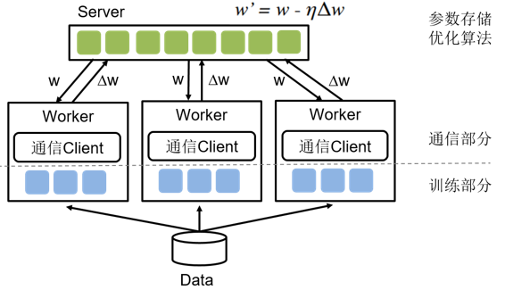
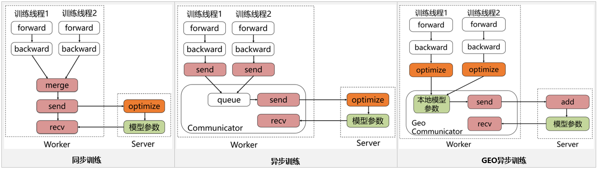

# 分布式-参数服务器训练简介

以下文档来源于[参数服务器训练简介](https://www.paddlepaddle.org.cn/tutorials/projectdetail/454253)

如图1所示，参数服务器是分布式训练领域普遍采用的编程架构，主要包含Server和Worker两个部分，其中Server负责参数的存储和更新，而Worker负责训练。飞桨的参数服务器功能也是基于这种经典的架构进行设计和开发的，同时在这基础上进行了SGD（Stochastic Gradient Descent）算法的创新（Geometric Stochastic Gradient Descent）。当前经过大量的实验验证，最佳的方案是每台机器上启动Server和Worker两个进程，而一个Worker进程中可以包含多个用于训练的线程。
<p align="center">

<p>

参数服务器是主要解决两类问题：

- 模型参数过大：单机内存空间不足，需要采用分布式存储。
- 训练数据过多：单机训练太慢，需要加大训练节点,来提高并发训练速度。 设想，当训练数据过多，一个Worker训练太慢时，可以引入多个Worker同时训练，这时Worker之间需要同步模型参数。直观想法是，引入一个Server，Server充当Worker间参数交换的媒介。但当模型参数过大以至于单机存储空间不足时或Worker过多导致一个Server是瓶颈时，就需要引入多个Server。


具体训练流程：

- 将训练数据均匀的分配给不同的Worker。
- 将模型参数分片，存储在不同的Server上。
- Worker端：读取一个minibatch训练数据，从Server端拉取最新的参数，计算梯度，并根据分片上传给不同的Server。
- Server端：接收Worker端上传的梯度，根据优化算法更新参数。根据Server端每次参数更新是否需要等待所有Worker端的梯度，分为同步训练和异步训练两种机制。


飞桨的参数服务器框架也是基于这种经典的参数服务器模式进行设计和开发的，同时在这基础上进行了SGD(Stochastic Gradient Descent）算法的创新（GEO-SGD）。目前飞桨支持3种模式，分别是同步训练模式、异步训练模式、GEO异步训练模式，如图2所示。

<p align="center">

<p>

## 同步训练

Worker在训练一个batch的数据后，会合并所有线程的梯度发给Server, Server在收到所有节点的梯度后，会统一进行梯度合并及参数更新。同步训练的优势在于Loss可以比较稳定的下降，缺点是整个训练速度较慢，这是典型的木桶原理，速度的快慢取决于最慢的那个线程的训练计算时间，因此在训练较为复杂的模型时，即模型训练过程中神经网络训练耗时远大于节点间通信耗时的场景下，推荐使用同步训练模式。

## 异步训练

在训练一个batch的数据后，Worker的每个线程会发送梯度给Server。而Server不会等待接收所有节点的梯度，而是直接基于已收到的梯度进行参数更新。异步训练去除了训练过程中的等待机制，训练速度得到了极大的提升，但是缺点也很明显，那就是Loss下降不稳定，容易发生抖动。建议在个性化推荐（召回、排序）、语义匹配等数据量大的场景使用。 尤其是推荐领域的点击率预估场景，该场景可能会出现千亿甚至万亿规模的稀疏特征，而稀疏参数也可以达到万亿数量级，且需要小时级或分钟级流式增量训练。如果使用异步训练模式，可以很好的满足该场景的online-learning需求。

## GEO异步训练

GEO(Geometric Stochastic Gradient Descent)异步训练是飞桨自研的异步训练模式，其最大的特点是将参数的更新从Server转移到Worker上。每个Worker在本地训练过程中会使用SGD优化算法更新本地模型参数，在训练若干个batch的数据后，Worker将发送参数更新信息给Server。Server在接收后会通过加和方式更新保存的参数信息。所以显而易见，在GEO异步训练模式下，Worker不用再等待Server发来新的参数即可执行训练，在训练效果和训练速度上有了极大的提升。但是此模式比较适合可以在单机内能完整保存的模型，在搜索、NLP等类型的业务上应用广泛，推荐在词向量、语义匹配等场景中使用。

> 运行策略的详细描述可以参考文档：[PaddlePaddle Fluid CPU分布式训练(Trainspiler)使用指南](https://www.paddlepaddle.org.cn/tutorials/projectdetail/454253)

## 单机代码转分布式

### 训练代码准备
参数服务器架构，有两个重要的组成部分：Server与Worker。为了启动训练，我们是否要准备两套代码分别运行呢？答案是不需要的。Paddle Fleet API将两者运行的逻辑进行了很好的统一，用户只需使用`fleet.init(role)`就可以判断当前启动的程序扮演server还是worker。使用如下的编程范式，只需10行，便可将单机代码转变为分布式代码：
``` python
role = role_maker.PaddleCloudRoleMaker()
fleet.init(role)

# Define your network, choose your optimizer(SGD/Adam/Adagrad etc.)
strategy = StrategyFactory.create_sync_strategy()
optimizer = fleet.distributed_optimizer(optimizer, strategy)

if fleet.is_server():
    fleet.init_server()
    fleet.run_server()
if fleet.is_worker():
    fleet.init_worker()
    # run training
    fleet.stop_worker()
```

### 运行环境准备
- Paddle参数服务器模式的训练，目前只支持在`Liunx`环境下运行，推荐使用`ubuntu`或`CentOS`
- Paddle参数服务器模式的前端代码支持`python 2.7`及`python 3.5+`，若使用`Dataset`模式的高性能IO，需使用`python 2.7`
- 使用多台机器进行分布式训练，请确保各自之间可以通过`ip:port`的方式访问`rpc`服务，使用`http/https`代理会导致通信失败
- 各个机器之间的通信耗费应尽量少

假设我们有两台机器，想要在每台机器上分别启动一个`server`进程以及一个`worker`进程，完成2x2（2个参数服务器，2个训练节点）的参数服务器模式分布式训练，按照如下步骤操作。

### 启动server
机器A，IP地址是`10.89.176.11`，通信端口是`36000`，配置如下环境变量后，运行训练的入口程序：
```bash
export PADDLE_PSERVERS_IP_PORT_LIST="10.89.176.11:36000,10.89.176.12:36000"
export TRAINING_ROLE=PSERVER
export POD_IP=10.89.176.11 # node A：10.89.176.11
export PADDLE_PORT=36000
export PADDLE_TRAINERS_NUM=2
python -u train.py --is_cloud=1
```
应能在日志中看到如下输出：

> I0318 21:47:01.298220 188592128 grpc_server.cc:470] Server listening on 127.0.0.1:36000 selected port: 36000

查看系统进程
> 8624 | ttys000 | 0:02.31 | python -u train.py --is_cloud=1

查看系统进程及端口占用：

> python3.7 | 8624 | paddle | 8u | IPv6 | 0xe149b87d093872e5 | 0t0 | TCP |  localhost:36000 (LISTEN)

也可以看到我们的`server`进程8624的确在`36000`端口开始了监听，等待`worker`的通信。

机器B，IP地址是`10.89.176.12`，通信端口是`36000`，配置如下环境变量后，运行训练的入口程序：
```bash
export PADDLE_PSERVERS_IP_PORT_LIST="10.89.176.11:36000,10.89.176.12:36000"
export TRAINING_ROLE=PSERVER
export POD_IP=10.89.176.12 # node B: 10.89.176.12
export PADDLE_PORT=36000
export PADDLE_TRAINERS_NUM=2
python -u train.py --is_cloud=1
```
也可以看到相似的日志输出与进程状况。（进行验证时，请务必确保IP与端口的正确性）

### 启动worker

接下来我们分别在机器A与B上开启训练进程。配置如下环境变量并开启训练进程：

机器A：
```bash
export PADDLE_PSERVERS_IP_PORT_LIST="10.89.176.11:36000,10.89.176.12:36000"
export TRAINING_ROLE=TRAINER
export PADDLE_TRAINERS_NUM=2
export PADDLE_TRAINER_ID=0 # node A：trainer_id = 0
python -u train.py --is_cloud=1
```

机器B：
```bash
export PADDLE_PSERVERS_IP_PORT_LIST="10.89.176.11:36000,10.89.176.12:36000"
export TRAINING_ROLE=TRAINER
export PADDLE_TRAINERS_NUM=2
export PADDLE_TRAINER_ID=1 # node B: trainer_id = 1
python -u train.py --is_cloud=1
```

运行该命令时，若pserver还未就绪，可在日志输出中看到如下信息：
> server not ready, wait 3 sec to retry...
> 
> not ready endpoints:['10.89.176.11:36000', '10.89.176.12:36000']

worker进程将持续等待，直到server开始监听，或等待超时。

当pserver都准备就绪后，可以在日志输出看到如下信息：
> I0317 11:38:48.099179 16719 communicator.cc:271] Communicator start
> 
> I0317 11:38:49.838711 16719 rpc_client.h:107] init rpc client with trainer_id 0

至此，分布式训练启动完毕，将开始训练。