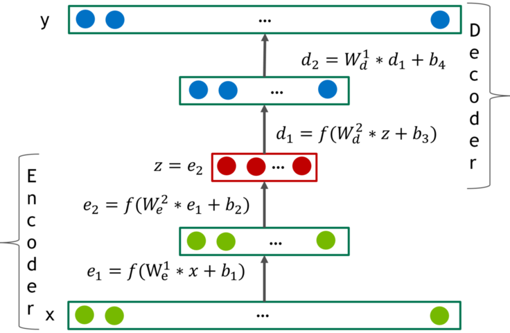

# DeepRec (Training Deep AutoEncoders for Collaborative Filtering)

代码请参考：[DeepRec](https://github.com/PaddlePaddle/PaddleRec/tree/master/models/rank/deeprec)  
如果我们的代码对您有用，还请点个star啊~ 

## 内容

- [DeepRec](#deeprec)
	- [内容](#内容)
	- [模型简介](#模型简介)
	- [数据准备](#数据准备)
	- [运行环境](#运行环境)
	- [快速开始](#快速开始)
	- [模型组网](#模型组网)
	- [效果复现](#效果复现)
	- [进阶使用](#进阶使用)
	- [FAQ](#faq)

## 模型简介
DeepRec使用基于自编码器的协同过滤，加入了一些tricks，达到了比以往的协同过滤方法更好的效果。tricks包括：1. 加大Dropout的比例(0.8); 2. 使用带负值的激活函数selu; 3. 提出Dense re-feeding, 把预测结果重新放回自编码器中作为新的样本再次预测, 以达到数据增强帮助防止模型过拟合

## 数据准备
我们在作者处理过的开源数据集Netflix上验证模型效果，在模型目录的data目录下为您准备了快速运行的示例数据，若需要使用全量数据可以参考下方[效果复现](#效果复现)部分。
数据的格式如下：
生成的格式以\t为分割点

```
u_id	i_id	rating
116	341	3.7
```

## 运行环境
PaddlePaddle>=2.0

python 3.5/3.6/3.7/3.8

os : windows/linux/macos

## 快速开始
本文提供了样例数据可以供您快速体验，在任意目录下均可执行。在deeprec模型目录的快速执行命令如下： 
```bash
# 进入模型目录
# cd models/rank/deeprec # 在任意目录均可运行
# 动态图训练
python -u trainer.py -m config.yaml # 全量数据运行config_bigdata.yaml 
# 动态图预测
python -u infer.py -m config.yaml 
```

## 模型组网
DeepRec是一个自编码器, 由encoder和decoder组成, 在encoder和decoder之间加入了一个drop概率很大的dropout层, 使用selu作为激活函数。模型的主要组网结构如下：

<p align="center">

<p>

### 效果复现
为了方便使用者能够快速的跑通每一个模型，我们在每个模型下都提供了样例数据。如果需要复现readme中的效果,请按如下步骤依次操作即可。 
在全量数据下模型的指标如下：

| 模型 | rmse   | layer_sizes             | batch_size | epoch_num | Time of each epoch |
| :------| :------ | :------ | :------| :------ | -------|
| DeepRec | 0.9172 | [n(17768), 512, 512, 1024] | 128        | 45        | 约55秒 |

1. 确认您当前所在目录为PaddleRec/models/rank/deeprec
2. 进入paddlerec/datasets/Netflix目录下，执行该脚本，会从国内源的服务器上下载Netflix Price数据集，并解压到指定文件夹。

``` bash
cd data
sh run.sh
```
3. 切回模型目录,执行命令运行全量数据
```bash
cd - # 切回模型目录
# 动态图训练
python -u trainer.py -m config_bigdata.yaml # 全量数据运行config_bigdata.yaml 
python -u infer.py -m config_bigdata.yaml # 全量数据运行config_bigdata.yaml 
```

## 进阶使用

## FAQ
