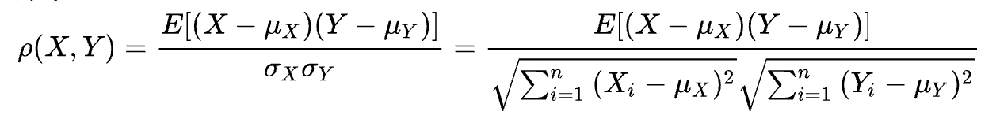

# 多任务相关性分析工具
在多任务学习中，我们一般会将相关性比较强的任务放在一起学习，从而使模型表达能力更强更丰富，我们基于Pearson系数实现了简单版本的数据相关性分析工具，后续会继续更新。  

## Pearson相关性系数
Pearson相关性系数是衡量向量相似度的一种方法。输出范围为-1到+1, 0代表无相关性，负值为负相关，正值为正相关。
公式如下：



## 具体操作
我们这版实现是基于数据label来计算的

1. 获取各个任务的数据集lable（在文件中按列存储），并放到同一个目录下，比如`data`
2. 执行命令
   ```
   task_relation_analyse.py data
   ```
