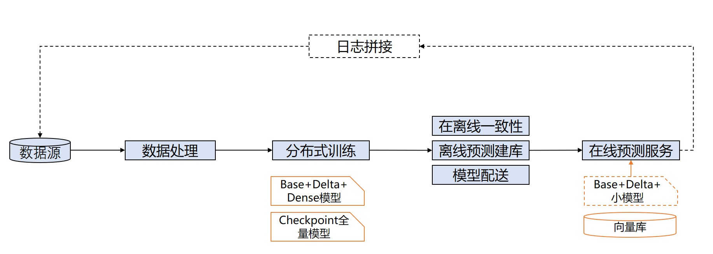

# 推荐全流程
基于推荐场景的技术需求和项目经验，PaddleRec目前已覆盖推荐系统从模型准备到最终线上推理服务的全过程，具体内容参见下图：

1. 线上服务产生的日志，拼接后落盘到存储上形成数据源，数据经过处理进入离线分布式训练系统。  
2. 训练过程持续产生用于线上预测服务的向量库及模型。
3. 离线训练产生的向量灌入在线服务向量库，模型配送到线上，经过在线离线一致性检查后，在线预测服务即可投入使用。    

## 数据准备
PaddleRec支持多种数据源，包括文件、kafka、odps、tf_record等，具体数据源适配和接入方法参见[数据接入](../tools/dataset/README.MD)

## 分布式训练
由于在推荐系统中，会不断产生用于训练模型的日志数据，因此往往采用流式训练模式，即训练数据不是一次性放入训练系统中，而是随着时间不断加入。流式训练具体内容参见[流式训练](./online_trainer.md)  
1. 如果你正在做推荐系统的召回模块，可以参考[dssm模型](../models/match/dssm/readme.md)，除了具体的组网实现之外，在进阶教程中还提供了关于召回模块需要的离线灌库和裁剪网络功能。  
2. 如果你正在做推荐系统的精排模块，可以参考[slot_dnn模型](../models/rank/slot_dnn/README.md)。  

## 特征重要性
在训练过程中，如果你想要衡量模型中特征的重要性，可以参考[特征重要性](./feature_importance.md)

## 在线推理
分布式训练过程中，会保存inference_model用于在线推理。
1. 如果你想要搭建一个独立的推理服务，请参考[Paddle Serving部署](./serving.md)
2. 如果你已经拥有一个在线服务，想要在其中增加Paddle的推理内容，请参考[Paddle Inference部署](../tools/inference/README.md)

## 在线离线一致性检查
在线上服务搭建完成，正式投入使用之前，需要进行在线离线一致性检查，确保在线服务的正确性，具体内容参见[在线离线一致性检查](./onoff_diff.md)
