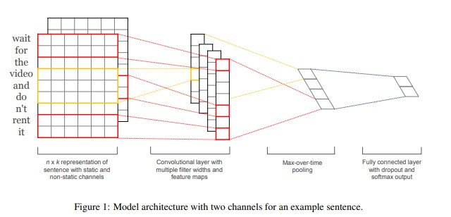

# 内容理解模型库

## 简介
我们提供了常见的内容理解任务中使用的模型算法的PaddleRec实现, 包括动态图和静态图的单机训练&预测效果指标。实现的内容理解模型包括 [Tagspace](tagspace)、[文本分类](textcnn)等。

模型算法库在持续添加中，欢迎关注。

## 目录
* [整体介绍](#整体介绍)
    * [模型列表](#模型列表)
* [使用教程](#使用教程)
    * [快速开始](#快速开始)
    * [模型效果](#模型效果)
    * [效果复现](#效果复现)

## 整体介绍

### 模型列表

|       模型        |       简介        |       论文        |
| :------------------: | :--------------------: | :---------: |
| TagSpace | 标签推荐 | [EMNLP 2014][TagSpace: Semantic Embeddings from Hashtags](https://www.aclweb.org/anthology/D14-1194.pdf) |
| textcnn | 文本分类 | [EMNLP 2014][Convolutional neural networks for sentence classication](https://www.aclweb.org/anthology/D14-1181.pdf) |

下面是每个模型的简介（注：图片引用自链接中的论文）

[TagSpace模型](https://www.aclweb.org/anthology/D14-1194.pdf)
<p align="center">

<p>

[textCNN模型](https://www.aclweb.org/anthology/D14-1181.pdf)
<p align="center">

<p>

## 使用教程

### 快速开始
```bash
# 进入模型目录
cd models/contentunderstanding/xxx # xxx为任意的contentunderstanding下的模型目录
# 动态图训练
python -u ../../../tools/trainer.py -m config.yaml # 全量数据运行config_bigdata.yaml 
# 动态图预测
python -u ../../../tools/infer.py -m config.yaml 

# 静态图训练
python -u ../../../tools/static_trainer.py -m config.yaml # 全量数据运行config_bigdata.yaml 
# 静态图预测
python -u ../../../tools/static_infer.py -m config.yaml 
``` 

### 模型效果
|       数据集        |       模型       |       loss         |       指标         |
| :------------------: | :--------------------: | :---------: |:---------: | 
|       ag news dataset        |       TagSpace       |       0.0198        |       acc：0.9727          | 
|       ChnSentiCorp        |       textcnn       |       0.2282        |        auc：0.9127         | 

### 效果复现
您需要进入PaddleRec/datasets目录下的对应数据集中运行脚本获取全量数据集，然后在模型目录下使用全量数据的参数运行。  
每个模型下的readme中都有详细的效果复现的教程，您可以进入模型的目录中详细查看。  
