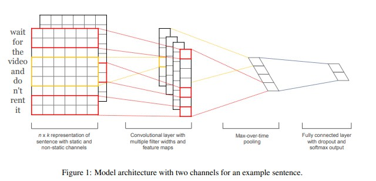

# textcnn文本分类模型

以下是本例的简要目录结构及说明： 

```
├── data #样例数据
    ├── train
        ├── train.txt #训练数据样例
    ├── test
        ├── test.txt #测试数据样例
    ├── preprocess.py #数据处理程序
├── __init__.py
├── README.md #文档
├── config.yaml # sample数据配置
├── config_bigdata.yaml # 全量数据配置
├── static_model.py # 构建静态图
├── dygraph_model.py # 构建动态图
├── net.py # 模型核心组网（动静统一）
├── senti_clas_reader.py #数据读取程序
```
注：在阅读该示例前，建议您先了解以下内容：
[paddlerec入门教程](https://github.com/PaddlePaddle/PaddleRec/blob/master/README.md)    
[textcnn](https://paddlerec.readthedocs.io/en/latest/models/contentunderstanding/textcnn.html)  


## 内容

- [模型简介](#模型简介)
- [数据准备](#数据准备)
- [运行环境](#运行环境)
- [快速开始](#快速开始)
- [模型组网](#模型组网)
- [效果复现](#效果复现)
- [进阶使用](#进阶使用)
- [FAQ](#FAQ)


## 模型简介
TextCNN网络是2014年提出的用来做文本分类的卷积神经网络，由于其结构简单、效果好，在文本分类、推荐等NLP领域应用广泛。对于文本分类问题，常见的方法无非就是抽取文本的特征。然后再基于抽取的特征训练一个分类器。 然而研究证明，TextCnn在文本分类问题上有着更加卓越的表现。从直观上理解，TextCNN通过一维卷积来获取句子中n-gram的特征表示。TextCNN对文本浅层特征的抽取能力很强，在短文本领域专注于意图分类时效果很好，应用广泛，且速度较快。  

## 数据准备
情感倾向分析（Sentiment Classification，简称Senta）针对带有主观描述的中文文本，可自动判断该文本的情感极性类别并给出相应的置信度。情感类型分为积极、消极。情感倾向分析能够帮助企业理解用户消费习惯、分析热点话题和危机舆情监控，为企业提供有利的决策支持。  
情感是人类的一种高级智能行为，为了识别文本的情感倾向，需要深入的语义建模。另外，不同领域（如餐饮、体育）在情感的表达各不相同，因而需要有大规模覆盖各个领域的数据进行模型训练。为此，我们通过基于深度学习的语义模型和大规模数据挖掘解决上述两个问题。  
数据格式为一句中文的评价语句，和一个代表情感信息的标签。两者之间用/t分隔，中文的评价语句已经分词，词之间用空格分隔。  
```
15.4寸 笔记本 的 键盘 确实 爽 ， 基本 跟 台式机 差不多 了 ， 蛮 喜欢 数字 小 键盘 ， 输 数字 特 方便 ， 样子 也 很 美观 ， 做工 也 相当 不错    1
跟 心灵 鸡汤 没 什么 本质 区别 嘛 ， 至少 我 不 喜欢 这样 读 经典 ， 把 经典 都 解读 成 这样 有点 去 中国 化 的 味道 了 0
```

## 运行环境
PaddlePaddle>=2.0

python 2.7/3.5/3.6/3.7

os : windows/linux/macos 


## 快速开始
本文提供了样例数据可以供您快速体验，在任意目录下均可执行。在textcnn模型目录的快速执行命令如下： 
```bash
# 进入模型目录
# cd models/contentunderstanding/textcnn # 在任意目录均可运行
# 动态图训练
python -u ../../../tools/trainer.py -m config.yaml # 全量数据运行config_bigdata.yaml 
# 动态图预测
python -u ../../../tools/infer.py -m config.yaml 

# 静态图训练
python -u ../../../tools/static_trainer.py -m config.yaml # 全量数据运行config_bigdata.yaml 
# 静态图预测
python -u ../../../tools/static_infer.py -m config.yaml 
``` 

## 模型组网
Yoon Kim在论文[EMNLP 2014][Convolutional neural networks for sentence classication](https://www.aclweb.org/anthology/D14-1181.pdf)提出了TextCNN并给出基本的结构。将卷积神经网络CNN应用到文本分类任务，利用多个不同size的kernel来提取句子中的关键信息（类似于多窗口大小的ngram），从而能够更好地捕捉局部相关性。模型的主体结构如图所示：  
<p align="center">

<p>


## 效果复现
为了方便使用者能够快速的跑通每一个模型，我们在每个模型下都提供了样例数据。如果需要复现readme中的效果,请按如下步骤依次操作即可。  
我们基于开源情感倾向分类数据集ChnSentiCorp进行评测，模型在测试集上的准确率如表所示：  

| 模型 | auc | batch_size | epoch_num| Time of each epoch |
| :------| :------ | :------ | :------| :------ | 
| textcnn | 0.91 | 128 | 10 | 约40s |

1. 确认您当前所在目录为PaddleRec/models/contentunderstanding/textcnn  
2. 进入paddlerec/datasets/senti_clas目录下，执行该脚本，会从国内源的服务器上下载我们预处理完成的senti_clas全量数据集，并解压到指定文件夹。
``` bash
cd ../../../datasets/senti_clas
sh run.sh
```
3. 切回模型目录,执行命令运行全量数据
```bash
cd - # 切回模型目录
# 动态图训练
python -u ../../../tools/trainer.py -m config_bigdata.yaml # 全量数据运行config_bigdata.yaml 
python -u ../../../tools/infer.py -m config_bigdata.yaml # 全量数据运行config_bigdata.yaml 
```

## 进阶使用

## FAQ
  
