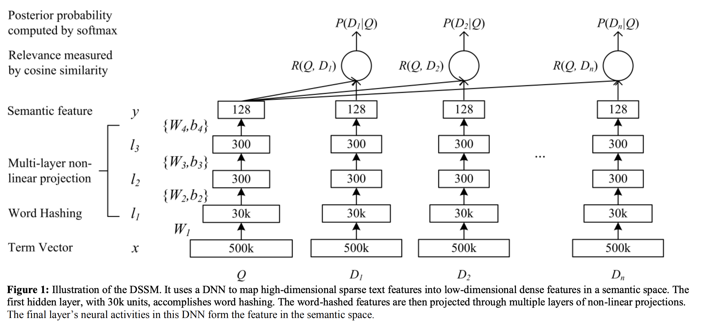

# DSSM文本匹配模型

以下是本例的简要目录结构及说明： 

```
├── data #样例数据
    ├── train
        ├── train.txt #训练数据样例
    ├── test
        ├── test.txt #测试数据样例
    ├── preprocess.py #数据处理程序
    ├── data_process #数据一键处理脚本
├── __init__.py
├── README.md #文档
├── config.yaml # sample数据配置
├── config_bigdata.yaml # 全量数据配置
├── net.py # 模型核心组网（动静统一）
├── static_model.py # 构建静态图
├── dygraph_model.py # 构建动态图
├── transform.py #将数据整理成合适的格式方便计算指标
├── run.sh #全量数据集中的训练脚本，从训练到预测并计算指标
├── bq_reader_train.py #训练时数据读取程序
├── bq_reader_infer.py #预测时数据读取程序
```

注：在阅读该示例前，建议您先了解以下内容：

[paddlerec入门教程](https://github.com/PaddlePaddle/PaddleRec/blob/master/README.md)

## 内容

- [模型简介](#模型简介)
- [数据准备](#数据准备)
- [运行环境](#运行环境)
- [快速开始](#快速开始)
- [模型组网](#模型组网)
- [效果复现](#效果复现)
- [进阶使用](#进阶使用)
- [FAQ](#FAQ)

## 模型简介
DSSM是Deep Structured Semantic Model的缩写，即我们通常说的基于深度网络的语义模型，其核心思想是将query和doc映射到到共同维度的语义空间中，通过最大化query和doc语义向量之间的余弦相似度，从而训练得到隐含语义模型，达到检索的目的。DSSM有很广泛的应用，比如：搜索引擎检索，广告相关性，问答系统，机器翻译等。    

## 数据准备
BQ是一个智能客服中文问句匹配数据集，该数据集是自动问答系统语料，共有120,000对句子对，并标注了句子对相似度值。数据中存在错别字、语法不规范等问题，但更加贴近工业场景。
原始数据集样例：
```
请问一天是否都是限定只能转入或转出都是五万。    微众多少可以赎回短期理财        0
微粒咨询电话号码多少    你们的人工客服电话是多少        1
已经在银行换了新预留号码。      我现在换了电话号码，这个需要更换吗      1
每个字段以tab键分隔，第1，2列表示两个文本。第3列表示类别（0或1，0表示两个文本不相似，1表示两个文本相似）。
```

## 运行环境
PaddlePaddle>=2.0

python 2.7/3.5/3.6/3.7

os : windows/linux/macos 

## 快速开始
本文提供了样例数据可以供您快速体验，在任意目录下均可执行。在dssm模型目录的快速执行命令如下： 
```bash
# 进入模型目录
# cd models/match/dssm # 在任意目录均可运行
# 动态图训练
python -u ../../../tools/trainer.py -m config.yaml # 全量数据运行config_bigdata.yaml 
# 动态图预测
python -u ../../../tools/infer.py -m config.yaml 

# 静态图训练
python -u ../../../tools/static_trainer.py -m config.yaml # 全量数据运行config_bigdata.yaml 
# 静态图预测
python -u ../../../tools/static_infer.py -m config.yaml 
``` 

## 模型组网
DSSM 的输入采用 BOW（Bag of words）的方式，相当于把字向量的位置信息抛弃了，整个句子里的词都放在一个袋子里了。将一个句子用这种方式转化为一个向量输入DNN中。  
Query 和 Doc 的语义相似性可以用这两个向量的 cosine 距离表示，然后通过softmax 函数选出与Query语义最相似的样本 Doc 。  

模型的具体细节可以阅读论文[DSSM](https://www.microsoft.com/en-us/research/wp-content/uploads/2016/02/cikm2013_DSSM_fullversion.pdf):
<p align="center">

<p>

## 效果复现
为了方便使用者能够快速的跑通每一个模型，我们在每个模型下都提供了样例数据。如果需要复现readme中的效果,请按如下步骤依次操作即可。  
在全量数据下模型的指标如下：  

| 模型 | 正序率 | batch_size | epoch_num| Time of each epoch |
| :------| :------ | :------ | :------| :------ | 
| DSSM | 0.79 | 128 | 1 | 约7分钟 |  

1. 确认您当前所在目录为PaddleRec/models/match/dssm
2. 进入paddlerec/datasets/BQ_dssm目录下，执行该脚本，会从国内源的服务器上下载我们预处理完成的BQ全量数据集，并解压到指定文件夹。  
``` bash
cd ../../../datasets/BQ_dssm
sh run.sh
```
3. 切回模型目录,直接一键运行：bash run.sh 即可得到复现的论文效果.
执行该脚本后，会开始自动训练并测试模型，将测试的结果保存到result.txt文件，再执行transform.py整理格式，最后通过执行../../../tools/cal_pos_neg.py进行评估得到数据的正序率指标   
```bash
cd - # 切回模型目录
bash run.sh #动态图训练并测试，最后得到指标
```

## 进阶使用
  
## FAQ
