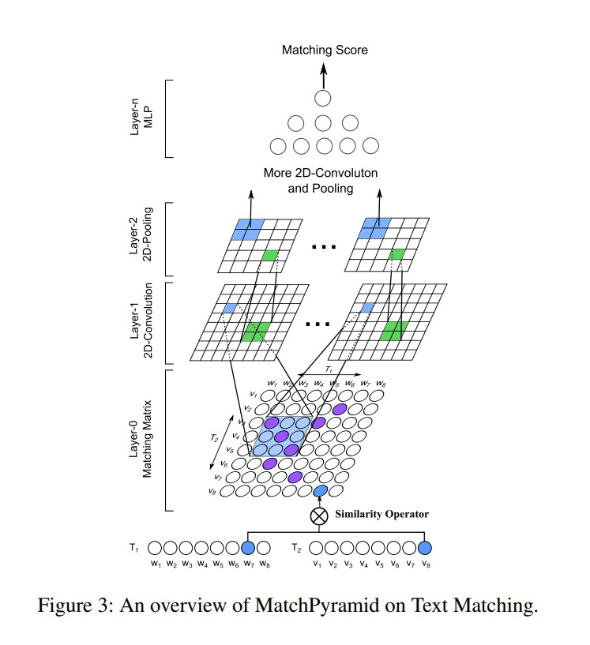

# match-pyramid文本匹配模型

以下是本例的简要目录结构及说明： 

```
├── data #样例数据
    ├── process.py #数据处理脚本
    ├── relation.test.fold1.txt #评估计算指标时用到的关系文件
    ├── train
    	├── train.txt #训练数据样例
    ├── test
    	├── test.txt #测试数据样例
├── __init__.py
├── README.md #文档
├── config.yaml # sample数据配置
├── config_bigdata.yaml # 全量数据配置
├── data_process.sh #数据下载和处理脚本
├── dygraph_model.py # 构建动态图
├── eval.py #计算指标的评估程序
├── net.py # 模型核心组网（动静统一）
├── letor_reader.py #数据读取程序
├── static_model.py # 构建静态图
├── run.sh #一键运行程序
```

注：在阅读该示例前，建议您先了解以下内容：

[paddlerec入门教程](https://github.com/PaddlePaddle/PaddleRec/blob/master/README.md)  
[match-pyramid](https://paddlerec.readthedocs.io/en/latest/models/match/match-pyramid.html)  

## 内容

- [模型简介](#模型简介)
- [数据准备](#数据准备)
- [运行环境](#运行环境)
- [快速开始](#快速开始)
- [模型组网](#模型组网)
- [效果复现](#效果复现)
- [进阶使用](#进阶使用)
- [FAQ](#FAQ)


## 模型简介
在许多自然语言处理任务中，匹配两个文本是一个基本问题。一种有效的方法是从单词，短语和句子中提取有意义的匹配模式以产生匹配分数。受卷积神经网络在图像识别中的成功启发，神经元可以根据提取的基本视觉模式（例如定向的边角和边角）捕获许多复杂的模式，所以我们尝试将文本匹配建模为图像识别问题。本模型对齐原作者庞亮开源的tensorflow代码：https://github.com/pl8787/MatchPyramid-TensorFlow/blob/master/model/model_mp.py， 实现了下述论文中提出的Match-Pyramid模型：

```text
@inproceedings{Pang L , Lan Y , Guo J , et al. Text Matching as Image Recognition[J]. 2016.,
  title={Text Matching as Image Recognition},
  author={Liang Pang, Yanyan Lan, Jiafeng Guo, Jun Xu, Shengxian Wan, Xueqi Cheng},
  year={2016}
}
```

## 数据准备
训练及测试数据集选用Letor07数据集和 embed_wiki-pdc_d50_norm 词向量初始化embedding层。  
该数据集包括：  
1.词典文件：我们将每个单词映射得到一个唯一的编号wid，并将此映射保存在单词词典文件中。例如：word_dict.txt  
2.语料库文件：我们使用字符串标识符的值表示一个句子的编号。第二个数字表示句子的长度。例如：qid_query.txt和docid_doc.txt  
3.关系文件：关系文件被用来存储两个句子之间的关系，如query 和document之间的关系。例如：relation.train.fold1.txt, relation.test.fold1.txt  
4.嵌入层文件：我们将预训练的词向量存储在嵌入文件中。例如：embed_wiki-pdc_d50_norm  

## 运行环境
PaddlePaddle>=2.0

python 2.7/3.5/3.6/3.7

os : windows/linux/macos  

## 快速开始
本文提供了样例数据可以供您快速体验，在任意目录下均可执行。在match-pyramid模型目录的快速执行命令如下： 
```bash
# 进入模型目录
# cd models/match/match-pyramid # 在任意目录均可运行
# 动态图训练
python -u ../../../tools/trainer.py -m config.yaml # 全量数据运行config_bigdata.yaml 
# 动态图预测
python -u ../../../tools/infer.py -m config.yaml 

# 静态图训练
python -u ../../../tools/static_trainer.py -m config.yaml # 全量数据运行config_bigdata.yaml 
# 静态图预测
python -u ../../../tools/static_infer.py -m config.yaml 
```  

## 模型组网
受卷积神经网络在图像识别中的成功启发，神经元可以根据提取的基本视觉模式（例如定向的边角和边角）捕获许多复杂的模式，所以我们尝试将文本匹配建模为图像识别问题。模型的组网结构如下：  
[match-pyramid](https://arxiv.org/pdf/1602.06359.pdf):
<p align="center">

<p>


## 效果复现
为了方便使用者能够快速的跑通每一个模型，我们在每个模型下都提供了样例数据。如果需要复现readme中的效果,请按如下步骤依次操作即可。  
在全量数据下模型的指标如下：  

| 模型 | map | batch_size | epoch_num| Time of each epoch |
| :------| :------ | :------ | :------| :------ | 
| match-pyramid | 0.39 | 128 | 2 | 约5分钟 |

1. 确认您当前所在目录为PaddleRec/models/match/match-pyramid
2. 进入paddlerec/datasets/letor07目录下，执行该脚本，会从国内源的服务器上下载我们预处理完成的Letor07全量数据集，并解压到指定文件夹。
``` bash
cd ../../../datasets/letor07
bash run.sh
```
3. 切回模型目录,直接一键运行：bash run.sh 即可得到复现的论文效果.
执行该脚本后，会开始自动训练并测试模型，将测试的结果保存到result.txt文件，最后通过执行eval.py进行评估得到数据的map指标   
```bash
cd - # 切回模型目录
bash run.sh #动态图训练并测试，最后得到指标
```

## 进阶使用
  
## FAQ
