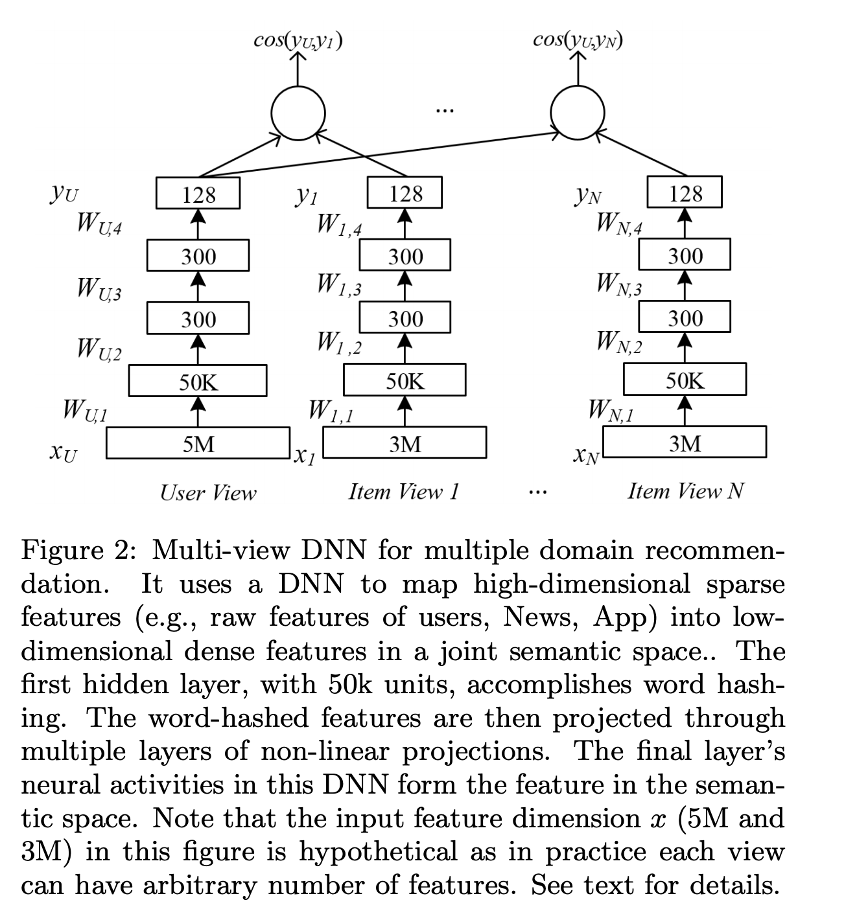

# multiview-simnet文本匹配模型

以下是本例的简要目录结构及说明： 

```
├── data #样例数据
    ├── train
        ├── train.txt #训练数据样例
    ├── test
        ├── test.txt #测试数据样例
    ├── preprocess.py #数据处理程序
    ├── data_process.sh #一键数据处理脚本
├── __init__.py
├── README.md #文档
├── config_bigdata.yaml #配置文件
├── config.yaml #配置文件
├── static_model.py # 构建静态图
├── dygraph_model.py # 构建动态图
├── run.sh #运行脚本,在效果复现时使用
├── transform.py #整理格式准备计算指标的程序
├── net.py # 模型核心组网（动静统一）
├── bq_reader_train.py #训练时数据读取程序
├── bq_reader_infer.py #预测时数据读取程序
```
注：在阅读该示例前，建议您先了解以下内容：

[paddlerec入门教程](https://github.com/PaddlePaddle/PaddleRec/blob/master/README.md)  
[multiview-sminet](https://paddlerec.readthedocs.io/en/latest/models/match/multiview-simnet.html)  

## 内容

- [模型简介](#模型简介)
- [数据准备](#数据准备)
- [运行环境](#运行环境)
- [快速开始](#快速开始)
- [模型组网](#模型组网)
- [效果复现](#效果复现)
- [进阶使用](#进阶使用)
- [FAQ](#FAQ)


## 模型简介
在个性化推荐场景中，推荐系统给用户提供的项目（Item）列表通常是通过个性化的匹配模型计算出来的。在现实世界中，一个用户可能有很多个视角的特征，比如用户Id，年龄，项目的点击历史等。一个项目，举例来说，新闻资讯，也会有多种视角的特征比如新闻标题，新闻类别等。多视角Simnet模型是可以融合用户以及推荐项目的多个视角的特征并进行个性化匹配学习的一体化模型。 

## 数据准备
BQ是一个智能客服中文问句匹配数据集，该数据集是自动问答系统语料，共有120,000对句子对，并标注了句子对相似度值。数据中存在错别字、语法不规范等问题，但更加贴近工业场景。
原始数据集样例：
```
请问一天是否都是限定只能转入或转出都是五万。    微众多少可以赎回短期理财        0
微粒咨询电话号码多少    你们的人工客服电话是多少        1
已经在银行换了新预留号码。      我现在换了电话号码，这个需要更换吗      1
每个字段以tab键分隔，第1，2列表示两个文本。第3列表示类别（0或1，0表示两个文本不相似，1表示两个文本相似）。
```
最终输出的数据格式为一个标识句子的slot，后跟一个句子中词的token。两者形成{slot：token}的形式标识一个词：  
```
0:358 0:206 0:205 0:250 0:9 0:3 0:207 0:10 0:330 0:164 1:1144 1:217 1:206 1:9 1:3 1:207 1:10 1:398 1:2 2:217 2:206 2:9 2:3 2:207 2:10 2:398 2:2
0:358 0:206 0:205 0:250 0:9 0:3 0:207 0:10 0:330 0:164 1:951 1:952 1:206 1:9 1:3 1:207 1:10 1:398 2:217 2:206 2:9 2:3 2:207 2:10 2:398 2:2
```


## 运行环境
PaddlePaddle>=2.0

python 2.7/3.5/3.6/3.7

os : windows/linux/macos 

## 快速开始
本文提供了样例数据可以供您快速体验，在任意目录下均可执行。在multiview-simnet模型目录的快速执行命令如下： 
```bash
# 进入模型目录
# cd models/match/multiview-simnet # 在任意目录均可运行
# 动态图训练
python -u ../../../tools/trainer.py -m config.yaml # 全量数据运行config_bigdata.yaml 
# 动态图预测
python -u ../../../tools/infer.py -m config.yaml 

# 静态图训练
python -u ../../../tools/static_trainer.py -m config.yaml # 全量数据运行config_bigdata.yaml 
# 静态图预测
python -u ../../../tools/static_infer.py -m config.yaml 
``` 

## 模型组网
多视角Simnet模型包括多个编码器模块，每个编码器被用在不同的特征视角上。当前，项目中提供Bag-of-Embedding编码器，Temporal-Convolutional编码器，和Gated-Recurrent-Unit编码器。我们会逐渐加入稀疏特征场景下比较实用的编码器到这个项目中。模型的训练方法，当前采用的是Pairwise ranking模式进行训练，即针对一对具有关联的User-Item组合，随机实用一个Item作为负例进行排序学习。 

模型的具体细节可以阅读论文[MultiView-Simnet](https://www.microsoft.com/en-us/research/wp-content/uploads/2016/02/frp1159-songA.pdf):
<p align="center">

<p>

## 效果复现
为了方便使用者能够快速的跑通每一个模型，我们在每个模型下都提供了样例数据。如果需要复现readme中的效果,请按如下步骤依次操作即可。
在全量数据下模型的指标如下：  

| 模型 | 正序率 | batch_size | epoch_num| Time of each epoch |
| :------| :------ | :------ | :------| :------ | 
| multiview-simnet | 0.82 | 1280 | 1 | 约20分钟 |  

1. 确认您当前所在目录为PaddleRec/models/match/multiview-simnet  
2. 进入paddlerec/datasets/BQ_simnet目录下，执行该脚本，会从国内源的服务器上下载我们预处理完成的BQ全量数据集，并解压到指定文件夹。  
``` bash
cd ../../../datasets/BQ_simnet
sh run.sh
```
3. 切回模型目录,直接一键运行：bash run.sh 即可得到复现的论文效果.
执行该脚本后，会开始自动训练并测试模型，将测试的结果保存到result.txt文件，再执行transform.py整理格式，最后通过执行../../../tools/cal_pos_neg.py进行评估得到数据的正序率指标   
```bash
cd - # 切回模型目录
bash run.sh #动态图训练并测试，最后得到指标
```

## 进阶使用
  
## FAQ
