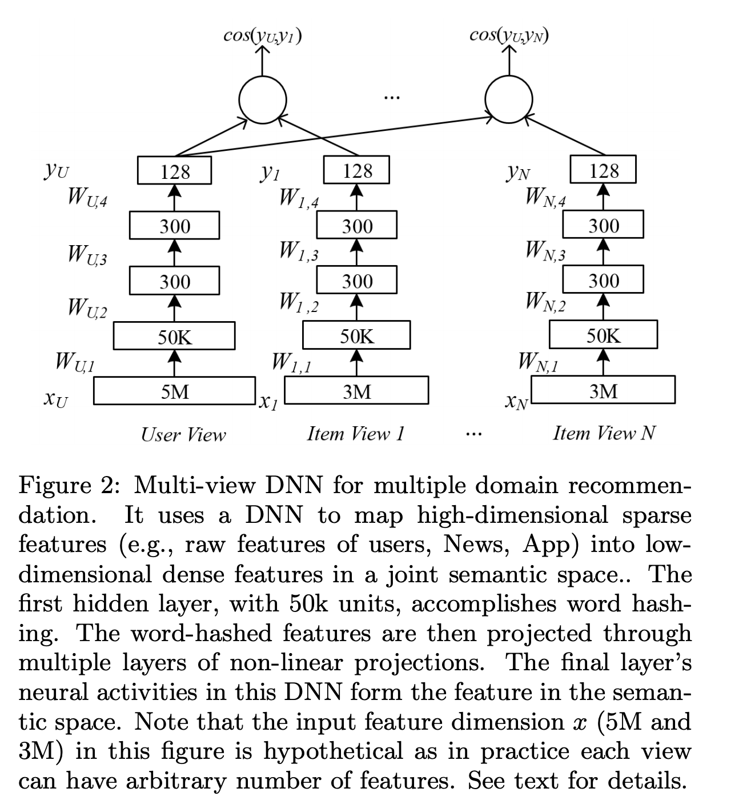

# 匹配模型库

## 简介
我们提供了常见的匹配任务中使用的模型算法的PaddleRec实现, 单机训练&预测效果指标以及分布式训练&预测性能指标等。实现的模型包括 [DSSM](http://gitlab.baidu.com/tangwei12/paddlerec/tree/develop/models/match/dssm)、[MultiView-Simnet](http://gitlab.baidu.com/tangwei12/paddlerec/tree/develop/models/match/multiview-simnet)。

模型算法库在持续添加中，欢迎关注。

## 目录
* [整体介绍](#整体介绍)
    * [匹配模型列表](#匹配模型列表)
* [使用教程](#使用教程)
    * [训练&预测](#训练&预测)

## 整体介绍
### 匹配模型列表

|       模型        |       简介        |       论文        |
| :------------------: | :--------------------: | :---------: |
| DSSM | Deep Structured Semantic Models | [Learning Deep Structured Semantic Models for Web Search using Clickthrough Data](https://www.microsoft.com/en-us/research/wp-content/uploads/2016/02/cikm2013_DSSM_fullversion.pdf)(2013) |
| MultiView-Simnet | Multi-view Simnet for Personalized recommendation | [A Multi-View Deep Learning Approach for Cross Domain User Modeling in Recommendation Systems](https://www.microsoft.com/en-us/research/wp-content/uploads/2016/02/frp1159-songA.pdf)(2015) |

下面是每个模型的简介（注：图片引用自链接中的论文）

[DSSM](https://www.microsoft.com/en-us/research/wp-content/uploads/2016/02/cikm2013_DSSM_fullversion.pdf):
<p align="center">

<p>

[MultiView-Simnet](https://www.microsoft.com/en-us/research/wp-content/uploads/2016/02/frp1159-songA.pdf):
<p align="center">

<p>

## 使用教程
### 训练&预测
```shell
python -m paddlerec.run -m paddlerec.models.match.dssm # dssm
python -m paddlerec.run -m paddlerec.models.match.multiview-simnet # multiview-simnet
```
