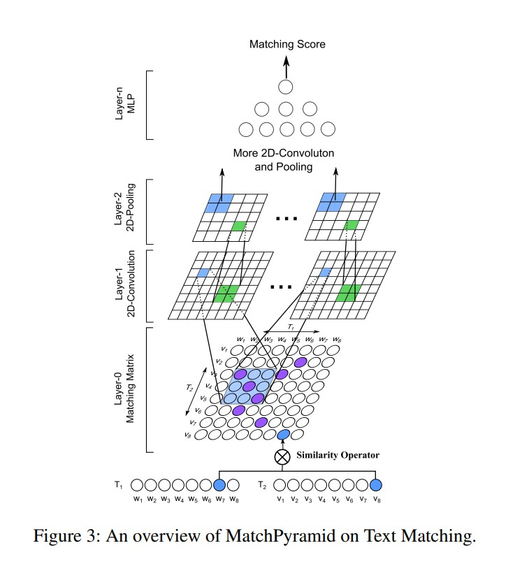

# 匹配模型库

## 简介
我们提供了常见的匹配任务中使用的模型算法的PaddleRec实现, 单机训练&预测效果指标以及分布式训练&预测性能指标等。实现的模型包括 [DSSM](http://gitlab.baidu.com/tangwei12/paddlerec/tree/develop/models/match/dssm)、[MultiView-Simnet](http://gitlab.baidu.com/tangwei12/paddlerec/tree/develop/models/match/multiview-simnet)、[match-pyramid](https://github.com/PaddlePaddle/PaddleRec/tree/master/models/match/match-pyramid)。

模型算法库在持续添加中，欢迎关注。

## 目录
* [整体介绍](#整体介绍)
    * [匹配模型列表](#匹配模型列表)
* [使用教程](#使用教程)
    * [训练&预测](#训练&预测)

## 整体介绍
### 匹配模型列表

|       模型        |       简介        |       论文        |
| :------------------: | :--------------------: | :---------: |
| DSSM | Deep Structured Semantic Models | [CIKM 2013][Learning Deep Structured Semantic Models for Web Search using Clickthrough Data](https://www.microsoft.com/en-us/research/wp-content/uploads/2016/02/cikm2013_DSSM_fullversion.pdf) |
| MultiView-Simnet | Multi-view Simnet for Personalized recommendation | [WWW 2015][A Multi-View Deep Learning Approach for Cross Domain User Modeling in Recommendation Systems](https://www.microsoft.com/en-us/research/wp-content/uploads/2016/02/frp1159-songA.pdf) |
| match-pyramid | Text Matching as Image Recognition | [arXiv W2016][Text Matching as Image Recognition](https://arxiv.org/pdf/1602.06359.pdf) |


下面是每个模型的简介（注：图片引用自链接中的论文）

[DSSM](https://www.microsoft.com/en-us/research/wp-content/uploads/2016/02/cikm2013_DSSM_fullversion.pdf):
<p align="center">

<p>

[MultiView-Simnet](https://www.microsoft.com/en-us/research/wp-content/uploads/2016/02/frp1159-songA.pdf):
<p align="center">

<p>

[match-pyramid](https://arxiv.org/pdf/1602.06359.pdf):
<p align="center">

<p>

## 使用教程(快速开始)
### 训练&预测
每个模型都提供了样例数据可以供您快速体验，在paddlerec目录下直接执行下面的命令即可启动训练：
```
python -m paddlerec.run -m models/match/dssm/config.yaml # dssm
python -m paddlerec.run -m models/match/multiview-simnet/config.yaml # multiview-simnet
python -m paddlerec.run -m models/contentunderstanding/match-pyramid/config.yaml #match-pyramid
```
### 效果复现
每个模型下的readme中都有详细的效果复现的教程，您可以进入模型的目录中详细查看  

### 模型效果 (测试)

|       数据集        |       模型       |      auc          |       map       |  
| :------------------: | :--------------------: | :---------: |:---------: |
|       zhidao       |       DSSM       |       0.55        |       --          | 
|       Letor07        |       match-pyramid       |       --        |      0.42          | 
|       zhidao        |       multiview-simnet       |       0.59        |       --          |
