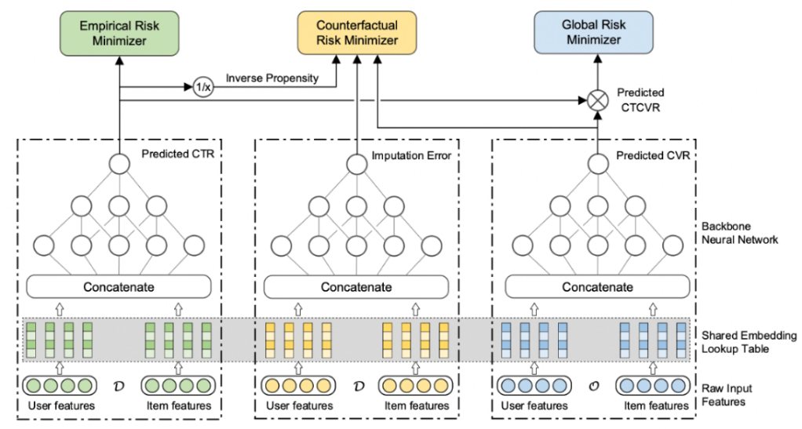
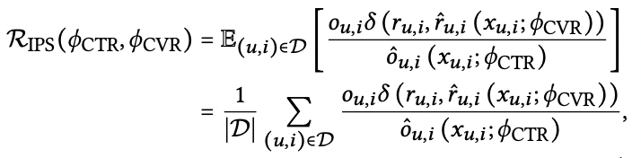
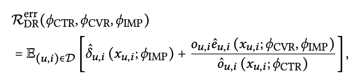
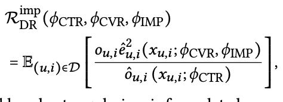
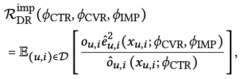

# ESCM2


以下是本例的简要目录结构及说明： 

```
├── data # 文档
    ├── train #训练数据
        ├──small.txt
    ├── test  #测试数据
		    ├── small.txt
├── __init__.py 
├── readme.md #文档
├── config.yaml # sample数据配置
├── config_bigdata.yaml # 全量数据配置
├── escm_reader.py # 数据读取程序
├── net.py # 模型核心组网（动静统一）
├── static_model.py # 构建静态图
├── dygraph_model.py # 构建动态图
```

注：在阅读该示例前，建议您先了解以下内容：

[paddlerec入门教程](https://github.com/PaddlePaddle/PaddleRec/blob/master/README.md)

## 内容

- [模型简介](#模型简介)
- [数据准备](#数据准备)
- [运行环境](#运行环境)
- [快速开始](#快速开始)
- [模型组网](#模型组网)
- [效果复现](#效果复现)
- [进阶使用](#进阶使用)
- [FAQ](#FAQ)

## 模型简介
该模型主要解决ESMM存在的两个问题：

1. **Inherent Estimation Bias (IEB)** 作者认为ESMM的CVR估计是高于真实情况的。
2. **Potential Independence Priority (PIP)** ESMM忽略了转化依赖点击这一因果性关系。

ESCM2是阿里发表在 SIGIR’2022 的论文[《ESCM2: Entire Space Counterfactual Multi-Task Model for Post-Click Conversion Rate Estimation》](  https://arxiv.org/pdf/2204.05125.pdf  )文章基于因果推断的思路来解决ESMM中的IEB和PIP问题。

## 数据准备
我们在开源数据集[Ali-CCP：Alibaba Click and Conversion Prediction](  https://tianchi.aliyun.com/datalab/dataSet.html?dataId=408  )上验证模型效果。在模型目录的data目录下为您准备了快速运行的示例数据，若需要使用全量数据可以参考下方[效果复现](#效果复现)部分。
数据格式参见demo数据：data/train

## 运行环境
PaddlePaddle>=2.0

python 2.7/3.5/3.6/3.7

os : windows/linux/macos 

## 快速开始
本文提供了样例数据可以供您快速体验，在任意目录下均可执行。在escm2模型目录的快速执行命令如下： 
```bash
# 进入模型目录
# cd models/multitask/escm2 # 在任意目录均可运行
# 动态图训练
python -u ../../../tools/trainer.py -m config.yaml # 全量数据运行config_bigdata.yaml 
# 动态图预测
python -u ../../../tools/infer.py -m config.yaml 

# 静态图训练
python -u ../../../tools/static_trainer.py -m config.yaml # 全量数据运行config_bigdata.yaml 
# 静态图预测
python -u ../../../tools/static_infer.py -m config.yaml 
```

## 模型组网
ESCM2使用了因果推荐中的IPW和DR方法来进行纠偏。模型的主要组网结构如下：

<p align="center">

<p>

其中IPW部分优化函数为：

<p align="center">

<p>

DR部分优化函数为：

<p align="center">

<p>
<p align="center">

<p>
<p align="center">

<p>

## 效果复现
为了方便使用者能够快速的跑通每一个模型，我们在每个模型下都提供了样例数据。如果需要复现readme中的效果,请按如下步骤依次操作即可。 
在全量数据下模型的训练指标如下：
| 模型 | auc_ctr | batch_size | epoch_num | Time of each epoch |
| :------| :------ | :------ | :------| :------ | 
| ESCM2 | 0.82 | 1024 | 10 | 约3分钟 |

1. 确认您当前所在目录为PaddleRec/models/multitask/esmm  
2. 进入paddlerec/datasets/ali-ccp目录下，执行该脚本，会从国内源的服务器上下载我们预处理完成的ali-ccp全量数据集，并解压到指定文件夹。
``` bash
cd ../../../datasets/ali-ccp
sh run.sh
``` 
3. 切回模型目录,执行命令运行全量数据
```bash
cd - # 切回模型目录
# 动态图训练
python -u ../../../tools/trainer.py -m config_bigdata.yaml # 全量数据运行config_bigdata.yaml 
python -u ../../../tools/infer.py -m config_bigdata.yaml # 全量数据运行config_bigdata.yaml 
```

## 进阶使用
  
## FAQ
