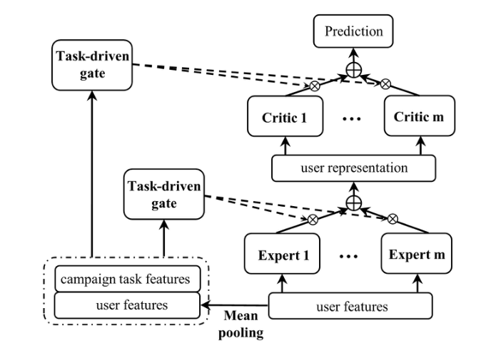

# MetaHeac

以下是本例的简要目录结构及说明：

```
├── data #样例数据
    ├── train #训练数据
        ├── train_stage1.pkl
    ├── test #测试数据
        ├── test_stage1.pkl
        ├── test_stage2.pkl
├── net.py # 核心模型组网
├── config.yaml # sample数据配置
├── config_big.yaml # 全量数据配置
├── dygraph_model.py # 构建动态图
├── reader_train.py # 训练数据读取程序
├── reader_test.py # infer数据读取程序
├── readme.md #文档
```

注：在阅读该示例前，建议您先了解以下内容：

[paddlerec入门教程](https://github.com/PaddlePaddle/PaddleRec/blob/master/README.md)

## 内容

- [模型简介](#模型简介)
- [数据准备](#数据准备)
- [运行环境](#运行环境)
- [快速开始](#快速开始)
- [模型组网](#模型组网)
- [效果复现](#效果复现)
- [infer说明](#infer说明)
- [进阶使用](#进阶使用)
- [FAQ](#FAQ)

## 模型简介
在推荐系统和广告平台上，营销人员总是希望通过视频或者社交等媒体渠道向潜在用户推广商品、内容或者广告。扩充候选集技术（Look-alike建模）是一种很有效的解决方案，但look-alike建模通常面临两个挑战：（1）一家公司每天可以开展数百场营销活动，以推广完全不同类别的各种内容。（2）某项活动的种子集只能覆盖有限的用户，因此一个基于有限种子用户的定制化模型往往会产生严重的过拟合。为了解决以上的挑战，论文《Learning to Expand Audience via Meta Hybrid Experts and Critics for Recommendation and Advertising》提出了一种新的两阶段框架Meta Hybrid Experts and Critics (MetaHeac)，采用元学习的方法训练一个泛化初始化模型，从而能够快速适应新类别内容推广任务。

## 数据准备
使用Tencent Look-alike Dataset,该数据集包含几百个种子人群、海量候选人群对应的用户特征，以及种子人群对应的广告特征。出于业务数据安全保证的考虑，所有数据均为脱敏处理后的数据。本次复现使用处理过的数据集，直接下载[propocessed data](https://drive.google.com/file/d/11gXgf_yFLnbazjx24ZNb_Ry41MI5Ud1g/view?usp=sharing),mataheac/data/目录下存放了从全量数据集获取的少量数据集，用于对齐模型。

## 运行环境
PaddlePaddle>=2.0

python 2.7/3.5/3.6/3.7

os : windows/linux/macos

## 快速开始
本文提供了样例数据可以供您快速体验，在任意目录下均可执行。在MetaHeac模型目录的快速执行命令如下：
```bash
# 进入模型目录
# cd PaddleRec/models/multitask/metaheac/ # 在任意目录均可运行
# 动态图训练
python -u ../../../tools/trainer.py -m config.yaml # 全量数据运行config_bigdata.yaml 
# 动态图预测
python -u ./infer.py -m config.yaml
```

## 模型组网
MetaHeac是发表在 KDD 2021 的论文[《Learning to Expand Audience via Meta Hybrid Experts and Critics for Recommendation and Advertising》](  https://arxiv.org/pdf/2105.14688  )文章提出一种新的两阶段框架Meta Hybrid Experts and Critics (MetaHeac),有效解决了真实场景中难以构建泛化模型,同时在所有内容领域中扩充高质量的受众候选集和基于有限种子用户的定制化模型容易产生严重过拟合的两个关键问题模型的主要组网结构如下：
[MetaHeac](https://arxiv.org/pdf/2105.14688):
<p align="center">

<p>

## 效果复现
为了方便使用者能够快速的跑通每一个模型，我们在每个模型下都提供了样例数据。如果需要复现readme中的效果,请按如下步骤依次操作即可。
在全量数据下模型的指标如下(train.py文件内 paddle.seed = 2021下效果)：

| 模型    | auc    | batch_size | epoch_num| Time of each epoch |
|:------|:-------| :------ | :------| :------ |
| MetaHeac | 0.7112 | 1024 | 1 | 3个小时左右 |

1. 确认您当前所在目录为PaddleRec/models/multitask/metaheac  
2. 进入paddlerec/datasets/目录下，执行该脚本，会从国内源的服务器上下载我们预处理完成的Lookalike全量数据集，并解压到指定文件夹。
``` bash
cd ../../../datasets/Lookalike
sh run.sh
``` 
3. 切回模型目录,执行命令运行全量数据
```bash
cd ../../models/multitask/metaheac/ # 切回模型目录
# 动态图训练
# step1： train
python -u ../../../tools/trainer.py -m config_big.yaml
# 动态图预测
# step2： infer 此时test数据集为hot
python -u ./infer.py -m config_big.yaml
# step3：修改config_big.yaml文件中test_data_dir的路径为cold
# python -u ./infer.py -m config.yaml
```

## infer说明
### 数据集说明
为了测试模型在不同规模的内容定向推广任务上的表现，将数据集根据内容定向推广任务给定的候选集大小进行了划分，分为大于T和小于T两部分。将腾讯广告大赛2018的Look-alike数据集中的T设置为4000，其中hot数据集中候选集大于T,cold数据集中候选集小于T.
### infer.py说明
infer.py是用于元学习模型infer的tool,在使用中主要有以下几点需要注意:
1. 在对模型进行infer时(train时也可使用这样的操作),可以将runner.infer_batch_size注释掉,这样将禁用DataLoader的自动组batch功能,进而可以使用自定义的组batch方式.
2. 由于元学习在infer时需要先对特定任务的少量数据集进行训练,因此在infer.py的infer_dataloader中每次接收单个子任务的全量infer数据集(包括训练数据和测试数据).
3. 实际组batch在infer.py中进行,在获取到单个子任务的数据后,获取config中的batch_size参数,对训练数据和测试数据进行组batch,并分别调用dygraph_model.py中的infer_train_forward和infer_forward进行训练和测试.
4. 和普通infer不同,由于需要对单个子任务进行少量数据的train和test,对于每个子任务来说加载的都是train阶段训练好的泛化模型.
5. 在对单个子任务infer时,创建了局部的paddle.metric.Auc("ROC"),可以查看每个子任务的AUC指标,在全局metric中维护包含所有子任务的AUC指标.

## 进阶使用

## FAQ
