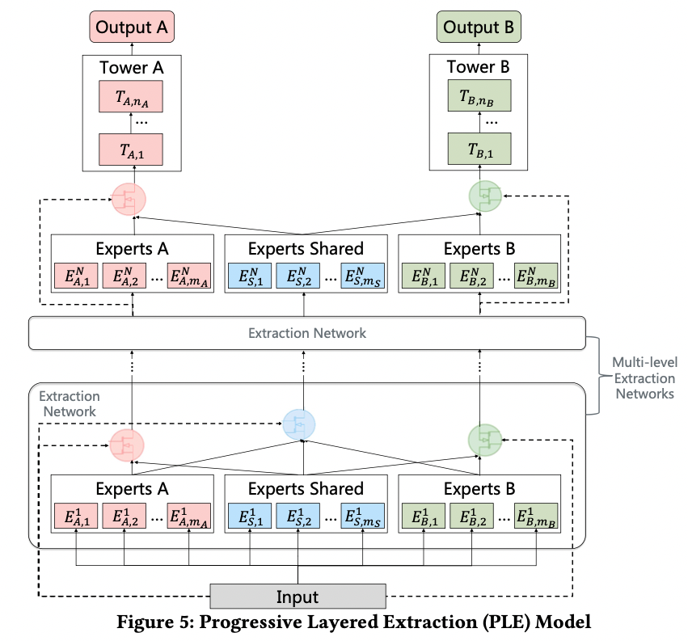

# PLE

**[AI Studio在线运行环境](https://aistudio.baidu.com/aistudio/projectdetail/3238938)**

 以下是本例的简要目录结构及说明： 

```
├── data # 文档
		├── train #训练数据
			├── train_data.txt
		├── test  #测试数据
			├── test_data.txt
├── __init__.py 
├── README.md #文档
├── config.yaml # sample数据配置
├── config_bigdata.yaml # 全量数据配置
├── census_reader.py # 数据读取程序
├── net.py # 模型核心组网（动静统一）
├── static_model.py # 构建静态图
├── dygraph_model.py # 构建动态图
```

注：在阅读该示例前，建议您先了解以下内容：

[paddlerec入门教程](https://github.com/PaddlePaddle/PaddleRec/blob/master/README.md)

## 内容

- [模型简介](#模型简介)
- [数据准备](#数据准备)
- [运行环境](#运行环境)
- [快速开始](#快速开始)
- [模型组网](#模型组网)
- [效果复现](#效果复现)
- [进阶使用](#进阶使用)
- [FAQ](#FAQ)

## 模型简介
多任务模型通过学习不同任务的联系和差异，可提高每个任务的学习效率和质量。但在多任务场景中经常出现跷跷板现象，即有些任务表现良好，有些任务表现变差。  论文[《Progressive Layered Extraction (PLE): A Novel Multi-Task Learning (MTL) Model for Personalized Recommendations》](https://dl.acm.org/doi/abs/10.1145/3383313.3412236 ) ，论文提出了Progressive Layered Extraction (简称PLE)，来解决多任务学习的跷跷板现象。 

## 模型准备
我们在Paddlepaddle定义PLE的网络结构，在开源数据集Census-income Data上验证模型效果。
数据的格式如下：
生成的格式以逗号为分割点
```
0,0,73,0,0,0,0,1700.09,0,0
```

## 运行环境
PaddlePaddle>=2.0

python 2.7/3.5/3.6/3.7

os : windows/linux/macos 

## 快速开始
本文提供了样例数据可以供您快速体验，在任意目录下均可执行。在ple模型目录的快速执行命令如下： 
```bash
# 进入模型目录
# cd models/multitask/ple # 在任意目录均可运行
# 动态图训练
python -u ../../../tools/trainer.py -m config.yaml # 全量数据运行config_bigdata.yaml 
# 动态图预测
python -u ../../../tools/infer.py -m config.yaml 

# 静态图训练
python -u ../../../tools/static_trainer.py -m config.yaml # 全量数据运行config_bigdata.yaml 
# 静态图预测
python -u ../../../tools/static_infer.py -m config.yaml 
``` 

## 模型组网
为了解决跷跷板和负迁移的现象，[PLE](https://dl.acm.org/doi/abs/10.1145/3383313.3412236)提出了一种共享结构设计的渐进式分层提取模型。其包含两部分， 一部分是一种显式区分共享专家塔和特定任务专家塔的门控 (CGC) 模型，另一部分是由单层CGC结构扩展到多层的PLE模型,
模型主要结构如下：
<p align="center">

<p>


## 效果复现
为了方便使用者能够快速的跑通每一个模型，我们在每个模型下都提供了样例数据。如果需要复现readme中的效果,请按如下步骤依次操作即可。 
在全量数据下模型的指标如下：
| 模型 | auc_marital | batch_size | epoch_num | Time of each epoch |
| :------| :------ | :------ | :------| :------ | 
| PLE | 0.99 | 32 | 100 | 约1分钟 |

1. 确认您当前所在目录为PaddleRec/models/multitask/ple  
2. 进入paddlerec/datasets/census目录下，执行该脚本，会从国内源的服务器上下载我们预处理完成的census全量数据集，并解压到指定文件夹。
``` bash
cd ../../../datasets/census
sh run.sh
``` 
3. 切回模型目录,执行命令运行全量数据
```bash
cd - # 切回模型目录
# 动态图训练
python -u ../../../tools/trainer.py -m config_bigdata.yaml # 全量数据运行config_bigdata.yaml 
python -u ../../../tools/infer.py -m config_bigdata.yaml # 全量数据运行config_bigdata.yaml 
```

## 进阶使用
  
## FAQ
