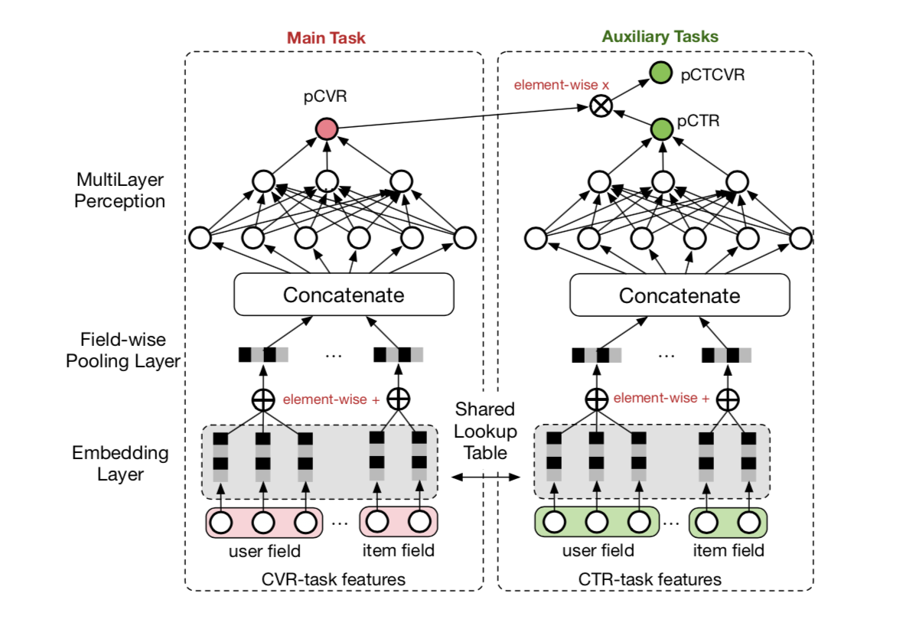
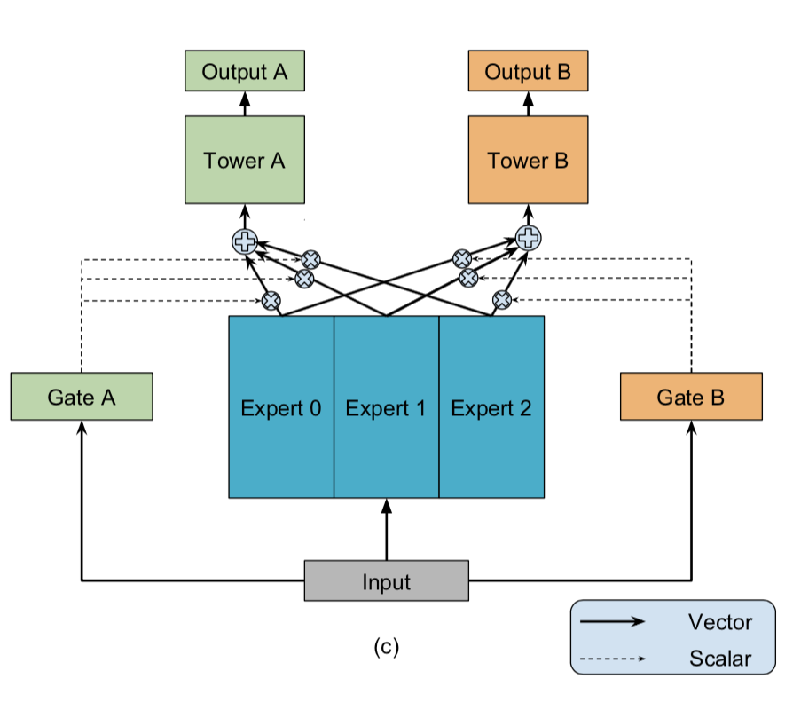
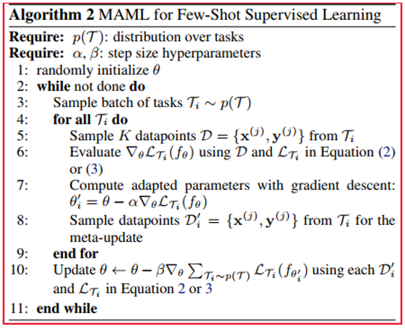

# 多任务学习模型库

## 简介
我们提供了常见的多任务学习中使用的模型算法的PaddleRec实现, 包括动态图和静态图的单机训练&预测效果指标。实现的多任务模型包括 [MMoE](mmoe)、[ESMM](esmm)等。

模型算法库在持续添加中，欢迎关注。

## 目录
* [整体介绍](#整体介绍)
    * [模型列表](#模型列表)
* [使用教程](#使用教程)
    * [快速开始](#快速开始)
    * [模型效果](#模型效果)
    * [效果复现](#效果复现)

## 整体介绍
### 模型列表

|       模型        |       简介        |       论文        |
| :------------------: | :--------------------: | :--------- |
| ESMM | Entire Space Multi-Task Model | [SIGIR 2018][Entire Space Multi-Task Model: An Effective Approach for Estimating Post-Click Conversion Rate](https://arxiv.org/abs/1804.07931) |
| MMOE | Multi-gate Mixture-of-Experts | [KDD 2018][Modeling Task Relationships in Multi-task Learning with Multi-gate Mixture-of-Experts](https://dl.acm.org/doi/abs/10.1145/3219819.3220007) |
| share_bottom | A Knowledge-Based Source of Inductive Bias | [ICML 1993][Multitask Learning: A Knowledge-Based Source of Inductive Bias](http://citeseerx.ist.psu.edu/viewdoc/download;jsessionid=F45CA386897E5A6EBCF74D5DBAC85A13?doi=10.1.1.57.3196&rep=rep1&type=pdf) |
| ple | Progressive Layered Extraction | [ACM 2020][Progressive Layered Extraction (PLE): A Novel Multi-Task Learning (MTL) Model for Personalized Recommendations](https://dl.acm.org/doi/abs/10.1145/3383313.3412236) |
| maml | Model-Agnostic Meta-Learning | [LCML 2017][Model-Agnostic Meta-Learning for Fast Adaptation of Deep Networks](https://arxiv.org/pdf/1703.03400.pdf) |
|        aitm         |      aitm       |                             [KDD][Modeling the Sequential Dependence among Audience Multi-step Conversions withMulti-task Learning in Targeted Display Advertising](https://arxiv.org/pdf/2105.08489v2.pdf)                              |

下面是每个模型的简介（注：图片引用自链接中的论文）


[ESMM](https://arxiv.org/abs/1804.07931):
<p align="center">

<p>

[MMoE](https://dl.acm.org/doi/abs/10.1145/3219819.3220007):
<p align="center">

<p>

[maml](https://arxiv.org/pdf/1703.03400.pdf):
<p align="center">

<p>

## 使用教程

### 快速开始
```bash
# 进入模型目录
cd models/multitask/xxx # xxx为任意的multitask下的模型目录
# 动态图训练
python -u ../../../tools/trainer.py -m config.yaml # 全量数据运行config_bigdata.yaml 
# 动态图预测
python -u ../../../tools/infer.py -m config.yaml 

# 静态图训练
python -u ../../../tools/static_trainer.py -m config.yaml # 全量数据运行config_bigdata.yaml 
# 静态图预测
python -u ../../../tools/static_infer.py -m config.yaml 
```

### 模型效果

|       数据集        |       模型       |       loss        |       auc       | 
| :------------------: | :--------------------: | :---------: |:---------: |
|       Census-income Data        |       MMoE       |       --        |       0.99324         |
|          Ali-CCP     |    ESMM       |       --        |      0.82          |
|          census     |    share_bottom       |       --        |      0.99          |
|          census     |    ple       |       --        |      0.99          |
|          omniglot     |    maml       |       --        |      0.98          |
|        Ali-CCP       |        aitm         |   --    | 0.6186 / 0.6525 |  
### 效果复现
您需要进入PaddleRec/datasets目录下的对应数据集中运行脚本获取全量数据集，然后在模型目录下使用全量数据的参数运行。  
每个模型下的readme中都有详细的效果复现的教程，您可以进入模型的目录中详细查看。  
