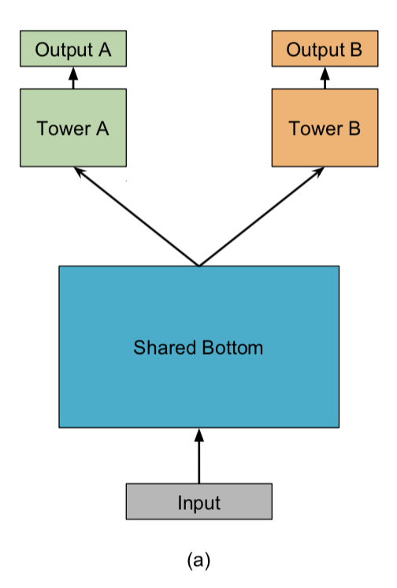

# 多任务学习模型库

## 简介
我们提供了常见的多任务学习中使用的模型算法的PaddleRec实现, 单机训练&预测效果指标以及分布式训练&预测性能指标等。实现的多任务模型包括 [MMoE](mmoe)、[Share-Bottom](share-bottom)、[ESMM](esmm)。

模型算法库在持续添加中，欢迎关注。

## 目录
* [整体介绍](#整体介绍)
    * [多任务模型列表](#多任务模型列表)
* [使用教程](#使用教程)
    * [训练&预测](#训练&预测)
* [效果对比](#效果对比)
    * [模型效果列表](#模型效果列表)

## 整体介绍
### 多任务模型列表

|       模型        |       简介        |       论文        |
| :------------------: | :--------------------: | :---------: |
| Share-Bottom | share-bottom | [Multitask learning](http://reports-archive.adm.cs.cmu.edu/anon/1997/CMU-CS-97-203.pdf)(1998) |
| ESMM | Entire Space Multi-Task Model | [Entire Space Multi-Task Model: An Effective Approach for Estimating Post-Click Conversion Rate](https://arxiv.org/abs/1804.07931)(2018) |
| MMoE | Multi-gate Mixture-of-Experts | [Modeling Task Relationships in Multi-task Learning with Multi-gate Mixture-of-Experts](https://dl.acm.org/doi/abs/10.1145/3219819.3220007)(2018) |

下面是每个模型的简介（注：图片引用自链接中的论文）


[ESMM](https://arxiv.org/abs/1804.07931):
<p align="center">

<p>

[Share-Bottom](http://reports-archive.adm.cs.cmu.edu/anon/1997/CMU-CS-97-203.pdf):
<p align="center">

<p>

[MMoE](https://dl.acm.org/doi/abs/10.1145/3219819.3220007):
<p align="center">

<p>

## 使用教程
### 训练&预测
```shell
python -m paddlerec.run -m paddlerec.models.multitask.mmoe/esmm/share-bottom 
```

## 效果对比
### 模型效果列表

|       数据集        |       模型       |       loss        |       评价指标       | 
| :------------------: | :--------------------: | :---------: |:---------: |
|       Census-income Data     |       Share-Bottom       |       --        |     0.93120/0.99256         |
|       Census-income Data        |       MMoE       |       --        |       0.94465/0.99324         |
|          Ali-CCP     |    ESMM       |       --        |      0.97181/0.49967          |

