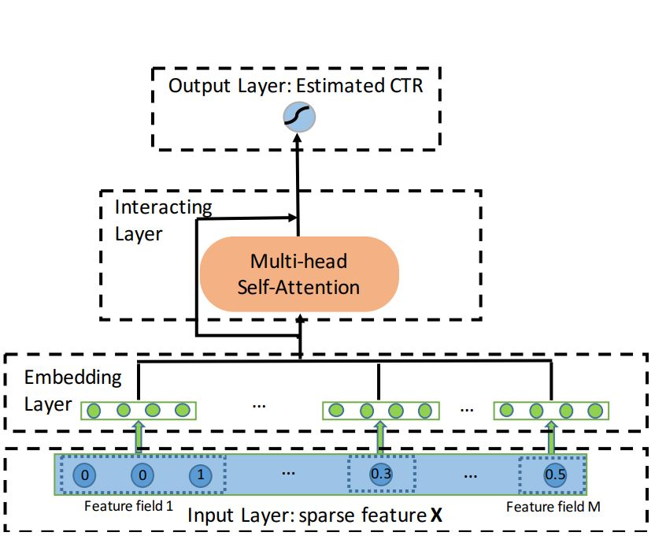

# 基于AutoInt模型的点击率预估模型


以下是本例的简要目录结构及说明： 

```
├── data #样例数据
    ├── sample_data #样例数据
        ├── train
            ├── sample_train.txt #训练数据样例
├── __init__.py
├── README.md #文档
├── config.yaml # sample数据配置
├── config_bigdata.yaml # 全量数据配置
├── net.py # 模型核心组网（动静统一）
├── criteo_reader.py #数据读取程序
├── static_model.py # 构建静态图
├── dygraph_model.py # 构建动态图
```

注：在阅读该示例前，建议您先了解以下内容：

[paddlerec入门教程](https://github.com/PaddlePaddle/PaddleRec/blob/master/README.md)

## 内容

- [模型简介](#模型简介)
- [数据准备](#数据准备)
- [运行环境](#运行环境)
- [快速开始](#快速开始)
- [模型组网](#模型组网)
- [效果复现](#效果复现)
- [进阶使用](#进阶使用)
- [FAQ](#FAQ)

## 模型简介
`CTR(Click Through Rate)`，即点击率，是“推荐系统/计算广告”等领域的重要指标，对其进行预估是商品推送/广告投放等决策的基础。简单来说，CTR预估对每次广告的点击情况做出预测，预测用户是点击还是不点击。CTR预估模型综合考虑各种因素、特征，在大量历史数据上训练，最终对商业决策提供帮助。本模型实现了下述论文中的AutoInt模型：

```text
@article{weiping2018autoint,
  title={AutoInt: Automatic Feature Interaction Learning via Self-Attentive Neural Networks},
  author={Weiping, Song and Chence, Shi and Zhiping, Xiao and Zhijian, Duan and Yewen, Xu and Ming, Zhang and Jian, Tang},
  journal={arXiv preprint arXiv:1810.11921},
  year={2018}
}
```

## 数据准备

训练及测试数据集选用[Display Advertising Challenge](https://www.kaggle.com/c/criteo-display-ad-challenge/)所用的Criteo数据集。该数据集包括两部分：训练集和测试集。训练集包含一段时间内Criteo的部分流量，测试集则对应训练数据后一天的广告点击流量。
每一行数据格式如下所示：
```
<label> <integer feature 1> ... <integer feature 13> <categorical feature 1> ... <categorical feature 26>
```
其中```<label>```表示广告是否被点击，点击用1表示，未点击用0表示。```<integer feature>```代表数值特征（连续特征），共有13个连续特征。```<categorical feature>```代表分类特征（离散特征），共有26个离散特征。相邻两个特征用```\t```分隔，缺失特征用空格表示。测试集中```<label>```特征已被移除。  

基于上述数据集，我们使用了参考repo及原论文给出的数据预处理方法，把原Criteo数据集转换成如下的数据格式：
```
<label> <feat index 1> ... <feat index 39> <feat value 1> ... <feat value 39>
```
其中```<label>```表示广告是否被点击，点击用1表示，未点击用0表示。```<feat index>```代表特征索引，用于取得连续特征及分类特征对应的embedding。```<feat value>```代表特征值，对于分类特征，```<feat value 14>```至```<feat value 39>```的取值为1，对于连续特征，```<feat value 1>```至```<feat value 13>```的取值为连续数值。相邻两个栏位用空格分隔。测试集中```<label>```特征已被移除。

在模型目录的data目录下为您准备了快速运行的示例数据，若需要使用全量数据可以参考下方[效果复现](#效果复现)部分。

## 运行环境
PaddlePaddle>=2.0

python 2.7/3.5/3.6/3.7

os : windows/linux/macos 

## 快速开始
本文提供了样例数据可以供您快速体验，在任意目录下均可执行。在autoint模型目录的快速执行命令如下：
```bash
# 进入模型目录
# cd models/rank/autoint # 在任意目录均可运行
# 动态图训练
python -u ../../../tools/trainer.py -m config.yaml # 全量数据运行config_bigdata.yaml 
# 动态图预测
python -u ../../../tools/infer.py -m config.yaml 

# 静态图训练
python -u ../../../tools/static_trainer.py -m config.yaml # 全量数据运行config_bigdata.yaml 
# 静态图预测
python -u ../../../tools/static_infer.py -m config.yaml 
``` 

## 模型组网

AutoInt模型的组网本质是一个二分类任务，代码参考`model.py`。模型主要组成是嵌入层(Embedding Layer)，交互层(Interacting Layer),输出层(Output Layer)以及相应的分类任务的loss计算和auc计算。




### 嵌入层(Embedding Layer)
AutoInt首先使用不同的嵌入层将输入的离散数据和连续数据分别映射到同一低维空间。


用公式表示如下：  

<br />


其中$\mathbf{x}_{i}$表示one-hot离散向量，$\mathbf{V}_{i}$是离散量对应的嵌入矩阵，$\mathbf{v}_{m}$将连续数据$x_{m}$映射到低维空间。

### 交互层(Interacting Layer)


交互层是AutoInt的核心，它使用了*Multi-head Self-Attention*来构造特征间的高阶组合，具体结构如上图所示。
对于每个从Embedding Layer取得的向量$\mathbf{e}_{m}$, 使用不同的注意力函数(Attention Head)$\Psi^{h}(\cdot,\cdot)$计算向量对$(\mathbf{e}_{m}, \mathbf{e}_{k})$间的相似度$\alpha^{h}_{\mathbf{m},\mathbf{k}}$。


<br />


最后把不同注意力函数的输出作拼接，然后使用了残差连接作为Interacting Layer的最终输出。


### 输出层(Output Layer)
输出层把所有在Interacting Layer学到的向量连接其来，然后把它作为fc层的输入，在通过激活函数sigmoid给出预测的点击率。


### Loss及Auc计算
- 为了得到每条样本分属于正负样本的概率，我们将预测结果和`1-predict`合并起来得到predict_2d，以便接下来计算auc。  
- 每条样本的损失为负对数损失值，label的数据类型将转化为float输入。  
- 该batch的损失`avg_cost`是各条样本的损失之和
- 我们同时还会计算预测的auc指标。

## 效果复现
为了方便使用者能够快速的跑通每一个模型，我们在每个模型下都提供了样例数据。如果需要复现readme中的效果,请按如下步骤依次操作即可。
在全量数据下模型的指标如下：  
| 模型 | auc | batch_size | epoch_num| Time of each epoch |
| :------| :------ | :------ | :------| :------ | 
| AutoInt | 0.80 | 1024 | 3 | 约5小时 |

1. 确认您当前所在目录为PaddleRec/models/rank/autoint
2. 进入paddlerec/datasets/criteo_autoint目录下，执行该脚本，会从国内源的服务器上下载我们预处理完成的criteo全量数据集，并解压到指定文件夹。
``` bash
cd ../../../datasets/criteo_autoint
sh run.sh
``` 
3. 切回模型目录,执行命令运行全量数据
```bash
cd - # 切回模型目录
# 动态图训练
python -u ../../../tools/trainer.py -m config_bigdata.yaml # 全量数据运行config_bigdata.yaml 
python -u ../../../tools/infer.py -m config_bigdata.yaml # 全量数据运行config_bigdata.yaml 
```

## 进阶使用
  
## FAQ
