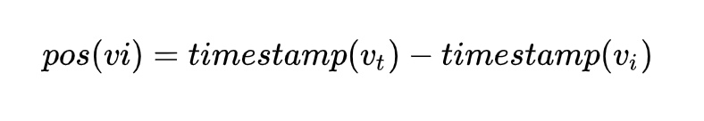
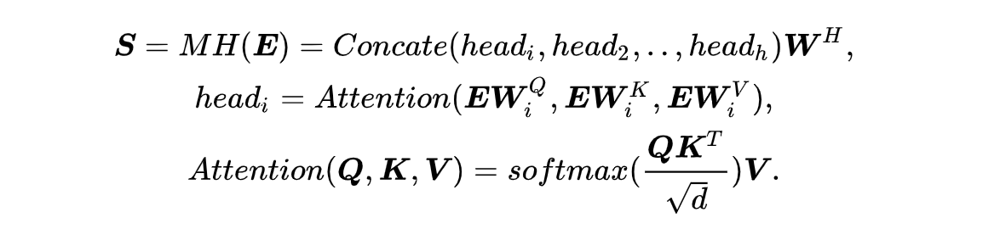
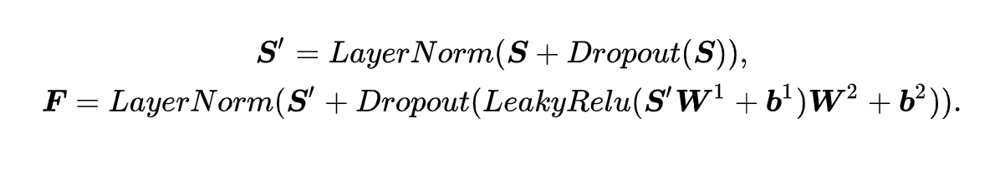

# 基于BST模型的点击率预估模型

**[AI Studio在线运行环境](https://aistudio.baidu.com/aistudio/projectdetail/3240205)**

以下是本例的简要目录结构及说明： 

```
├── data #样例数据
    ├── train_data #样例数据
        ├── paddle_train.txt #训练数据样例
├── README.md #文档
├── config.yaml # sample数据配置
├── config_bigdata.yaml # 全量数据配置
├── net.py # 模型核心组网（动静统一）
├── amazon_reader.py #数据读取程序
├── static_model.py # 构建静态图
├── dygraph_model.py # 构建动态图
```

注：在阅读该示例前，建议您先了解以下内容：

[paddlerec入门教程](https://github.com/PaddlePaddle/PaddleRec/blob/master/README.md)

## 内容

- [模型简介](#模型简介)
- [数据准备](#数据准备)
- [运行环境](#运行环境)
- [快速开始](#快速开始)
- [模型组网](#模型组网)
- [效果复现](#效果复现)
- [进阶使用](#进阶使用)
- [FAQ](#FAQ)

## 模型简介
`CTR(Click Through Rate)`，即点击率，是“推荐系统/计算广告”等领域的重要指标，对其进行预估是商品推送/广告投放等决策的基础。简单来说，CTR预估对每次广告的点击情况做出预测，预测用户是点击还是不点击。CTR预估模型综合考虑各种因素、特征，在大量历史数据上训练，最终对商业决策提供帮助。本模型实现了下述论文中的BST模型：

```text
@inproceedings{chen2019behavior,
  title={Behavior sequence transformer for e-commerce recommendation in alibaba},
  author={Chen, Qiwei and Zhao, Huan and Li, Wei and Huang, Pipei and Ou, Wenwu},
  booktitle={Proceedings of the 1st International Workshop on Deep Learning Practice for High-Dimensional Sparse Data},
  pages={1--4},
  year={2019}
}
```

## 数据准备

训练及测试数据集选用(http://snap.stanford.edu/data/amazon/productGraph/categoryFiles) Amazon数据集。该数据集包括两部分：训练集和测试集。
每一行数据格式如下所示：
```
<label> <userid> <history> <cate> <position> <target> <target_cate> <target_position>
```
其中```<label>```表示广告是否被点击，点击用1表示，未点击用0表示。```<userid>```代表用户id特征。```<history>```代表用户历史点击商品id序列。```<cate>```代表用户历史点击商品类别序列。```<position>```代表用户历史点击商品位置序列。```<target>```代表目标商品id。```<target_cate>```代表目标商品类别。```<target_position>```代表目标商品位置。测试集中。```<label>```特征已被移除。  
在模型目录的data目录下为您准备了快速运行的示例数据，若需要使用全量数据可以参考下方[效果复现](#效果复现)部分。

## 运行环境
PaddlePaddle>=2.0

python 2.7/3.5/3.6/3.7

os : windows/linux/macos 

## 快速开始
本文提供了样例数据可以供您快速体验，在任意目录下均可执行。在bst模型目录的快速执行命令如下： 
```bash
# 进入模型目录
# cd models/rank/bst # 在任意目录均可运行
# 动态图训练
python -u ../../../tools/trainer.py -m config.yaml # 全量数据运行config_bigdata.yaml 
# 动态图预测
python -u ../../../tools/infer.py -m config.yaml 

# 静态图训练
python -u ../../../tools/static_trainer.py -m config.yaml # 全量数据运行config_bigdata.yaml 
# 静态图预测
python -u ../../../tools/static_infer.py -m config.yaml 
``` 

## 模型组网

### 商品特征部分
BST模型的组网本质是一个二分类任务，代码参考bst1.8.5版本的`model.py`。模型主要组成是线性层部分, transformer部分以及相应的分类任务的loss计算和auc计算。bst将用户点击的商品特征序列和目标商品特征序列分别过embedding层后，拼接到一起并使用transformer编码，与原生transformer不同的是，bst的位置编码如下所示：



接着是Self-Attention计算公式:



然后是前馈网络部分：



### 用户特征部分
对于用户特征，论文中将该特征过完embedding层之后，只是与经过transformer之后的商品特征进行简单的拼接，并过了三个fc层，每一层都加入了LeakyReLU激活函数。    

最后一层为输出维度为1的fc层，方便计算预测值。  

### Loss及Auc计算
- 预测的结果由最后一层全连接层通过激活函数sigmoid给出，为了得到每条样本分属于正负样本的概率，我们将预测结果和`1-predict`合并起来得到predict_2d，以便接下来计算auc。  
- 每条样本的损失为负对数损失值，label的数据类型将转化为float输入。  
- 该batch的损失`avg_cost`是各条样本的损失之和
- 我们同时还会计算预测的auc指标。

## 效果复现
为了方便使用者能够快速的跑通每一个模型，我们在每个模型下都提供了样例数据。如果需要复现readme中的效果,请按如下步骤依次操作即可。
在全量数据下模型的指标如下：  
| 模型 | auc | batch_size | epoch_num| Time of each epoch |
| :------| :------ | :------ | :------| :------ | 
| BST | 0.77+ | 256 | 7 | 约0.55小时 |

1. 确认您当前所在目录为PaddleRec/models/rank/bst
2. 进入data目录下，执行该脚本，会下载amazon全量数据集，并解压到指定文件夹。
``` bash
cd ./data
sh data_process.sh
python build_dataset.py
``` 
3. 切回模型目录,执行命令运行全量数据
```bash
cd - # 切回模型目录
# 动态图训练
python -u ../../../tools/trainer.py -m config_bigdata.yaml # 全量数据运行config_bigdata.yaml 
python -u ../../../tools/infer.py -m config_bigdata.yaml # 全量数据运行config_bigdata.yaml 
```

## 进阶使用
  
## FAQ
