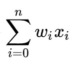
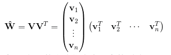
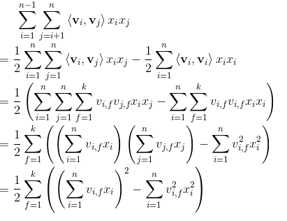

# 基于deepFM模型的点击率预估模型

以下是本例的简要目录结构及说明： 

```
├── sample_data #样例数据
    ├── train
        ├── sample_train.txt #训练数据样例
    ├── preprocess.py #数据处理程序
    ├── run.sh #数据一键处理脚本
    ├── download_preprocess.py #数据下载脚本
    ├── get_slot_data.py #格式整理程序
├── __init__.py
├── README.md #文档
├── model.py #模型文件
├── config.yaml #配置文件
```

注：在阅读该示例前，建议您先了解以下内容：

[paddlerec入门教程](https://github.com/PaddlePaddle/PaddleRec/blob/master/README.md)

## 内容

- [模型简介](#模型简介)
- [数据准备](#数据准备)
- [运行环境](#运行环境)
- [快速开始](#快速开始)
- [模型组网](#模型组网)
- [效果复现](#效果复现)
- [进阶使用](#进阶使用)
- [FAQ](#FAQ)

## 模型简介
`CTR(Click Through Rate)`，即点击率，是“推荐系统/计算广告”等领域的重要指标，对其进行预估是商品推送/广告投放等决策的基础。简单来说，CTR预估对每次广告的点击情况做出预测，预测用户是点击还是不点击。CTR预估模型综合考虑各种因素、特征，在大量历史数据上训练，最终对商业决策提供帮助。本模型实现了下述论文中的deepFM模型：

```text
@inproceedings{guo2017deepfm,
  title={DeepFM: A Factorization-Machine based Neural Network for CTR Prediction},
  author={Huifeng Guo, Ruiming Tang, Yunming Ye, Zhenguo Li and Xiuqiang He},
  booktitle={the Twenty-Sixth International Joint Conference on Artificial Intelligence (IJCAI)},
  pages={1725--1731},
  year={2017}
}
```

## 数据准备
### 数据来源
训练及测试数据集选用[Display Advertising Challenge](https://www.kaggle.com/c/criteo-display-ad-challenge/)所用的Criteo数据集。该数据集包括两部分：训练集和测试集。训练集包含一段时间内Criteo的部分流量，测试集则对应训练数据后一天的广告点击流量。
每一行数据格式如下所示：
```bash
<label> <integer feature 1> ... <integer feature 13> <categorical feature 1> ... <categorical feature 26>
```
其中```<label>```表示广告是否被点击，点击用1表示，未点击用0表示。```<integer feature>```代表数值特征（连续特征），共有13个连续特征。```<categorical feature>```代表分类特征（离散特征），共有26个离散特征。相邻两个特征用```\t```分隔，缺失特征用空格表示。测试集中```<label>```特征已被移除。  
详细的数据解析过程请参考dnn模型下的readme文件：[基于DNN模型的点击率预估模型](https://github.com/PaddlePaddle/PaddleRec/blob/master/models/rank/dnn/README.md)

### 一键下载训练及测试数据
```bash
sh run.sh
```
进入models/rank/deepfm/data目录下，执行该脚本，会从国内源的服务器上下载Criteo数据集，并解压到指定文件夹，然后自动处理数据转化为可直接进行训练的格式。解压后全量训练数据放置于`./train_datal`，全量测试数据放置于`./test_data`，可以直接输入的训练数据放置于`./slot_train_datal`，可直接输入的测试数据放置于`./slot_test_datal`

## 运行环境
PaddlePaddle>=1.7.2

python 2.7/3.5/3.6/3.7

PaddleRec >=0.1

os : windows/linux/macos

## 快速开始
本文提供了样例数据可以供您快速体验，在paddlerec目录下执行下面的命令即可快速启动训练： 

```
python -m paddlerec.run -m models/rank/deepfm/config.yaml
```
使用样例数据快速跑通的结果实例:
```
PaddleRec: Runner train_runner Begin
Executor Mode: train
processor_register begin
Running SingleInstance.
Running SingleNetwork.
Warning:please make sure there are no hidden files in the dataset folder and check these hidden files:[]
Running SingleStartup.
Running SingleRunner.
2020-09-24 03:45:57,924-INFO:   [Train] batch: 1, time_each_interval: 2.22s, BATCH_AUC: [0.43357143 0.4689441  0.43859649 0.42124542 0.44302615 0.44444444
 0.48305085 0.47866667 0.48032407 0.45833333], AUC: [0.43357143 0.4562963  0.43859649 0.47866667 0.44302615 0.44444444
 0.48305085 0.4562963  0.49451754 0.45833333]
epoch 0 done, use time: 2.38709902763, global metrics: BATCH_AUC=2.2195661068, AUC=[0.43357143 0.4689441  0.43859649 0.42124542 0.44302615 0.44444444
 0.48305085 0.47866667 0.48032407 0.45833333]
2020-09-24 03:45:59,023-INFO:   [Train] batch: 1, time_each_interval: 0.07s, BATCH_AUC: [0.4570095  0.45771188 0.45467121 0.47039474 0.46313874 0.45297619
 0.46199579 0.45470861 0.47237934 0.47326632], AUC: [0.4570095  0.45771188 0.45575717 0.47039474 0.46313874 0.45297619
 0.46199579 0.45470861 0.47237934 0.47326632]
epoch 1 done, use time: 0.0733981132507, global metrics: BATCH_AUC=0.0677909851074, AUC=[0.4570095  0.45771188 0.45467121 0.47039474 0.46313874 0.45297619
 0.46199579 0.45470861 0.47237934 0.47326632]
PaddleRec Finish
```

## 模型组网

deepFM模型的组网本质是一个二分类任务，代码参考`model.py`。模型主要组成是一阶项部分，二阶项部分,dnn部分以及相应的分类任务的loss计算和auc计算。模型的组网可以看做FM部分和dnn部分的结合，其中FM部分主要的工作是通过特征间交叉得到低阶特征，以二阶特征为主。FM的表达式如下，可观察到，只是在线性表达式后面加入了新的交叉项特征及对应的权值。


### 一阶项部分
一阶项部分类似于我们rank下的logistic_regression模型。主要由embedding层和reduce_sum层组成  
首先介绍Embedding层的搭建方式：`Embedding`层的输入是`feat_idx`，shape由超参的`sparse_feature_number`定义。需要特别解释的是`is_sparse`参数，当我们指定`is_sprase=True`后，计算图会将该参数视为稀疏参数，反向更新以及分布式通信时，都以稀疏的方式进行，会极大的提升运行效率，同时保证效果一致。  
各个稀疏的输入通过Embedding层后，进行reshape操作，方便和连续值进行结合。  
将离散数据通过embedding查表得到的值，与连续数据的输入进行相乘再累加的操作，合为一个一阶项的整体。  
用公式表示如下：  



### 二阶项部分
二阶项部分主要实现了公式中的交叉项部分，也就是特征的组合部分。Wij求解的思路是通过矩阵分解的方法。所有的二次项参数Wij可以组成一个对称阵W，那么这个矩阵就可以如下分解：  



V 的第 i 列便是第 i 维特征的隐向量。特征分量Xi与Xj的交叉项系数就等于Xi对应的隐向量与Xj对应的隐向量的内积，即每个参数 wij=⟨vi,vj⟩
交叉项的展开式如下：



### dnn部分
相比fm模型，我们去除了fm模型中的偏移量，而加入了dnn部分作为特征间的高阶组合，通过并行的方式组合fm和dnn两种方法，两者共用底层的embedding数据。dnn部分的主要组成为三个全连接层，每层FC的输出维度都为400，每层FC都后接一个relu激活函数，每层FC的初始化方式为符合正态分布的随机初始化.    
最后接了一层输出维度为1的fc层，方便与fm部分综合计算预测值。  

### Loss及Auc计算
- 预测的结果将FM的一阶项部分，二阶项部分以及dnn部分相加，再通过激活函数sigmoid给出，为了得到每条样本分属于正负样本的概率，我们将预测结果和`1-predict`合并起来得到predict_2d，以便接下来计算auc。  
- 每条样本的损失为负对数损失值，label的数据类型将转化为float输入。  
- 该batch的损失`avg_cost`是各条样本的损失之和
- 我们同时还会计算预测的auc，auc的结果由`fluid.layers.auc()`给出，该层的返回值有三个，分别是全局auc: `auc_var`，当前batch的auc: `batch_auc_var`，以及auc_states: `_`，auc_states包含了`batch_stat_pos, batch_stat_neg, stat_pos, stat_neg`信息。
完成上述组网后，我们最终可以通过训练拿到`auc`指标。

## 效果复现
为了方便使用者能够快速的跑通每一个模型，我们在每个模型下都提供了样例数据。如果需要复现readme中的效果,请按如下步骤依次操作即可。
在全量数据下模型的指标如下：  

| 模型 | auc | batch_size | thread_num| epoch_num| Time of each epoch |
| :------| :------ | :------| :------ | :------| :------ | 
| deepFM | 0.8044 | 1024 | 10 | 2 | 约3.5小时 |

1. 确认您当前所在目录为PaddleRec/models/rank/deepfm
2. 在data目录下运行数据一键处理脚本，命令如下：  
``` 
cd data
sh run.sh
cd ..
```
3. 退回deepfm目录中，打开文件config.yaml,更改其中的参数  
将workspace改为您当前的绝对路径。（可用pwd命令获取绝对路径）  
将train_sample中的batch_size从5改为1024  
将train_sample中的data_path改为{workspace}/data/slot_train_data  
将infer_sample中的batch_size从5改为1024  
将infer_sample中的data_path改为{workspace}/data/slot_test_data  
4. 运行命令，模型会进行两个epoch的训练，然后预测第二个epoch，并获得相应auc指标  
```
python -m paddlerec.run -m ./config.yaml
```
5. 经过全量数据训练后，执行预测的结果示例如下：
```
PaddleRec: Runner infer_runner Begin
Executor Mode: infer
processor_register begin
Running SingleInstance.
Running SingleNetwork.
Warning:please make sure there are no hidden files in the dataset folder and check these hidden files:[]
Running SingleInferStartup.
Running SingleInferRunner.
load persistables from incerement/1
2020-09-23 11:26:38,879-INFO:   [Infer] batch: 1, time_each_interval: 1.39s, AUC: [0.8044914]
2020-09-23 11:26:39,468-INFO:   [Infer] batch: 2, time_each_interval: 0.59s, AUC: [0.80449145]
2020-09-23 11:26:40,021-INFO:   [Infer] batch: 3, time_each_interval: 0.55s, AUC: [0.80449146]
2020-09-23 11:26:40,557-INFO:   [Infer] batch: 4, time_each_interval: 0.54s, AUC: [0.80449131]
2020-09-23 11:26:41,148-INFO:   [Infer] batch: 5, time_each_interval: 0.59s, AUC: [0.80449144]
2020-09-23 11:26:41,659-INFO:   [Infer] batch: 6, time_each_interval: 0.51s, AUC: [0.80449172]
2020-09-23 11:26:42,182-INFO:   [Infer] batch: 7, time_each_interval: 0.52s, AUC: [0.80449169]
2020-09-23 11:26:42,691-INFO:   [Infer] batch: 8, time_each_interval: 0.51s, AUC: [0.80449169]
2020-09-23 11:26:43,190-INFO:   [Infer] batch: 9, time_each_interval: 0.50s, AUC: [0.80449191]
2020-09-23 11:26:43,671-INFO:   [Infer] batch: 10, time_each_interval: 0.48s, AUC: [0.80449164]
...
2020-09-23 12:16:10,279-INFO:   [Infer] batch: 8982, time_each_interval: 0.18s, AUC: [0.8044914]
2020-09-23 12:16:10,518-INFO:   [Infer] batch: 8983, time_each_interval: 0.24s, AUC: [0.80449133]
Infer infer_phase of epoch 1 done, use time: 1764.81796193, global metrics: AUC=0.80449133
PaddleRec Finish
```

## 进阶使用
  
## FAQ
