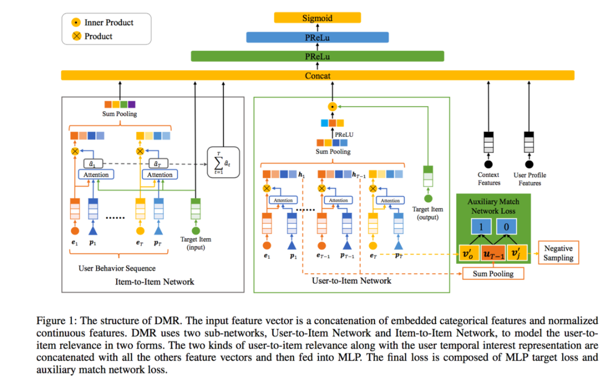

# DMR模型

**[AI Studio在线运行环境](https://aistudio.baidu.com/aistudio/projectdetail/3240346)**

以下是本例的简要目录结构及说明： 

```
├── data #样例数据
    ├── sample_data
        ├── alimama_sampled_train.txt #训练数据样例
├── __init__.py
├── readme.md #文档
├── config.yaml # sample数据配置
├── config_bigdata.yaml # 全量数据配置
├── net.py # 模型核心组网（动静统一）
├── alimama_reader.py #数据读取程序
├── static_model.py # 构建静态图
├── dygraph_model.py # 构建动态图
```

注：在阅读该示例前，建议您先了解以下内容：

[paddlerec入门教程](https://github.com/PaddlePaddle/PaddleRec/blob/master/README.md)

## 内容

- [模型简介](#模型简介)
- [数据准备](#数据准备)
- [运行环境](#运行环境)
- [快速开始](#快速开始)
- [模型组网](#模型组网)
- [效果复现](#效果复现)
- [进阶使用](#进阶使用)
- [FAQ](#FAQ)

## 模型简介
两个deep子网络获取user的两种抽象表达，得到U和target item的score，结合其他特征送入MLP计算ctr score。[Deep Match to Rank Model for Personalized Click-Through Rate Prediction](https://github.com/lvze92/DMR/blob/master/%5BDMR%5D%20Deep%20Match%20to%20Rank%20Model%20for%20Personalized%20Click-Through%20Rate%20Prediction-AAAI20.pdf)文章通过 User-to-Item 子网络和 Item-to-Item 子网络来表征 U2I 相关性，再结合传统的rec model features，提升模型的表达能力。  
本模型来自飞桨论文复现挑战赛（第三期）bnujli大神贡献的[DMR的第一名方案](https://aistudio.baidu.com/aistudio/projectdetail/1770964?channelType=0&channel=0)达到了原作者github[DMR](https://github.com/lvze92/DMR)的精度。

## 数据准备
本模型使用论文中的数据集Alimama Dataset，在模型目录的data目录下为您准备了快速运行的示例数据，若需要使用全量数据可以参考下方[效果复现](#效果复现)部分。

## 运行环境
PaddlePaddle>=2.0

python 3.5/3.6/3.7

os : windows/linux/macos 

## 快速开始
本文提供了样例数据可以供您快速体验，在任意目录下均可执行。在DMR模型目录的快速执行命令如下： 
```bash
# 进入模型目录
# cd models/rank/dmr # 在任意目录均可运行
# 动态图训练
python -u ../../../tools/trainer.py -m config.yaml # 全量数据运行config_bigdata.yaml 
# 动态图预测
python -u ../../../tools/infer.py -m config.yaml 

# 静态图训练
python -u ../../../tools/static_trainer.py -m config.yaml # 全量数据运行config_bigdata.yaml 
# 静态图预测
python -u ../../../tools/static_infer.py -m config.yaml 
``` 

## 模型组网
论文[Deep Match to Rank Model for Personalized Click-Through Rate Prediction](https://github.com/lvze92/DMR/blob/master/%5BDMR%5D%20Deep%20Match%20to%20Rank%20Model%20for%20Personalized%20Click-Through%20Rate%20Prediction-AAAI20.pdf)中的网络结构如图所示:  
<p align="center">

<p>

## 效果复现
为了方便使用者能够快速的跑通每一个模型，我们在每个模型下都提供了样例数据。如果需要复现readme中的效果,请按如下步骤依次操作即可。  
在全量数据下模型的指标如下：  

| 模型 | auc | batch_size | epoch_num | Time of each epoch |
| :------| :------ | :------ | :------| :------ | 
| DMR | 0.6434 | 5120 | 1 | 约2小时 |

1. 确认您当前所在目录为PaddleRec/models/rank/dmr  
2. 进入paddlerec/datasets/Ali_Display_Ad_Click目录下，执行该脚本，会从国内源的服务器上下载我们预处理完成的Alimama全量数据集，并解压到指定文件夹。若您希望从原始数据集自行处理，请详见该目录下的readme。

``` bash
cd ../../../datasets/Ali_Display_Ad_Click
sh run.sh
```
3. 切回模型目录,执行命令运行全量数据

```bash
cd - # 切回模型目录
# 动态图训练
python -u ../../../tools/trainer.py -m config_bigdata.yaml # 全量数据运行config_bigdata.yaml 
python -u ../../../tools/infer.py -m config_bigdata.yaml # 全量数据运行config_bigdata.yaml
```

## 进阶使用
  
## FAQ
