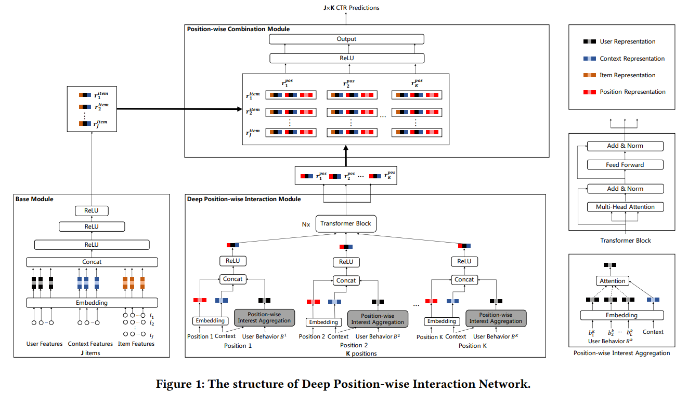

# Deep Position-wise Interaction Network for CTR Prediction

**[AI Studio在线运行环境](https://aistudio.baidu.com/aistudio/projectdetail/4419323)**

 以下是本例的简要目录结构及说明：

```shell
├── data    # sample数据
    ├── dpin_sample.data
├── __init__.py 
├── README.md   # README
├── config.yaml   # sample数据配置
├── config_bigdata.yaml # 全量数据配置
├── dpin_reader.py  # 数据读取程序
├── net.py    # 模型核心组网(动静统一)
├── dygraph_model.py # 构建动态图
```

注：在阅读该示例前，建议您先了解以下内容：

[paddlerec入门教程](https://github.com/PaddlePaddle/PaddleRec/blob/master/README.md)

## 内容

- [Deep Position-wise Interaction Network for CTR Prediction](#deep-position-wise-interaction-network-for-ctr-prediction)
  - [内容](#内容)
  - [模型简介](#模型简介)
  - [数据准备](#数据准备)
  - [运行环境](#运行环境)
  - [快速开始](#快速开始)
  - [模型组网](#模型组网)
  - [效果复现](#效果复现)
  - [进阶使用](#进阶使用)
  - [FAQ](#faq)

## 模型简介

位置偏差是推荐系统有偏数据中的一个典型偏差类型，主要表现在列表中靠前的商品更容易被用户点击，而不是因为用户喜欢。传统方法认为点击率等于检查概率和关联概率的乘积，这种假设太多简单，不足以模拟位置和其他信息之间的交互。因此论文《Deep Position-wise Interaction Network for CTR Prediction》综合考虑位置、用户、上下文之间的非线性交互，提出 DPIN 模型。

本模型实现了下述论文中的 DPIN 模型：

```
@inproceedings{su2021detecting,
  title={Deep Position-wise Interaction Network for CTR Prediction},
  author={Jianqiang Huang, Ke Hu, Qingtao Tang, Mingjian Chen, Yi Qi, Jia Cheng, Jun Lei},
  booktitle={Proceedings of the 44th International ACM SIGIR Conference on Research and Development in Information Retrieval (SIGIR ’21)},
  year={2021}
}
```

## 数据准备

原文并未提供开源数据集，因此我们使用KDD Cup 2012，Track2的赛题数据，该数据集用于搜索广告系统中的CTR预估，提供了用户在腾讯搜索中的查询词、广告信息、广告相对位置、用户点击情况、用户属性信息等。与本论文所描述的场景以及试图解决的问题相吻合。

用户可以从Kaggle上获取所使用的数据集，地址如下：https://www.kaggle.com/competitions/kddcup2012-track2/data

这里我们只使用到了`training.txt`文件，文件大小9.87GB。总共有149639106条数据，每条数据包含如下信息：click、impression、displayURL、adID、advertiseID、depth、position、queryID、keywordID、titleID、descriptionID、userID。这里我们只选择使用如下信息：click、adID、advertiseID、position、userID。

为了与DIN模型进行对比，这里还需要为DIN模型生成相应的训练数据。DIN模型并未将广告的位置信息引入模型，因此除去position字段信息即可。具体训练数据生成方法详见`datasets/preprocess.py`。

下面给出了一条数据的样例，并附上了介绍

```shell
# 历史浏览商品ID;历史浏览商品分类ID;历史浏览商品位置;目标商品ID;目标商品分类ID;目标商品位置;是否点击
80 71;17 50;1 1;82;56;3;0
```

## 运行环境

PaddlePaddle>=2.1

python 2.7/3.5/3.6/3.7

os : windows/linux/macos

## 快速开始

本文提供了样例数据可以供您快速体验，在任意目录下均可执行。在 dpin 模型目录的快速执行命令如下：

```bash
# 进入模型目录
cd PaddleRec/models/rank/dpin # 在任意目录均可运行
# 动态图训练
python -u ../../../tools/trainer.py -m config.yaml   # sample数据运行
python -u ../../../tools/trainer.py -m config_bigdata.yaml # 全量数据运行
# 动态图预测
python -u ../../../tools/infer.py -m config.yaml   # sample数据预测
python -u ../../../tools/infer.py -m config_bigdata.yaml # 全量数据预测
```

## 模型组网

相较于传统的 CTR 模型只有一个 Base Module 模块，本模型有三个模块组成：Base Module、Combination Module、Interaction Module。将位置信息的建模从 Base Module 中抽离，成为新的 Interaction Module。

Base Module与传统方法一致，是一个简单的 MLP 结构，用于将用户特征、商品特征和上下文特征融合。

Interaction Module 用于生成与商品内容无关的位置特征，其中使用到了Attention与Tramsformer机制，可以更好的发掘出位置的特征。

而 Combination Module 将交互后的物品特征与每个位置特征交互，生成每个商品在每个位置的CTR。

<p align="center">

<p>

## 效果复现

为了方便使用者能够快速的跑通每一个模型，我们在每个模型下都提供了样例数据。如果需要复现readme中的效果,请按如下步骤依次操作即可。
在全量数据下模型的指标如下：

| 模型 | auc   | pauc   | batch_size | epoch_num | Time of each epoch |
| :------| :------ | :------ | :------| :------ | :------ |
| DPIN | 0.68 | 0.67 | 1024 | 20 | 19min |
| DIN | 0.63 | 0.62 | 1024 | 20 | 13min |


1. 确认您当前所在目录为PaddleRec/models/rank/dpin
2. 进入PaddleRec/datasets/KDD2012_track2目录下，执行`run.sh`脚本，会从国内源的服务器上下载dpin全量数据集，并解压到指定文件夹。

``` bash
cd ../../../datasets/KDD2012_track2
bash run.sh
```

3. 切回模型目录,执行命令运行全量数据

```bash
cd - # 切回模型目录
# 动态图训练
python -u ../../../tools/trainer.py -m config_bigdata.yaml # 全量数据运行
python -u ../../../tools/infer.py -m config_bigdata.yaml # 全量数据预测
```

## 进阶使用

本模型支持飞桨训推一体认证 (Training and Inference Pipeline Certification(TIPC)) 信息和测试工具，方便用户查阅每种模型的训练推理部署打通情况，并可以进行一键测试。

使用本工具，可以测试不同功能的支持情况，以及预测结果是否对齐，测试流程概括如下：

1. 运行`prepare.sh`准备测试所需数据和模型；
2. 运行测试脚本`test_train_inference_python.sh`，产出log，由log可以看到不同配置是否运行成功；

测试单项功能仅需两行命令，命令格式如下：

```shell
# 功能：准备数据
# 格式：bash + 运行脚本 + 参数1: 配置文件选择 + 参数2: 模式选择
# 模式选择 [Mode] = 'lite_train_lite_infer' | 'whole_train_whole_infer' | 'whole_infer' | 'lite_train_whole_infer'
bash test_tipc/prepare.sh configs/[model_name]/[params_file_name] [Mode]

# 功能：运行测试
# 格式：bash + 运行脚本 + 参数1: 配置文件选择 + 参数2: 模式选择
bash test_tipc/test_train_inference_python.sh configs/[model_name]/[params_file_name]  [Mode]
```

例如，测试基本训练预测功能的`lite_train_lite_infer`模式，运行：

```shell
# 确保当前目录在 PaddleRec
# cd PaddleRec
# 准备数据
bash test_tipc/prepare.sh ./test_tipc/configs/dpin/train_infer_python.txt 'lite_train_lite_infer'
# 运行测试
bash test_tipc/test_train_inference_python.sh ./test_tipc/configs/dpin/train_infer_python.txt 'lite_train_lite_infer'
```

## FAQ
