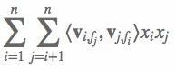

# 基于FFM模型的点击率预估模型

**[AI Studio在线运行环境](https://aistudio.baidu.com/aistudio/projectdetail/3240369)**

以下是本例的简要目录结构及说明： 

```
├── data #样例数据
    ├── sample_data #样例数据
        ├── train
            ├── sample_train.txt #训练数据样例
├── __init__.py
├── README.md #文档
├── config.yaml # sample数据配置
├── config_bigdata.yaml # 全量数据配置
├── net.py # 模型核心组网（动静统一）
├── criteo_reader.py #数据读取程序
├── static_model.py # 构建静态图
├── dygraph_model.py # 构建动态图
```

注：在阅读该示例前，建议您先了解以下内容：

[paddlerec入门教程](https://github.com/PaddlePaddle/PaddleRec/blob/master/README.md)

## 内容

- [模型简介](#模型简介)
- [数据准备](#数据准备)
- [运行环境](#运行环境)
- [快速开始](#快速开始)
- [模型组网](#模型组网)
- [效果复现](#效果复现)
- [进阶使用](#进阶使用)
- [FAQ](#FAQ)

## 模型简介
`CTR(Click Through Rate)`，即点击率，是“推荐系统/计算广告”等领域的重要指标，对其进行预估是商品推送/广告投放等决策的基础。简单来说，CTR预估对每次广告的点击情况做出预测，预测用户是点击还是不点击。CTR预估模型综合考虑各种因素、特征，在大量历史数据上训练，最终对商业决策提供帮助。本模型实现了下述论文中的FFM模型：

```text
@inproceedings{juan2016field,
	  title={Field-aware factorization machines for CTR prediction},
	    author={Juan, Yuchin and Zhuang, Yong and Chin, Wei-Sheng and Lin, Chih-Jen},
		  booktitle={Proceedings of the 10th ACM conference on recommender systems},
		    pages={43--50},
			  year={2016}
}
```

## 数据准备
训练及测试数据集选用[Display Advertising Challenge](https://www.kaggle.com/c/criteo-display-ad-challenge/)所用的Criteo数据集。该数据集包括两部分：训练集和测试集。训练集包含一段时间内Criteo的部分流量，测试集则对应训练数据后一天的广告点击流量。
每一行数据格式如下所示：
```
<label> <integer feature 1> ... <integer feature 13> <categorical feature 1> ... <categorical feature 26>
```
其中```<label>```表示广告是否被点击，点击用1表示，未点击用0表示。```<integer feature>```代表数值特征（连续特征），共有13个连续特征。```<categorical feature>```代表分类特征（离散特征），共有26个离散特征。相邻两个特征用```\t```分隔，缺失特征用空格表示。测试集中```<label>```特征已被移除。  
在模型目录的data目录下为您准备了快速运行的示例数据，若需要使用全量数据可以参考下方[效果复现](#效果复现)部分。


## 运行环境
PaddlePaddle>=2.0

python 2.7/3.5/3.6/3.7

os : windows/linux/macos 

## 快速开始
本文提供了样例数据可以供您快速体验，在任意目录下均可执行。在ffm模型目录的快速执行命令如下： 
```bash
# 进入模型目录
# cd models/rank/ffm # 在任意目录均可运行
# 动态图训练
python -u ../../../tools/trainer.py -m config.yaml # 全量数据运行config_bigdata.yaml 
# 动态图预测
python -u ../../../tools/infer.py -m config.yaml 

# 静态图训练
python -u ../../../tools/static_trainer.py -m config.yaml # 全量数据运行config_bigdata.yaml 
# 静态图预测
python -u ../../../tools/static_infer.py -m config.yaml 
``` 
## 模型组网
FFM模型的组网本质是一个二分类任务，代码参考`net.py`。模型主要组成是一阶项部分，Field-aware 二阶项部分以及相应的分类任务的loss计算和auc计算。模型的组网可以较为方便的于公式对应，FFM的表达式如下，可观察到，只是在线性表达式后面加入了新的交叉项特征及对应的权值。


### 一阶项部分
一阶项部分类似于我们rank下的logistic_regression模型。主要由embedding层和reduce_sum层组成  
首先介绍Embedding层的搭建方式：`Embedding`层的输入是`feat_idx`，shape由超参的`sparse_feature_number`定义。需要特别解释的是`is_sparse`参数，当我们指定`is_sprase=True`后，计算图会将该参数视为稀疏参数，反向更新以及分布式通信时，都以稀疏的方式进行，会极大的提升运行效率，同时保证效果一致。  
各个稀疏的输入通过Embedding层后，进行reshape操作，方便和连续值进行结合。  
将离散数据通过embedding查表得到的值，与连续数据的输入进行相乘再累加的操作，合为一个一阶项的整体。  
我们又构造了一个初始化为0，shape为1的变量，作为公式前零阶项的部分。 


### Field-aware二阶项部分
这部分主要实现了公式中的交叉项部分，也就是特征的组合部分。  




### Loss及Auc计算
- 预测的结果通过直接通过激活函数sigmoid给出，为了得到每条样本分属于正负样本的概率，我们将预测结果和`1-predict`合并起来得到predict_2d，以便接下来计算auc。  
- 每条样本的损失为负对数损失值，label的数据类型将转化为float输入。  
- 该batch的损失`avg_cost`是各条样本的损失之和  
- 我们同时还会计算预测的auc指标。  

## 效果复现
为了方便使用者能够快速的跑通每一个模型，我们在每个模型下都提供了样例数据。如果需要复现readme中的效果,请按如下步骤依次操作即可。
在全量数据下模型的指标如下：  
| 模型 | auc | batch_size | epoch_num| Time of each epoch |
| :------| :------ | :------ | :------| :------ | 
| FFM | 0.79 | 4096 | 10 | 约14.3小时 |

1. 确认您当前所在目录为PaddleRec/models/rank/ffm
2. 进入paddlerec/datasets/criteo目录下，执行该脚本，会从国内源的服务器上下载我们预处理完成的criteo全量数据集，并解压到指定文件夹。
``` bash
cd ../../../datasets/criteo
sh run.sh
``` 
3. 切回模型目录,执行命令运行全量数据
```bash
cd - # 切回模型目录
# 动态图训练
python -u ../../../tools/trainer.py -m config_bigdata.yaml # 全量数据运行config_bigdata.yaml 
python -u ../../../tools/infer.py -m config_bigdata.yaml # 全量数据运行config_bigdata.yaml 
```

## 进阶使用
  
## FAQ
