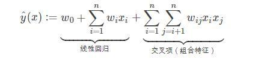
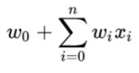

# 基于FM模型的点击率预估模型

以下是本例的简要目录结构及说明： 

```
├── sample_data #样例数据
    ├── train
        ├── sample_train.txt #训练数据样例
    ├── preprocess.py #数据处理程序
    ├── run.sh #数据一键处理脚本
    ├── download_preprocess.py #数据下载脚本
    ├── get_slot_data.py #格式整理程序
├── __init__.py
├── README.md #文档
├── model.py #模型文件
├── config.yaml #配置文件
```

注：在阅读该示例前，建议您先了解以下内容：

[paddlerec入门教程](https://github.com/PaddlePaddle/PaddleRec/blob/master/README.md)

## 内容

- [模型简介](#模型简介)
- [数据准备](#数据准备)
- [运行环境](#运行环境)
- [快速开始](#快速开始)
- [模型组网](#模型组网)
- [效果复现](#效果复现)
- [进阶使用](#进阶使用)
- [FAQ](#FAQ)

## 模型简介
`CTR(Click Through Rate)`，即点击率，是“推荐系统/计算广告”等领域的重要指标，对其进行预估是商品推送/广告投放等决策的基础。简单来说，CTR预估对每次广告的点击情况做出预测，预测用户是点击还是不点击。CTR预估模型综合考虑各种因素、特征，在大量历史数据上训练，最终对商业决策提供帮助。本模型实现了下述论文中的FM模型：

```text
@inproceedings{guo2017deepfm,
  title={DeepFM: A Factorization-Machine based Neural Network for CTR Prediction},
  author={Huifeng Guo, Ruiming Tang, Yunming Ye, Zhenguo Li and Xiuqiang He},
  booktitle={the Twenty-Sixth International Joint Conference on Artificial Intelligence (IJCAI)},
  pages={1725--1731},
  year={2017}
}
```

## 数据准备
### 数据来源
训练及测试数据集选用[Display Advertising Challenge](https://www.kaggle.com/c/criteo-display-ad-challenge/)所用的Criteo数据集。该数据集包括两部分：训练集和测试集。训练集包含一段时间内Criteo的部分流量，测试集则对应训练数据后一天的广告点击流量。
每一行数据格式如下所示：
```bash
<label> <integer feature 1> ... <integer feature 13> <categorical feature 1> ... <categorical feature 26>
```
其中```<label>```表示广告是否被点击，点击用1表示，未点击用0表示。```<integer feature>```代表数值特征（连续特征），共有13个连续特征。```<categorical feature>```代表分类特征（离散特征），共有26个离散特征。相邻两个特征用```\t```分隔，缺失特征用空格表示。测试集中```<label>```特征已被移除。  
详细的数据解析过程请参考dnn模型下的readme文件：[基于DNN模型的点击率预估模型](https://github.com/PaddlePaddle/PaddleRec/blob/master/models/rank/dnn/README.md)

### 一键下载训练及测试数据
```bash
sh run.sh
```
进入models/rank/fm/data目录下，执行该脚本，会从国内源的服务器上下载Criteo数据集，并解压到指定文件夹，然后自动处理数据转化为可直接进行训练的格式。解压后全量训练数据放置于`./train_datal`，全量测试数据放置于`./test_data`，可以直接输入的训练数据放置于`./slot_train_datal`，可直接输入的测试数据放置于`./slot_test_datal`

## 运行环境
PaddlePaddle>=1.7.2

python 2.7/3.5/3.6/3.7

PaddleRec >=0.1

os : windows/linux/macos

## 快速开始
本文提供了样例数据可以供您快速体验，在paddlerec目录下执行下面的命令即可快速启动训练： 

```
python -m paddlerec.run -m models/rank/fm/config.yaml
```
使用样例数据快速跑通的结果实例:

```
PaddleRec: Runner train_runner Begin
Executor Mode: train
processor_register begin
Running SingleInstance.
Running SingleNetwork.
Warning:please make sure there are no hidden files in the dataset folder and check these hidden files:[]
Running SingleStartup.
Running SingleRunner.
I0925 03:07:10.455991 26128 parallel_executor.cc:440] The Program will be executed on CPU using ParallelExecutor, 1 cards are used, so 1 programs are executed in parallel.
I0925 03:07:10.460461 26128 build_strategy.cc:365] SeqOnlyAllReduceOps:0, num_trainers:1
I0925 03:07:10.476308 26128 parallel_executor.cc:307] Inplace strategy is enabled, when build_strategy.enable_inplace = True
I0925 03:07:10.477986 26128 parallel_executor.cc:375] Garbage collection strategy is enabled, when FLAGS_eager_delete_tensor_gb = 0
2020-09-25 03:07:10,761-INFO:   [Train] batch: 1, time_each_interval: 0.31s, BATCH_AUC: [0.55555556], AUC: [0.55555556]
2020-09-25 03:07:10,816-INFO:   [Train] batch: 2, time_each_interval: 0.06s, BATCH_AUC: [0.61111111], AUC: [0.61111111]
2020-09-25 03:07:10,870-INFO:   [Train] batch: 3, time_each_interval: 0.05s, BATCH_AUC: [0.515625], AUC: [0.515625]
2020-09-25 03:07:10,921-INFO:   [Train] batch: 4, time_each_interval: 0.05s, BATCH_AUC: [0.59], AUC: [0.59]
2020-09-25 03:07:10,975-INFO:   [Train] batch: 5, time_each_interval: 0.05s, BATCH_AUC: [0.52380952], AUC: [0.52380952]
...
2020-09-25 03:07:13,307-INFO:   [Train] batch: 17, time_each_interval: 0.06s, BATCH_AUC: [0.63376048], AUC: [0.63376048]
2020-09-25 03:07:13,363-INFO:   [Train] batch: 18, time_each_interval: 0.06s, BATCH_AUC: [0.64298615], AUC: [0.64298615]
2020-09-25 03:07:13,417-INFO:   [Train] batch: 19, time_each_interval: 0.05s, BATCH_AUC: [0.64117133], AUC: [0.64117133]
epoch 1 done, use time: 1.08840990067, global metrics: BATCH_AUC=0.64117133, AUC=[0.64117133]
PaddleRec Finish
```
## 模型组网

FM模型的组网本质是一个二分类任务，代码参考`model.py`。模型主要组成是一阶项部分，二阶项部分以及相应的分类任务的loss计算和auc计算。模型的组网可以较为方便的于公式对应，FM的表达式如下，可观察到，只是在线性表达式后面加入了新的交叉项特征及对应的权值。



### 一阶项部分
一阶项部分类似于我们rank下的logistic_regression模型。主要由embedding层和reduce_sum层组成  
首先介绍Embedding层的搭建方式：`Embedding`层的输入是`feat_idx`，shape由超参的`sparse_feature_number`定义。需要特别解释的是`is_sparse`参数，当我们指定`is_sprase=True`后，计算图会将该参数视为稀疏参数，反向更新以及分布式通信时，都以稀疏的方式进行，会极大的提升运行效率，同时保证效果一致。  
各个稀疏的输入通过Embedding层后，进行reshape操作，方便和连续值进行结合。  
将离散数据通过embedding查表得到的值，与连续数据的输入进行相乘再累加的操作，合为一个一阶项的整体。  
我们又构造了一个初始化为0，shape为1的变量，作为公式前零阶项的部分。 



### 二阶项部分
二阶项部分主要实现了公式中的交叉项部分，也就是特征的组合部分。Wij求解的思路是通过矩阵分解的方法。所有的二次项参数Wij可以组成一个对称阵W，那么这个矩阵就可以如下分解：  


V 的第 i 列便是第 i 维特征的隐向量。特征分量Xi与Xj的交叉项系数就等于Xi对应的隐向量与Xj对应的隐向量的内积，即每个参数 wij=⟨vi,vj⟩
交叉项的展开式如下：


### Loss及Auc计算
- 预测的结果通过直接通过激活函数sigmoid给出，为了得到每条样本分属于正负样本的概率，我们将预测结果和`1-predict`合并起来得到predict_2d，以便接下来计算auc。  
- 每条样本的损失为负对数损失值，label的数据类型将转化为float输入。  
- 该batch的损失`avg_cost`是各条样本的损失之和  
- 我们同时还会计算预测的auc，auc的结果由`fluid.layers.auc()`给出，该层的返回值有三个，分别是全局auc: `auc_var`，当前batch的auc: `batch_auc_var`，以及auc_states: `_`，auc_states包含了`batch_stat_pos, batch_stat_neg, stat_pos, stat_neg`信息。  
  完成上述组网后，我们最终可以通过训练拿到`auc`指标。  

## 效果复现
为了方便使用者能够快速的跑通每一个模型，我们在每个模型下都提供了样例数据。如果需要复现readme中的效果,请按如下步骤依次操作即可。
在全量数据下模型的指标如下：  

| 模型 | auc | batch_size | thread_num| epoch_num| Time of each epoch |
| :------| :------ | :------| :------ | :------| :------ | 
| FM | 0.7619 | 1024 | 10 | 2 | 约3.5小时 |

1. 确认您当前所在目录为PaddleRec/models/rank/fm
2. 在data目录下运行数据一键处理脚本，命令如下：  
``` 
cd data
sh run.sh
cd ..
```
3. 退回fm目录中，打开文件config.yaml,更改其中的参数  
将workspace改为您当前的绝对路径。（可用pwd命令获取绝对路径）  
将train_sample中的batch_size从5改为1024  
将train_sample中的data_path改为{workspace}/data/slot_train_data  
将infer_sample中的batch_size从5改为1024  
将infer_sample中的data_path改为{workspace}/data/slot_test_data  
根据自己的需求调整phase中的线程数  
4. 运行命令，模型会进行两个epoch的训练，然后预测第二个epoch，并获得相应auc指标  
```
python -m paddlerec.run -m ./config.yaml
```
5. 经过全量数据训练后，执行预测的结果示例如下：
```
PaddleRec: Runner train_runner Begin
Executor Mode: train
processor_register begin
Running SingleInstance.
Running SingleNetwork.
Warning:please make sure there are no hidden files in the dataset folder and check these hidden files:[]
Warning:please make sure there are no hidden files in the dataset folder and check these hidden files:[]
Running SingleStartup.
Running SingleRunner.
I0921 13:11:33.118367 20932 parallel_executor.cc:440] The Program will be executed on CPU using ParallelExecutor, 1 cards are used, so 1 programs are executed in parallel.
I0921 13:11:33.120508 20932 build_strategy.cc:365] SeqOnlyAllReduceOps:0, num_trainers:1
I0921 13:11:33.122474 20932 parallel_executor.cc:307] Inplace strategy is enabled, when build_strategy.enable_inplace = True
I0921 13:11:33.123886 20932 parallel_executor.cc:375] Garbage collection strategy is enabled, when FLAGS_eager_delete_tensor_gb = 0
2020-09-21 13:11:33,631-INFO:   [Train] batch: 1, time_each_interval: 0.51s, BATCH_AUC: [0.44643497], AUC: [0.44643497]
2020-09-21 13:11:33,831-INFO:   [Train] batch: 2, time_each_interval: 0.20s, BATCH_AUC: [0.46514697], AUC: [0.46514697]
2020-09-21 13:11:33,983-INFO:   [Train] batch: 3, time_each_interval: 0.15s, BATCH_AUC: [0.47406181], AUC: [0.47406181]
2020-09-21 13:11:34,139-INFO:   [Train] batch: 4, time_each_interval: 0.16s, BATCH_AUC: [0.47984827], AUC: [0.47984827]
...
2020-09-22 12:16:08,478-INFO:   [Infer] batch: 8973, time_each_interval: 0.25s, AUC: [0.76192624]
2020-09-22 12:16:08,625-INFO:   [Infer] batch: 8974, time_each_interval: 0.15s, AUC: [0.76192887]
2020-09-22 12:16:08,760-INFO:   [Infer] batch: 8975, time_each_interval: 0.14s, AUC: [0.76193024]
2020-09-22 12:16:08,964-INFO:   [Infer] batch: 8976, time_each_interval: 0.20s, AUC: [0.76193132]
2020-09-22 12:16:09,186-INFO:   [Infer] batch: 8977, time_each_interval: 0.22s, AUC: [0.7619334]
2020-09-22 12:16:09,439-INFO:   [Infer] batch: 8978, time_each_interval: 0.25s, AUC: [0.7619324]
2020-09-22 12:16:09,687-INFO:   [Infer] batch: 8979, time_each_interval: 0.25s, AUC: [0.76193426]
2020-09-22 12:16:09,900-INFO:   [Infer] batch: 8980, time_each_interval: 0.21s, AUC: [0.76193488]
2020-09-22 12:16:10,101-INFO:   [Infer] batch: 8981, time_each_interval: 0.20s, AUC: [0.76193451]
2020-09-22 12:16:10,279-INFO:   [Infer] batch: 8982, time_each_interval: 0.18s, AUC: [0.76193513]
2020-09-22 12:16:10,518-INFO:   [Infer] batch: 8983, time_each_interval: 0.24s, AUC: [0.76193726]
Infer infer_phase of epoch 1 done, use time: 1764.81796193, global metrics: AUC=0.76193726
PaddleRec Finish
```

## 进阶使用

## FAQ
