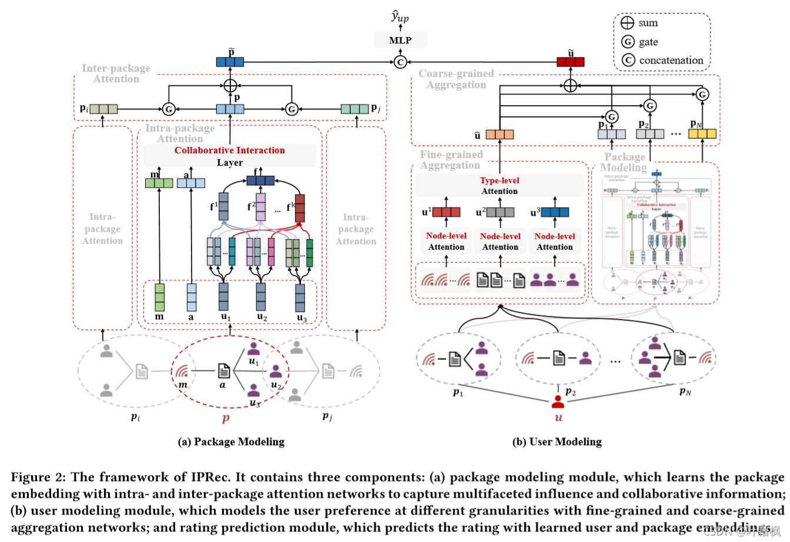

# iprec模型

以下是本例的简要目录结构及说明： 

```
├── data #样例数据
    ├── sammple_data
        ├── train #数据样例
            ├── train.jsonl
        ├── test
            ├── test.jsonl            
├── config.yaml # sample数据配置
├── config_bigdata.yaml # 全量数据配置
├── dygraph_model.py # 构建动态图
├── infer.py # 预测脚本
├── reader.py #数据读取程序
├── net.py # 模型核心组网（动静统一）
├── readme.md #文档
```

注：在阅读该示例前，建议您先了解以下内容：

[paddlerec入门教程](https://github.com/PaddlePaddle/PaddleRec/blob/master/README.md)

## 内容

- [模型简介](#模型简介)
- [数据准备](#数据准备)
- [运行环境](#运行环境)
- [快速开始](#快速开始)
- [模型组网](#模型组网)
- [效果复现](#效果复现)
- [进阶使用](#进阶使用)
- [FAQ](#FAQ)

## 模型简介
Package Recommendation with Intra- and Inter-Package Attention Networks 《利用“包内”和“包间”注意力网络的包推荐》。  
随着移动互联网中在线社交网络的蓬勃发展，我们提出了一个新颖的社交推荐场景，名为Package Recommendation。在这种场景中，用户不再被推荐单个项目或项目列表，而是被推荐异构且类型多样对象的组合（称为包，例如，包括新闻、媒体和观看新闻的朋友）。与传统推荐不同，在包推荐中，包中的对象被明确显示给用户，用户会对显式展示的对象表现出极大的兴趣，反过来这些对象可能对用户行为产生重大影响，并显著改变传统的推荐模式。

## 数据准备
训练及测试数据集选自时间窗口为3天的微信公众号的用户日志，按7:1:2划分训练集、验证集、测试集
在模型目录的data目录下为您准备了快速运行的示例数据，若需要使用全量数据可以参考下方效果复现部分。
## 运行环境
PaddlePaddle>=2.0

python 2.7/3.5/3.6/3.7

os : windows/linux/macos 

## 快速开始
本文提供了样例数据可以供您快速体验，在任意目录下均可执行。在iprec模型目录的快速执行命令如下： 
```bash
# 进入模型目录
# cd models/recall/iprec # 在任意目录均可运行
# 动态图训练
python -u ../../../tools/trainer.py -m config.yaml # 全量数据运行config_bigdata.yaml 
# 动态图预测
python -u ../../../tools/infer.py -m config.yaml 
```
## 模型组网
模型整体结构如下： 



## 效果复现
为了方便使用者能够快速的跑通每一个模型，我们在每个模型下都提供了样例数据。如果需要复现readme中的效果,请按如下步骤依次操作即可。  
在全量数据下模型的指标如下：  

| 模型    | auc    | batch_size | epoch_num| Time of each epoch |
|:------|:-------| :------ | :------| :------ | |
| iprec | 0.6934 | 256 | 1 | 3600s |

1. 确认您当前所在目录为PaddleRec/models/rank/iprec
2. 进入Paddlerec/datasets/iprec

``` bash
cd ../../../datasets/iprec
sh run.sh
```
3. 切回模型目录,执行命令运行全量数据

```bash
cd - # 切回模型目录
python -u ../../../tools/trainer.py -m config_bigdata.yaml
python -u ../../../tools/infer.py -m config_bigdata.yaml
```

## 进阶使用
  
## FAQ
