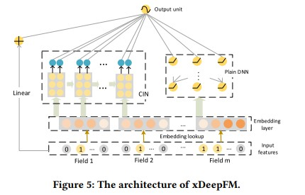
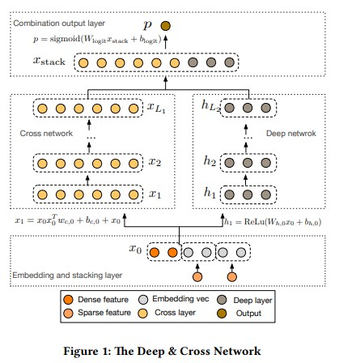
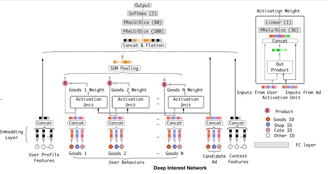

# 排序模型库

## 简介
我们提供了常见的排序任务中使用的模型算法的PaddleRec实现, 单机训练&预测效果指标以及分布式训练&预测性能指标等。实现的排序模型包括 [多层神经网络](dnn)、[Deep Cross Network](dcn)、[DeepFM](deepfm)、 [xDeepFM](xdeepfm)、[Deep Interest Network](din)、[Wide&Deep](wide_deep)。

模型算法库在持续添加中，欢迎关注。

## 目录
* [整体介绍](#整体介绍)
    * [模型列表](#模型列表)
* [使用教程](#使用教程)
    * [数据处理](#数据处理)
    * [训练](#训练)
    * [预测](#预测)
* [效果对比](#效果对比)
    * [模型效果列表](#模型效果列表)
* [分布式](#分布式)
    * [模型性能列表](#模型性能列表)

## 整体介绍
### 模型列表

|       模型        |       简介        |       论文        |
| :------------------: | :--------------------: | :---------: |
| DNN | 多层神经网络 | -- |
| wide&deep | Deep + wide(LR) | [Wide & Deep Learning for Recommender Systems](https://dl.acm.org/doi/pdf/10.1145/2988450.2988454)(2016) |
| DeepFM | DeepFM | [DeepFM: A Factorization-Machine based Neural Network for CTR Prediction](https://arxiv.org/pdf/1703.04247.pdf)(2017) |
| DCN | Deep Cross Network | [Deep & Cross Network for Ad Click Predictions](https://dl.acm.org/doi/pdf/10.1145/3124749.3124754)(2017) |
| xDeepFM | xDeepFM | [xDeepFM: Combining Explicit and Implicit Feature Interactions for Recommender Systems](https://dl.acm.org/doi/pdf/10.1145/3219819.3220023)(2018) |
| DIN | Deep Interest Network | [Deep Interest Network for Click-Through Rate Prediction](https://dl.acm.org/doi/pdf/10.1145/3219819.3219823)(2018) |

下面是每个模型的简介（注：图片引用自链接中的论文）

[wide&deep](https://dl.acm.org/doi/pdf/10.1145/2988450.2988454):
<p align="center">

<p>

[DeepFM](https://arxiv.org/pdf/1703.04247.pdf):
<p align="center">

<p>

[XDeepFM](https://dl.acm.org/doi/pdf/10.1145/3219819.3220023):
<p align="center">

<p>

[DCN](https://dl.acm.org/doi/pdf/10.1145/3124749.3124754):
<p align="center">

<p>

[DIN](https://dl.acm.org/doi/pdf/10.1145/3219819.3219823):
<p align="center">

<p>

## 使用教程(快速开始)
使用样例数据快速开始，参考[训练](###训练) & [预测](###预测)
## 使用教程(复现论文)
为了方便使用者能够快速的跑通每一个模型，我们在每个模型下都提供了样例数据，并且调整了batch_size等超参以便在样例数据上更加友好的显示训练&测试日志。如果需要复现readme中的效果请按照如下表格调整batch_size等超参，并使用提供的脚本下载对应数据集以及数据预处理。
|       模型       |       batch_size      |       thread_num      |       epoch_num      |
| :------------------: | :--------------------: | :--------------------: | :--------------------: |
|       DNN        |       1000       |        10       |        1       |
|       DCN        |       512       |       20       |        2       |
|       DeepFM     |       100       |       10       |        30       |
|       DIN        |       32       |       10       |        100       |
|       Wide&Deep  |       40       |       1       |        40       |
|       xDeepFM        |       100       |       1       |        10       |
### 数据处理
参考每个模型目录数据下载&预处理脚本

```
sh run.sh
```

数据读取默认使用core/reader.py

### 训练
```
cd modles/rank/dnn # 进入选定好的排序模型的目录 以DNN为例
python -m paddlerec.run -m paddlerec.models.rank.dnn # 使用内置配置
python -m paddlerec.run -m ./config.yaml # 自定义修改超参后，指定配置文件，使用自定义配置
```
### 预测
```
# 修改对应模型的config.yaml，mode配置infer_runner
# 示例: mode: runner1 -> mode: infer_runner
# infer_runner中 class配置为 class: single_infer
# 如果训练阶段和预测阶段的模型输入一致，phase不需要改动，复用train的即可

# 修改完config.yaml后 执行:
python -m paddlerec.run -m ./config.yaml # 以DNN为例
```

## 效果对比
### 模型效果 (测试)

|       数据集        |       模型       |       loss        |       auc          |       acc         |       mae          |
| :------------------: | :--------------------: | :---------: |:---------: | :---------: |:---------: |
|       Criteo        |       DNN       |       --        |       0.79395          |       --          |       --          |
|       Criteo        |       DeepFM       |       0.44797        |       0.80460          |       --          |       --          |
|       Criteo        |       DCN       |       0.44704        |       0.80654          |       --          |       --          |
|       Criteo        |       xDeepFM       |       0.48657        |       --          |       --          |       --          |
|       Census-income Data        |       Wide&Deep       |       0.76195         |       0.90577          |       --          |       --          |
|       Amazon Product        |       DIN       |       0.47005        |       0.86379         |       --          |       --          |


## 分布式
### 模型训练性能 (样本/s)
|       数据集        |       模型       |       单机        |       同步 (4节点)          |       同步 (8节点)          |  同步 (16节点)          |  同步 (32节点)          |
| :------------------: | :--------------------: | :---------: |:---------: |:---------: |:---------: |:---------: |
|       Criteo        |       DNN       |       99821        |       148788          |       148788          |  507936          |  856032          |
|       Criteo        |       DeepFM       |       --        |       --          |       --          |   --          |   --          |
|       Criteo        |       DCN       |       --        |       --          |       --          |  --          |  --          |
|       Criteo        |       xDeepFM       |       --        |       --          |       --          |  --          |  --          |
|       Census-income Data        |       Wide&Deep       |       --        |       --          |       --          |  --          |  --          |
|       Amazon Product        |       DIN       |       --        |       --          |       --          |  --          |  --          |

----

|       数据集        |       模型       |       单机        |       异步 (4节点)          |       异步 (8节点)          |  异步 (16节点)          |  异步 (32节点)          |
| :------------------: | :--------------------: | :---------: |:---------: |:---------: |:---------: |:---------: |
|       Criteo        |       DNN       |       99821        |       316918          |       602536          |  1130557          |  2048384          |
|       Criteo        |       DeepFM       |       --        |       --          |       --          |   --          |   --          |
|       Criteo        |       DCN       |       --        |       --          |       --          |  --          |  --          |
|       Criteo        |       xDeepFM       |       --        |       --          |       --          |  --          |  --          |
|       Census-income Data        |       Wide&Deep       |       --        |       --          |       --          |  --          |  --          |
|       Amazon Product        |       DIN       |       --        |       --          |       --          |  --          |  --          |
