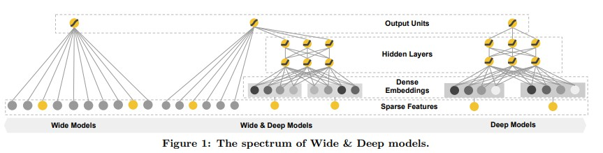
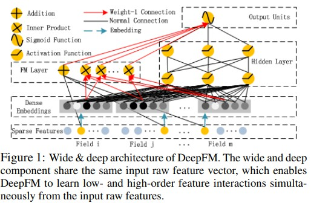

# 排序模型库

## 简介
我们提供了常见的排序任务中使用的模型算法的PaddleRec实现, 包括动态图和静态图的单机训练&预测效果指标。实现的排序模型包括 [logistic regression](logistic_regression)、[多层神经网络](dnn)、[FM](fm)、[gatenet](gatenet)、[DeepFM](deepfm)、[Wide&Deep](wide_deep)、[naml](naml)。

模型算法库在持续添加中，欢迎关注。

## 目录
* [整体介绍](#整体介绍)
    * [模型列表](#模型列表)
* [使用教程](#使用教程)
    * [快速开始](#快速开始)
    * [模型效果](#模型效果)
    * [效果复现](#效果复现)


## 整体介绍
### 模型列表

|         模型          |       简介        |                                                                                                                 论文                                                                                                                  |
|:-------------------:|:---------------:|:-----------------------------------------------------------------------------------------------------------------------------------------------------------------------------------------------------------------------------------:|
|         DNN         |     多层神经网络      |                                                                                                                 --                                                                                                                  |
| Logistic Regression |      逻辑回归       |                                                                                                                 --                                                                                                                  |
|         FM          |      因子分解机      |                                                                        [Factorization Machine](https://ieeexplore.ieee.org/abstract/document/5694074)(2010)                                                                         |
|      wide&deep      | Deep + wide(LR) |                                                              [Wide & Deep Learning for Recommender Systems](https://dl.acm.org/doi/pdf/10.1145/2988450.2988454)(2016)                                                               |
|       DeepFM        |     DeepFM      |                                                        [DeepFM: A Factorization-Machine based Neural Network for CTR Prediction](https://arxiv.org/pdf/1703.04247.pdf)(2017)                                                        |
|       GateDnn       |  门机制在dnn网络中的应用  |                                                             [GateNet: Gating-Enhanced Deep Network for Click-Through Rate Prediction](https://arxiv.org/abs/2007.03519)                                                             |
|        naml         |      naml       |                                                           [Neural News Recommendation with Attentive Multi-View Learning](https://arxiv.org/abs/1907.05576?context=cs.LG)                                                           |
|         bst         |       bst       |                                                          [Behavior sequence transformer for e-commerce recommendation in alibaba](https://arxiv.org/pdf/1905.06874v1.pdf)                                                           |
|         DCN         |       DCN       |                                                          [DeepAndCross: Deep & Cross Network for Ad Click Predictions](https://dl.acm.org/doi/pdf/10.1145/3124749.3124754)                                                          |
|      deepfefm       |    deepfefm     |                                                           [Field-Embedded Factorization Machines for Click-through rate prediction](https://arxiv.org/pdf/2009.09931.pdf)                                                           |
|        dien         |      dien       |                                                             [Deep Interest Evolution Network for Click-Through Rate Prediction](https://arxiv.org/pdf/1809.03672v5.pdf)                                                             |
|         din         |       din       |                                                                  [Deep Interest Network for Click-Through Rate Prediction](https://arxiv.org/pdf/1706.06978v4.pdf)                                                                  |
|        dlrm         |      dlrm       |                                                     [Deep Learning Recommendation Model for Personalization and Recommendation Systems](https://arxiv.org/pdf/1906.00091v1.pdf)                                                     |
|         dmr         |       dmr       |[Deep Match to Rank Model for Personalized Click-Through Rate Prediction](https://github.com/lvze92/DMR/blob/master/%5BDMR%5D%20Deep%20Match%20to%20Rank%20Model%20for%20Personalized%20Click-Through%20Rate%20Prediction-AAAI20.pdf)|
|         ffm         |       ffm       |                                                             [Field-aware factorization machines for CTR prediction](https://www.csie.ntu.edu.tw/~cjlin/papers/ffm.pdf)                                                              |
|       xdeepfm       |     xdeepfm     |                                                   [xdeepfm: Combining explicit and implicit feature interactions for recommender systems](https://arxiv.org/pdf/1803.05170v3.pdf)                                                   |


下面是每个模型的简介（注：图片引用自链接中的论文）

[wide&deep](https://dl.acm.org/doi/pdf/10.1145/2988450.2988454):

<p align="center">

<p>

[DeepFM](https://arxiv.org/pdf/1703.04247.pdf):

<p align="center">

<p>


## 使用教程

### 快速开始
```bash
# 进入模型目录
cd models/rank/xxx # xxx为任意的rank下的模型目录
# 动态图训练
python -u ../../../tools/trainer.py -m config.yaml # 全量数据运行config_bigdata.yaml 
# 动态图预测
python -u ../../../tools/infer.py -m config.yaml 

# 静态图训练
python -u ../../../tools/static_trainer.py -m config.yaml # 全量数据运行config_bigdata.yaml 
# 静态图预测
python -u ../../../tools/static_infer.py -m config.yaml 
```

### 模型效果

|         数据集          |         模型          |  loss   |       auc       |    acc    |
|:--------------------:|:-------------------:|:-------:|:---------------:|:---------:|
|        Criteo        |         DNN         |   --    |      0.77       |    --     |
|        Criteo        | Logistic Regression |   --    |      0.67       |    --     |
|        Criteo        |         FM          |   --    |      0.78       |    --     |
|        Criteo        |       GateDnn       |   --    |      0.79       |    --     |
|         MIND         |        naml         |   --    |       --        | top1：0.43 |
|        Criteo        |       DeepFM        | 0.44797 |      0.78       |    --     |
|        criteo        |      Wide&Deep      | 0.76195 |      0.82       |    --     |
|        amazon        |         BST         |   --    |      0.77       |    --     |
|        criteo        |         dcn         |   --    |      0.77       |    --     |
|        criteo        |      deepfefm       |   --    |     0.8028      |    --     |
|    amazonElec_Din    |        dien         |   --    |      0.826      |    --     |
|    amazonElec_Din    |         din         |   --    |      0.83       |    --     |
|        criteo        |        DLRM         |   --    |      0.79       |    --     |
| Ali_Display_Ad_Click |         dmr         |   --    |     0.6434      |    --     |
|        criteo        |         ffm         |   --    |      0.79       |    --     |
|        criteo        |       xDeepFM       |   --    |      0.79       |    --     |


### 效果复现
您需要进入PaddleRec/datasets目录下的对应数据集中运行脚本获取全量数据集，然后在模型目录下使用全量数据的参数运行。  
每个模型下的readme中都有详细的效果复现的教程，您可以进入模型的目录中详细查看。  
