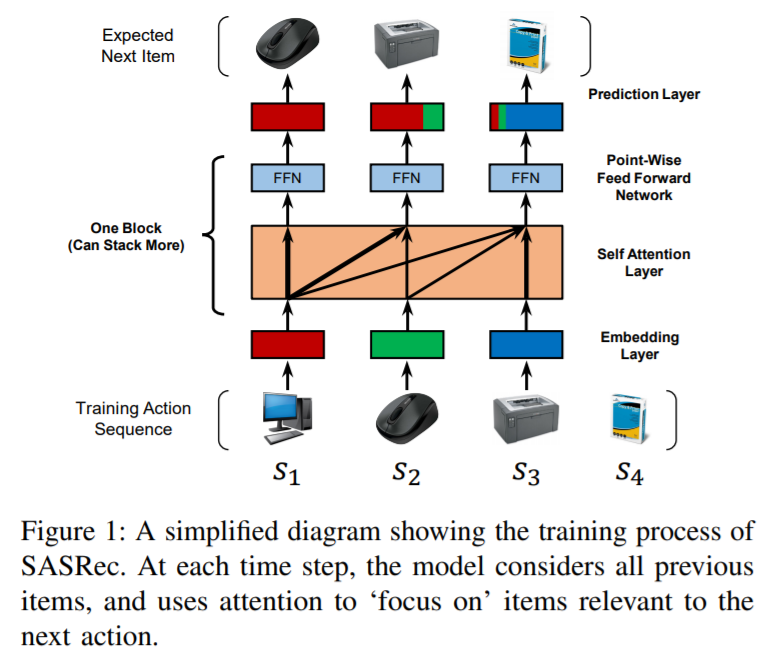
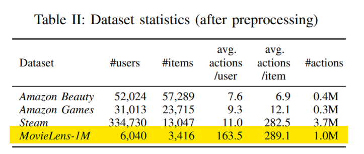
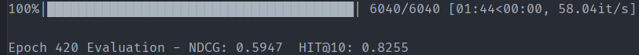

# 基于 SASRec 的序列推荐模型
以下是本例的简要目录结构及说明：

```
├── data # 样例数据
    ├── m1-1m.txt # movielen 1m 数据集
├── sasrec # 模型代码
├── __init__.py
├── README.md # 文档
├── train.sh # 训练脚本
├── eval.sh # 测试脚本
├── requirements.txt # 模块要求
```

## 内容

- [模型简介](#模型简介)
- [数据准备](#数据准备)
- [复现结果](#复现结果)
- [运行环境](#运行环境)
- [快速开始](#快速开始)
- [模型细节](#模型细节)
- [参考](#参考)

## 模型简介



论文：[Self-Attentive Sequential Recommendation](https://arxiv.org/pdf/1808.09781.pdf)

## 数据准备



本次实验中，我们采用了原作者处理后的数据集，剔除了活动次数少于 5 的用户记录，清洗后格式后`<user id, item id>`，以`user id`为第一关键字、`time`为第二关键字排序。

## 复现结果

| Datasets     | Metrics | Paper's | Ours   | abs. improv. |
| ------------ | ------- | ------- | ------ | ------------ |
| MovieLens-1m | HIT@10  | 0.8245  | 0.8255 | 0.0010       |
| MovieLens-1m | NDCG@10 | 0.5905  | 0.5947 | 0.0042       |

## 运行环境

- Python >= 3
- PaddlePaddle >= 2.0.0
- see `requirements.txt`


## 快速开始

### Train

```shell
bash train.sh
```

### Download Trained model

[SASRec model](https://cowtransfer.com/s/013a779f0c7242)

将模型分别放置于 `output` 目录下，如下运行 `eval` bash 脚本即可测试模型。

### Test

```shell
bash eval.sh
```

可以得到如下结果：



模型在 200 epochs 左右收敛，继续训练性能会有小幅提升。

## 模型细节

1. 原文中的`LayerNorm`层为`MultiHeadAttention`和`Point-wise FFN`的前置，实验证明后置模型性能更优，这也与`Transformer`原始架构相符。
2. 原文优化器为`Adam`，使用`AdamW`获得了更好的收敛效果。

## 参考

```
@misc{kang2018selfattentive,
      title={Self-Attentive Sequential Recommendation}, 
      author={Wang-Cheng Kang and Julian McAuley},
      year={2018},
      eprint={1808.09781},
      archivePrefix={arXiv},
      primaryClass={cs.IR}
}
```

* https://github.com/kang205/SASRec
* https://github.com/pmixer/SASRec.pytorch
