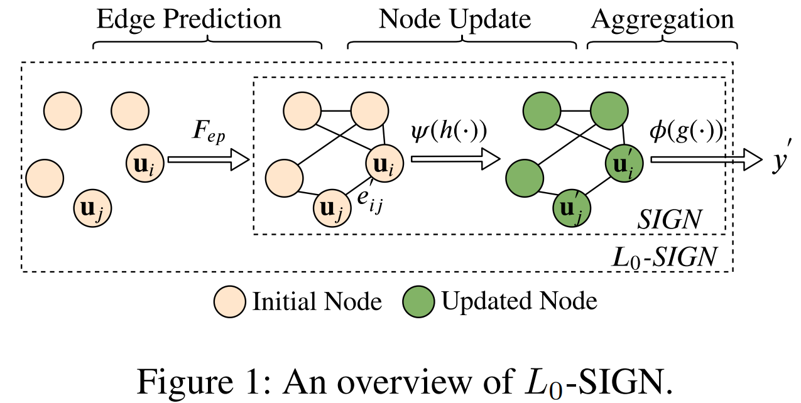

# Detecting Beneficial Feature Interactions for Recommender Systems

**[AI Studio在线运行环境](https://aistudio.baidu.com/aistudio/projectdetail/3869111)**

 以下是本例的简要目录结构及说明：

```shell
├── data    # sample数据
    ├── ml-tag-sample.data
├── __init__.py 
├── README.md   # README
├── config.yaml   # sample数据配置
├── config_bigdata.yaml # 全量数据配置
├── sign_reader.py  # 数据读取程序
├── net.py    # 模型核心组网(动静统一)
├── dygraph_model.py # 构建动态图
```

注：在阅读该示例前，建议您先了解以下内容：

[paddlerec入门教程](https://github.com/PaddlePaddle/PaddleRec/blob/master/README.md)

## 内容

- [Detecting Beneficial Feature Interactions for Recommender Systems](#detecting-beneficial-feature-interactions-for-recommender-systems)
  - [内容](#内容)
  - [模型简介](#模型简介)
  - [数据准备](#数据准备)
  - [运行环境](#运行环境)
  - [快速开始](#快速开始)
  - [模型组网](#模型组网)
  - [效果复现](#效果复现)
  - [进阶使用](#进阶使用)
  - [FAQ](#faq)

## 模型简介

特征交叉通过将两个或多个特征相乘，来实现样本空间的非线性变换，提高模型的非线性能力，其在推荐系统领域中可以显著提高准确率。以往的研究考虑了所有特征之间的交叉，但是某些特征交叉与推荐结果的相关性不大，其引入的噪声会降低模型的准确率。因此论文[《Detecting Beneficial Feature Interactions for Recommender Systems》]( https://arxiv.org/pdf/2008.00404v6.pdf )中提出了一种利用图神经网络自动发现有意义特征交叉的模型L0-SIGN。

作者使用图神经网络建模每个样本的特征，将特征交叉与图中的边相联系，用GNN的关系推理能力对特征交叉进行建模。使用L0正则化的边预测来限制图中检测的边的数量，以此进行有意义特征交叉的检测。

本模型实现了下述论文中的 SIGN 模型：

```
@inproceedings{su2021detecting,
  title={Detecting Beneficial Feature Interactions for Recommender Systems},
  author={Su, Yixin and Zhang, Rui and Erfani, Sarah and Xu, Zhenghua},
  booktitle={Proceedings of the 34th AAAI Conference on Artificial Intelligence (AAAI)},
  year={2021}
}
```

## 数据准备

论文使用了4个开源数据集，`DBLP_v1`、`frappe`、`ml-tag`、`twitter`，这里使用`ml-tag`验证模型效果，在模型目录的data目录中准备了快速运行的示例数据，若需要使用全量数据可以参考下方[效果复现](#效果复现)部分。
该数据集专注于电影标签推荐，每个数据实例都代表一个图，数据格式如下：

```shell
# 电影标签 用户ID 电影ID 电影ID
0.0 24 25 26
1.0 62 63 64
```

## 运行环境

PaddlePaddle>=2.0

pgl>=2.2.0

python 2.7/3.5/3.6/3.7

os : windows/linux/macos

## 快速开始

本文提供了样例数据可以供您快速体验，在任意目录下均可执行。在sign模型目录的快速执行命令如下：

```bash
# 准备环境: 安装pgl
pip install pgl

# 进入模型目录
cd PaddleRec/models/rank/sign # 在任意目录均可运行
# 动态图训练
python -u ../../../tools/trainer.py -m config.yaml   # sample数据运行
python -u ../../../tools/trainer.py -m config_bigdata.yaml # 全量数据运行
# 动态图预测
python -u ../../../tools/infer.py -m config.yaml   # sample数据预测
python -u ../../../tools/infer.py -m config_bigdata.yaml # 全量数据预测
```

## 模型组网

L0-SIGN模型有两个模块，一个是L0边预估模块，通过矩阵分解图的邻接矩阵进行边的预估，一个是图分类SIGN模块。模型的主要组网结构如图1所示，与 `net.py` 中的代码一一对应 ：

<p align="center">

<p>

## 效果复现

为了方便使用者能够快速的跑通每一个模型，我们在每个模型下都提供了样例数据。如果需要复现readme中的效果,请按如下步骤依次操作即可。
在全量数据下模型的指标如下：

| 模型 | auc   | acc   | batch_size | epoch_num | Time of each epoch |
| :------| :------ | :------ | :------| :------ | :------ |
| SIGN | 0.9418 | 0.8927 | 1024 | 40 | 约18分钟 |

1. 确认您当前所在目录为PaddleRec/models/rank/sign
2. 进入PaddleRec/datasets/sign目录下，执行`run.sh`脚本，会从国内源的服务器上下载sign全量数据集，并解压到指定文件夹。

``` bash
cd ../../../datasets/sign
bash run.sh
```

3. 安装依赖

```shell
# 安装pgl
pip install pgl
```

3. 切回模型目录,执行命令运行全量数据

```bash
cd - # 切回模型目录
# 动态图训练
python -u ../../../tools/trainer.py -m config_bigdata.yaml # 全量数据运行
python -u .././../tools/infer.py -m config_bigdata.yaml # 全量数据预测
```

## 进阶使用

本模型支持飞桨训推一体认证 (Training and Inference Pipeline Certification(TIPC)) 信息和测试工具，方便用户查阅每种模型的训练推理部署打通情况，并可以进行一键测试。

使用本工具，可以测试不同功能的支持情况，以及预测结果是否对齐，测试流程概括如下：

1. 运行`prepare.sh`准备测试所需数据和模型；
2. 运行测试脚本`test_train_inference_python.sh`，产出log，由log可以看到不同配置是否运行成功；

测试单项功能仅需两行命令，命令格式如下：

```shell
# 功能：准备数据
# 格式：bash + 运行脚本 + 参数1: 配置文件选择 + 参数2: 模式选择
# 模式选择 [Mode] = 'lite_train_lite_infer' | 'whole_train_whole_infer' | 'whole_infer' | 'lite_train_whole_infer'
bash test_tipc/prepare.sh configs/[model_name]/[params_file_name] [Mode]

# 功能：运行测试
# 格式：bash + 运行脚本 + 参数1: 配置文件选择 + 参数2: 模式选择
bash test_tipc/test_train_inference_python.sh configs/[model_name]/[params_file_name]  [Mode]
```

例如，测试基本训练预测功能的`lite_train_lite_infer`模式，运行：

```shell
# 确保当前目录在 PaddleRec
# cd PaddleRec
# 准备数据
bash test_tipc/prepare.sh ./test_tipc/configs/sign/train_infer_python.txt 'lite_train_lite_infer'
# 运行测试
bash test_tipc/test_train_inference_python.sh ./test_tipc/configs/sign/train_infer_python.txt 'lite_train_lite_infer'
```

## FAQ
