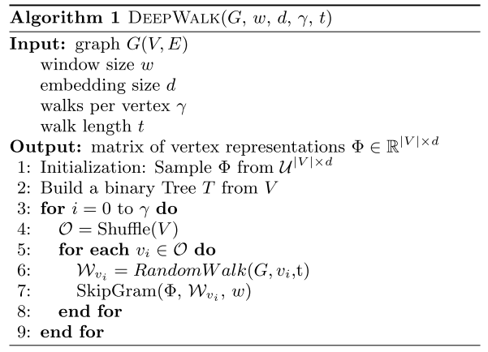
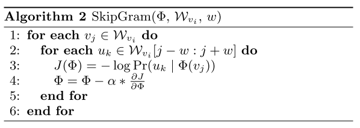

# Distributed Deepwalk in PGL

以下是本例的简要目录结构及说明： 

```
├── deepwalk_train
    ├── config_bigdata.yaml
    ├── static_model.py
├── multi_class
    ├── __init__.py
    ├── config.yaml
    ├── config_bigdata.yaml
    ├── static_model.py
    ├── macrof1.py
├── README.md #文档
├── net.py # 模型核心组网（动静统一）
├── randwalk_reader.py #数据读取程序
```
注：在阅读该示例前，建议您先了解以下内容：
[paddlerec入门教程](https://github.com/PaddlePaddle/PaddleRec/blob/master/README.md)  

## 内容
- [模型简介](#模型简介)
- [数据准备](#数据准备)
- [运行环境](#运行环境)
- [快速开始](#快速开始)
- [模型组网](#模型组网)
- [效果复现](#效果复现)
- [进阶使用](#进阶使用)
- [FAQ](#FAQ)


## 模型简介
Deepwalk是一个用于图形表征学习的算法。它的目的是图嵌入，和词嵌入一样，图嵌入所做的工作就是将构成图的基本单位-节点-映射到一个向量空间中，使向量空间中的嵌入的每个节点与其在图中的相互关系基本一致。给定任何图，它可以学习节点的连续特征表示，然后可以用于各种下游机器学习任务。基于PGL，我们实现deepwalk算法，并在multi-label classification任务上达到了与论文相同的指标水平。

## 数据准备
[BlogCatalog](https://dl.acm.org/doi/pdf/10.1145/1557019.1557109)数据集是一个社会关系网络，图是由博主及其社会关系（比如好友）组成，标签是博主的兴趣爱好。本数据集已内置在PGL中。


## 运行环境
PaddlePaddle>=2.0

python 2.7/3.5/3.6/3.7

pgl>=2.0  

注意：本模型需要安装pgl才能正常运行,安装方式：
```
pip install pgl
```

os : windows/linux/macos 


## 快速开始
本文提供了样例数据可以供您快速体验，在任意目录下均可执行。在deepwalk模型目录的快速执行命令如下： 
```bash
# 进入模型目录
# cd models/recall/deepwalk # 在任意目录均可运行
# 下游机器学习任务
cd  multi_class
# 静态图训练
python -u ../../../../tools/static_trainer.py -m config.yaml # 全量数据运行config_bigdata.yaml 
# 静态图预测
python -u ../../../../tools/static_infer.py -m config.yaml
# 计算 MacroF1
python macrof1.py
``` 

## 模型组网
Bryan Perozzi在论文[DeepWalk: Online Learning of Social Representations](https://arxiv.org/pdf/1403.6652.pdf)提出了Deepwalk并给出基本的结构。如下图是原文中对于自己算法的描述：

<p align="center">

<p>
<p align="center">

<p>

## 效果复现
为了方便使用者能够快速的跑通每一个模型，我们在每个模型下都提供了样例数据。如果需要复现readme中的效果,请按如下步骤依次操作即可。  
我们基于开源情感倾向分类数据集ChnSentiCorp进行评测，模型在测试集上的准确率如表所示：  

| 模型 | MacroF1 | batch_size | epoch_num| Time of each epoch |
| :------| :------ | :------ | :------| :------ | 
| Deepwalk | 0.295 | 512 | 1 | 约2小时 |

1. 确认您当前所在目录为models/recall/deepwalk  
2. 进入deepwalk_train训练图嵌入
```
cd deepwalk_train
python -u ../../../../tools/static_trainer.py -m config_bigdata.yaml
cd ..
```
3. 进入multi_class,进行下游任务训练
```bash
cd  multi_class
# 静态图训练
python -u ../../../../tools/static_trainer.py -m config_bigdata.yaml 
python -u ../../../../tools/static_infer.py -m config_bigdata.yaml
# 计算 MacroF1
python macrof1.py
```

## 进阶使用

## FAQ
