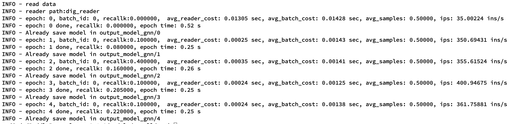
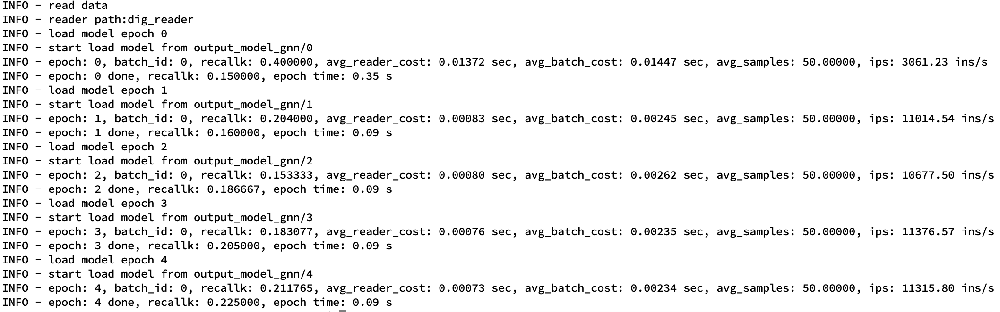

# 基于SRGNN模型的商品推荐
以下是本例的简要目录结构及说明： 

```
├── data #样例数据
    ├── train
        ├── train.txt
    ├── test
        ├── test.txt
    ├── download.py
    ├── convert_data.py
    ├── preprocess.py
├── __init__.py
├── README.md # 文档
├── model.py #模型文件
├── config.yaml #配置文件
├── data_prepare.sh #一键数据处理脚本
├── reader.py #训练数据reader
├── evaluate_reader.py # 预测数据reader
```

注：在阅读该示例前，建议您先了解以下内容：

[paddlerec入门教程](https://github.com/PaddlePaddle/PaddleRec/blob/master/README.md)

## 内容

- [模型简介](#模型简介)
- [数据准备](#数据准备)
- [运行环境](#运行环境)
- [快速开始](#快速开始)
- [结果展示](#结果展示)
- [论文复现](#论文复现)
- [进阶使用](#进阶使用)
- [FAQ](#FAQ)


## 模型简介
SR-GNN模型的介绍可以参阅论文[Session-based Recommendation with Graph Neural Networks](https://arxiv.org/abs/1811.00855)。
本文解决的是Session-based Recommendation这一问题,过程大致分为以下四步：
1. 首先对所有的session序列通过有向图进行建模。
2. 然后通过GNN，学习每个node（item）的隐向量表示
3. 通过一个attention架构模型得到每个session的embedding
4. 最后通过一个softmax层进行全表预测
本模型配置默认使用demo数据集，若进行精度验证，请参考[论文复现](#论文复现)部分。


## 数据准备

本示例中数据处理共包含三步：
- Step1: 原始数据数据集下载，本示例提供了两个开源数据集：DIGINETICA和Yoochoose，可选其中任意一个训练本模型。数据下载命令及原始数据格式如下所示。若采用diginetica数据集，执行完该命令之后，会在data目录下得到原始数据文件train-item-views.csv。若采用yoochoose数据集，执行完该命令之后，会在data目录下得到原始数据文件yoochoose-clicks.dat。
    ```
    cd data && python download.py diginetica     # or yoochoose
    ```
    > [Yoochooses](https://2015.recsyschallenge.com/challenge.html)数据集来源于RecSys Challenge 2015，原始数据包含如下字段：
    1. Session ID – the id of the session. In one session there are one or many clicks.
    2. Timestamp – the time when the click occurred.
    3. Item ID – the unique identifier of the item.
    4. Category – the category of the item.

    > [DIGINETICA](https://competitions.codalab.org/competitions/11161#learn_the_details-data2)数据集来源于CIKM Cup 2016 _Personalized E-Commerce Search Challenge_项目。原始数据包含如下字段：
    1. sessionId - the id of the session. In one session there are one or many clicks.
    2. userId - the id of the user, with anonymized user ids.
    3. itemId - the unique identifier of the item.
    4. timeframe - time since the first query in a session, in milliseconds.
    5. eventdate - calendar date.

- Step2: 数据预处理。
    1. 以session_id为key合并原始数据集，得到每个session的日期，及顺序点击列表。
    2. 过滤掉长度为1的session；过滤掉点击次数小于5的items。
    3. 训练集、测试集划分。原始数据集里最新日期七天内的作为训练集，更早之前的数据作为测试集。
    ```
    cd data && python preprocess.py --dataset diginetica   # or yoochoose
    ```
- Step3: 数据整理。 将训练文件统一放在data/train目录下，测试文件统一放在data/test目录下。
    ```
    cat data/diginetica/train.txt | wc -l >> data/config.txt    # or yoochoose1_4 or yoochoose1_64
    rm -rf data/train/*
    rm -rf data/test/*
    mv data/diginetica/train.txt data/train
    mv data/diginetica/test.txt data/test
    ```
数据处理完成后，data/train目录存放训练数据，data/test目录下存放测试数据，数据格式如下:
```
#session\tlabel
10,11,12,12,13,14\t15
```
data/config.txt中存放数据统计信息，第一行代表训练集中item总数，用以配置模型词表大小，第二行代表训练集大小。

方便起见， 我们提供了一键式数据处理脚本：
```
sh data_prepare.sh diginetica      # or yoochoose1_4 or yoochoose1_64
```

## 运行环境
PaddlePaddle>=2.0

python 3.5/3.6/3.7

os : windows/linux/macos 

## 快速开始
本文提供了样例数据可以供您快速体验，在任意目录下均可执行。在gnn模型目录的快速执行命令如下： 
```
bash
# 进入模型目录
# cd models/rank/dnn # 在任意目录均可运行
# 动态图训练
python -u ../../../tools/trainer.py -m dygraph_config.yaml 
# 动态图预测
python -u ../../../tools/infer.py -m dygraph_config.yaml 

# 静态图训练
python -u ../../../tools/static_trainer.py -m static_config.yaml
# 静态图预测
python -u ../../../tools/static_infer.py -m static_config.yaml 
```
### yaml文件说明
dygraph_config.yaml需要配置的参数如下
```
train_data_dir #数据集的位置
use_gpu #是否使用GPU
use_fleet #表示使用单机或者多机多卡
train_batch_size #batch size
epochs #轮数
print_interval #间隔batch size输出
#infer的参数类似
```
static_config.yaml需要注意的是由于需要实现指导input的sequence len的大小，预先定义如下参数(可以尽量设置较大的值)
```
max_seq_len: 15
max_uniq_len: 11
```
### dig_reader说明
数据导入的格式，继承Dataset，对于类函数`def __getitem__(self, idx)`需要实现对数据读入的单条样本返回结果

### model说明
对于动态图和静态图略有区别，实现了两个不同的model文件，其中静态图由于acc的计算每轮不会累积，需要修改tools/static_trainer和infer_trainer中的部分代码，修改后的代码保存在当前目录下，见`# ******************`标记处；推荐使用动态图模型


### 结果展示
基于动态图样例数据训练结果展示：


基于动态图样例数据测试结果展示：


### 论文复现
用原论文的完整数据复现论文效果需要在static_config.yaml修改超参：
- batch_size: 修改config.yaml中dataset_train数据集的batch_size为100。
- epochs: 修改config.yaml中runner的epochs为5。
- sparse_feature_number: 不同训练数据集(diginetica or yoochoose)配置不一致，diginetica数据集配置为43098，yoochoose数据集配置为37484。具体见数据处理后得到的data/config.txt文件中第一行。
- corpus_size: 不同训练数据集配置不一致，diginetica数据集配置为719470，yoochoose数据集配置为5917745。具体见数据处理后得到的data/config.txt文件中第二行。
```
python -u ../../../tools/static_trainer.py -m static_config.yaml
```

## 进阶使用
  
## FAQ
