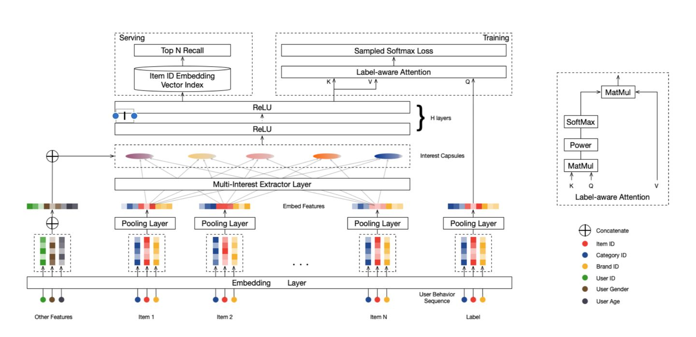

# MIND(Multi-Interest Network with Dynamic Routing)

以下是本例的简要目录结构及说明： 
```
├── data #样例数据
│   ├── demo                    #demo训练数据
│   │   └── demo.txt     
│   └── valid                    #demo测试数据
│       └── part-0    
├── config.yaml                 #demo数据配置
├── config_bigdata.yaml         #全量数据配置
├── infer.py                    #评测动态图
├── dygraph_model.py            #构建动态图
├── mind_reader.py              #训练数据reader
├── mind_infer_reader.py        #评测数据reader
├── net.py                      #模型核心组网（动静合一）
├── static_infer.py             #评测静态图
└── static_model.py             #构建静态图
```

注：在阅读该示例前，建议您先了解以下内容：

[paddlerec入门教程](https://github.com/PaddlePaddle/PaddleRec/blob/master/README.md)

## 内容
- [模型简介](#模型简介)
- [数据准备](#数据准备)
- [运行环境](#运行环境)
- [快速开始](#快速开始)
- [模型组网](#模型组网)
- [效果复现](#效果复现)
- [进阶使用](#进阶使用)
- [FAQ](#FAQ)

## 模型简介
本例实现了基于动态路由的用户多兴趣网络，如下图所示：
<p align="center">

<p>
Multi-Interest Network with Dynamic Routing (MIND) 是通过构建用户和商品向量在统一的向量空间的多个用户兴趣向量，以表达用户多样的兴趣分布。然后通过向量召回技术，利用这多个兴趣向量去检索出TopK个与其近邻的商品向量，得到 TopK个 用户感兴趣的商品。其核心是一个基于胶囊网络和动态路由的（B2I Dynamic Routing）Multi-Interest Extractor Layer。

推荐参考论文:[http://cn.arxiv.org/abs/1904.08030](http://cn.arxiv.org/abs/1904.08030)

## 数据准备
在模型目录的data目录下为您准备了快速运行的示例数据，训练数据、测试数据、词表文件依次保存在data/train, data/test文件夹中。若需要使用全量数据可以参考下方效果复现部分。

训练数据的格式如下：
```
0,17978,0
0,901,1
0,97224,2
0,774,3
0,85757,4
```
分别表示uid、item_id和点击的顺序(时间戳)

测试数据的格式如下：
```
user_id:487766 target_item:0 hist_item:17784 hist_item:126 hist_item:36 hist_item:124 hist_item:34 hist_item:1 hist_item:134 hist_item:6331 hist_item:141 hist_item:4336 hist_item:1373 eval_item:1062 eval_item:867 eval_item:62
user_id:487793 target_item:0 hist_item:153428 hist_item:132997 hist_item:155723 hist_item:66546 hist_item:335397 hist_item:1926 eval_item:1122 eval_item:10105
user_id:487805 target_item:0 hist_item:291025 hist_item:25190 hist_item:2820 hist_item:26047 hist_item:47259 hist_item:36376 eval_item:260145 eval_item:83865
user_id:487811 target_item:0 hist_item:180837 hist_item:202701 hist_item:184587 hist_item:211642 eval_item:101621 eval_item:55716
user_id:487820 target_item:0 hist_item:268524 hist_item:44318 hist_item:35153 hist_item:70847 eval_item:238318
user_id:487825 target_item:0 hist_item:35602 hist_item:4353 hist_item:1540 hist_item:72921 eval_item:501
```
其中`hist_item`和`eval_item`均是变长序列，读取方式可以看`mind_infer_reader.py`

## 运行环境
PaddlePaddle>=2.0

python 2.7/3.5/3.6/3.7

os : linux/macos

## 快速开始

在mind模型目录的快速执行命令如下：
```
# 安装faiss
# CPU
pip install faiss-cpu
# GPU
# pip install faiss-gpu

# 进入模型目录
# cd models/recall/mind # 在任意目录均可运行
# 动态图训练
python -u ../../../tools/trainer.py -m config.yaml 
# 动态图预测
python -u infer.py -m config.yaml -top_n 50  #对测试数据进行预测，并通过faiss召回候选结果评测Reacll、NDCG、HitRate指标

# 静态图训练
python -u ../../../tools/static_trainer.py -m config.yaml # 全量数据运行config_bigdata.yaml 
# 静态图预测
python -u static_infer.py -m config.yaml -top_n 50  #对测试数据进行预测，并通过faiss召回候选结果评测Reacll、NDCG、HitRate指标
```

## 模型组网

细节见上面[模型简介](#模型简介)部分

### 效果复现
由于原始论文没有提供实验的复现细节，为了方便使用者能够快速的跑通每一个模型，我们使用论文[ComiRec](https://arxiv.org/abs/2005.09347)提供的AmazonBook数据集和训练任务进行复现。我们在每个模型下都提供了样例数据。如果需要复现readme中的效果,请按如下步骤依次操作即可。 

在全量数据下模型的指标如下：
| 模型 |  batch_size | epoch_num| Recall@50 | NDCG@50 | HitRate@50 |Time of each epoch |
| :------| :------ | :------ | :------| :------ | :------|  :------ | 
| mind | 128 | 20 | 8.43% | 13.28% | 17.22% | 398.64s(CPU) |


1. 确认您当前所在目录为PaddleRec/models/recall/mind
2. 进入paddlerec/datasets/AmazonBook目录下执行run.sh脚本，会下载处理完成的AmazonBook数据集，并解压到指定目录
```bash
cd ../../../datasets/AmazonBook
sh run.sh
``` 
3. 安装依赖，我们使用[faiss](https://github.com/facebookresearch/faiss)来进行向量召回
```bash
# CPU-only version(pip)
pip install faiss-cpu

# GPU(+CPU) version(pip)
#pip install faiss-gpu

# CPU-only version(conda)
#conda install -c pytorch faiss-cpu

# GPU(+CPU) version(conda)
#conda install -c pytorch faiss-gpu
```
4. 切回模型目录,执行命令运行全量数据
```bash
cd - # 切回模型目录
# 动态图训练
python -u ../../../tools/trainer.py -m config_bigdata.yaml # 全量数据运行config_bigdata
python -u infer.py -m config_bigdata.yaml -top_n 50 # 全量数据运行config_bigdata
```

## 进阶使用
  
## FAQ

## 参考

数据集及训练任务参考了[ComiRec](https://github.com/THUDM/ComiRec)
