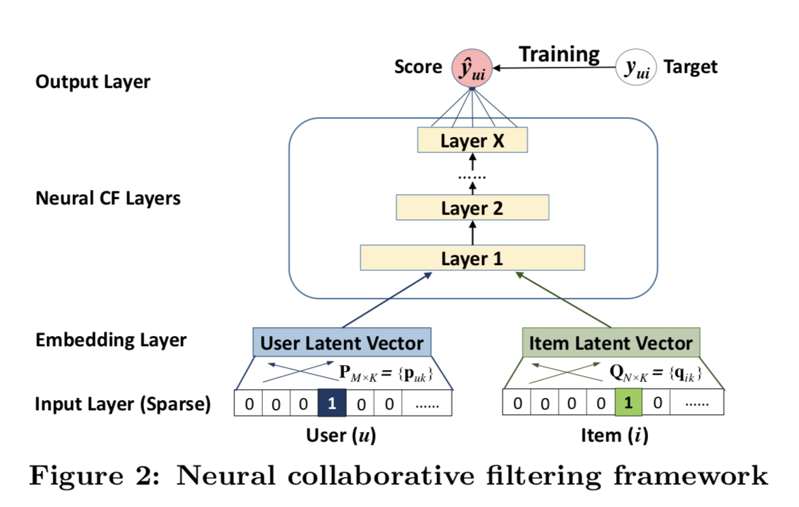

# NCF召回模型

以下是本例的简要目录结构及说明： 

```
├── data #样例数据
    ├── train
        ├── small_data.csv #训练数据样例
    ├── test
        ├── small_data.csv #测试数据样例
├── __init__.py
├── readme.md #文档
├── config.yaml # sample数据配置
├── config_bigdata.yaml # 全量数据配置
├── net.py # 模型核心组网（动静统一）
├── movielens_reader.py #数据读取程序
├── static_model.py # 构建静态图
├── dygraph_model.py # 构建动态图
├── evaluate.py # 计算指标
├── run.sh # 一键运行脚本
```

注：在阅读该示例前，建议您先了解以下内容：

[paddlerec入门教程](https://github.com/PaddlePaddle/PaddleRec/blob/master/README.md)

## 内容

- [模型简介](#模型简介)
- [数据准备](#数据准备)
- [运行环境](#运行环境)
- [快速开始](#快速开始)
- [模型组网](#模型组网)
- [效果复现](#效果复现)
- [进阶使用](#进阶使用)
- [FAQ](#FAQ)

## 模型简介
很多应用场景，并没有显性反馈的存在。因为大部分用户是沉默的用户，并不会明确给系统反馈“我对这个物品的偏好值是多少”。因此，推荐系统可以根据大量的隐性反馈来推断用户的偏好值。[《Neural Collaborative Filtering 》](https://arxiv.org/pdf/1708.05031.pdf)作者利用深度学习来对user和item特征进行建模，使模型具有非线性表达能力。具体来说使用多层感知机来学习user-item交互函数，提出了一种隐性反馈协同过滤解决方案。

## 数据准备
本模型使用论文中的数据集ml-1m（即MovieLens数据集）和pinterest-20（即Pinterest数据集）在模型目录的data目录下为您准备了快速运行的示例数据，若需要使用全量数据可以参考下方[效果复现](#效果复现)部分。  
每个数据集分为三个文件，后缀分别为：（.test.negative），（.test.rating），（.train.rating）  
在.train.rating和.test.rating中的数据格式为：  
user_id + \t + item_id + \t + rating(用户评分) + \t + timestamp(时间戳)  
在test.negative中的数据格式为：  
(userID,itemID) + \t + negativeItemID1 + \t + negativeItemID2 …(包含99个negative样本)  

## 运行环境
PaddlePaddle>=2.0

python 2.7/3.5/3.6/3.7

os : windows/linux/macos 

## 快速开始
本文提供了样例数据可以供您快速体验，在任意目录下均可执行。在ncf模型目录的快速执行命令如下： 
```bash
# 进入模型目录
# cd models/recall/ncf # 在任意目录均可运行
# 动态图训练
python -u ../../../tools/trainer.py -m config.yaml # 全量数据运行config_bigdata.yaml 
# 动态图预测
python -u ../../../tools/infer.py -m config.yaml 

# 静态图训练
python -u ../../../tools/static_trainer.py -m config.yaml # 全量数据运行config_bigdata.yaml 
# 静态图预测
python -u ../../../tools/static_infer.py -m config.yaml 
``` 

## 模型组网
论文[Neural Collaborative Filtering ](https://arxiv.org/pdf/1708.05031.pdf)中的neumf网络结构如图所示:  
<p align="center">

<p>

## 效果复现
为了方便使用者能够快速的跑通每一个模型，我们在每个模型下都提供了样例数据。如果需要复现readme中的效果,请按如下步骤依次操作即可。  
在全量数据下模型的指标如下：  

| 模型 | HR@10 | NDCG@10 | batch_size | epoch_num| Time of each epoch |
| :------| :------ |:------ | :------ | :------| :------ | 
| NCF_NeuMF | 0.58 | 0.33 | 256 | 20 | 约20分钟 |

1. 确认您当前所在目录为PaddleRec/models/recall/ncf  
2. 进入paddlerec/datasets/movielens_pinterest_NCF目录下，执行该脚本，会从国内源的服务器上下载我们预处理完成的movielens和pinterest全量数据集，并解压到指定文件夹。

``` bash
cd ../../../datasets/movielens_pinterest_NCF
sh run.sh
```
3. 切回模型目录,执行命令运行全量数据

```bash
cd - # 切回模型目录
# 动态图训练并得到指标(这里需要使用bash启动脚本)
bash run.sh
```

## 进阶使用
  
## FAQ
