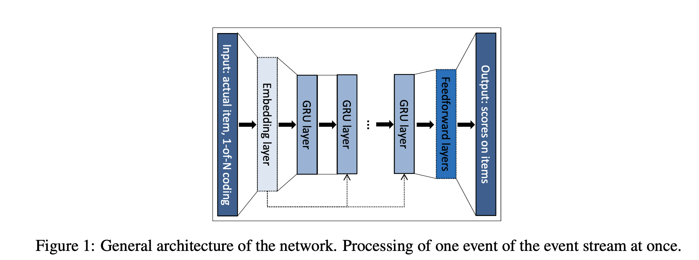
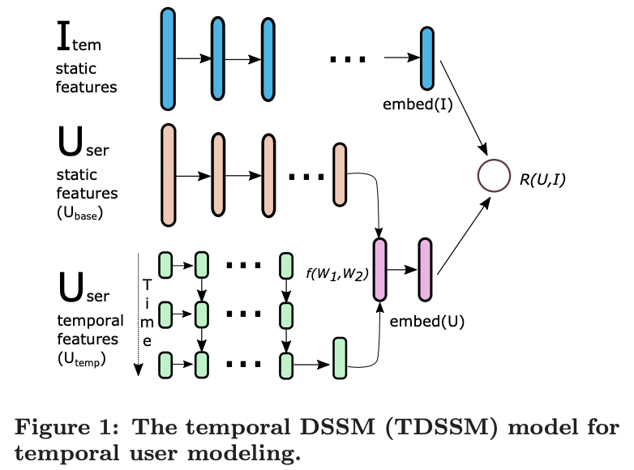
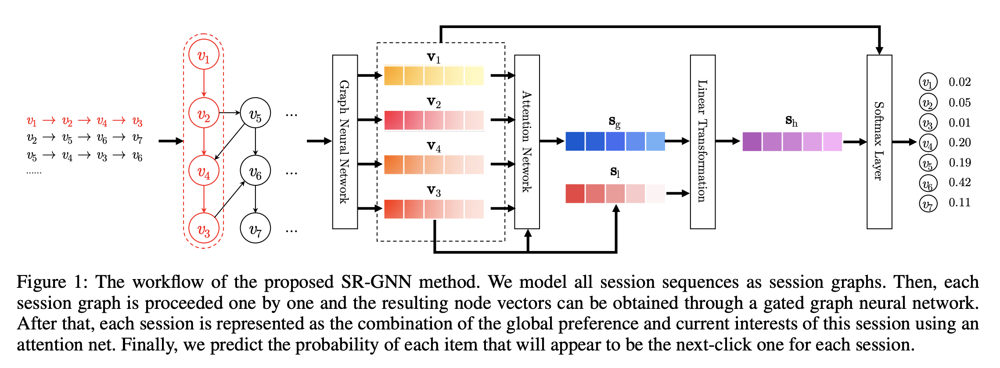

# 召回模型库

## 简介
我们提供了常见的召回任务中使用的模型算法的PaddleRec实现, 单机训练&预测效果指标以及分布式训练&预测性能指标等。实现的召回模型包括 [SR-GNN](http://gitlab.baidu.com/tangwei12/paddlerec/tree/develop/models/recall/gnn)、[GRU4REC](http://gitlab.baidu.com/tangwei12/paddlerec/tree/develop/models/recall/gru4rec)、[Sequence Semantic Retrieval Model](http://gitlab.baidu.com/tangwei12/paddlerec/tree/develop/models/recall/ssr)、 [Tree-based Deep Model](http://gitlab.baidu.com/tangwei12/paddlerec/tree/develop/models/recall/tdm)、[Word2Vector](http://gitlab.baidu.com/tangwei12/paddlerec/tree/develop/models/recall/word2vec)。

模型算法库在持续添加中，欢迎关注。

## 目录
* [整体介绍](#整体介绍)
    * [召回模型列表](#召回模型列表)
* [使用教程](#使用教程)
    * [数据处理](#数据处理)
    * [训练](#训练)
    * [预测](#预测)
* [效果对比](#效果对比)
    * [模型效果列表](#模型效果列表)
* [分布式](#分布式)
    * [模型性能列表](#模型性能列表)

## 整体介绍
### 召回模型列表

|       模型        |       简介        |       论文        |
| :------------------: | :--------------------: | :---------: |
| Word2Vec | word2vector | [Distributed Representations of Words and Phrases and their Compositionality](https://papers.nips.cc/paper/5021-distributed-representations-of-words-and-phrases-and-their-compositionality.pdf)(2013) |
| GRU4REC | SR-GRU | [Session-based Recommendations with Recurrent Neural Networks](https://arxiv.org/abs/1511.06939)(2015) |
| SSR | Sequence Semantic Retrieval Model | [Multi-Rate Deep Learning for Temporal Recommendation](http://sonyis.me/paperpdf/spr209-song_sigir16.pdf)(2016) |
| GNN | SR-GNN | [Session-based Recommendation with Graph Neural Networks](https://arxiv.org/abs/1811.00855)(2018) |

下面是每个模型的简介（注：图片引用自链接中的论文）

[Word2Vec](https://papers.nips.cc/paper/5021-distributed-representations-of-words-and-phrases-and-their-compositionality.pdf):

[GRU4REC](https://arxiv.org/abs/1511.06939):

[SSR](http://sonyis.me/paperpdf/spr209-song_sigir16.pdf):

[GNN](https://arxiv.org/abs/1811.00855):

## 使用教程
### 数据处理

### 训练

### 预测

## 效果对比
### 模型效果列表

|       数据集        |       模型       |       loss        |       Recall@20       | 
| :------------------: | :--------------------: | :---------: |:---------: |
|       DIGINETICA     |       GNN       |       --        |       0.507       |
|       RSC15        |       GRU4REC       |       --        |       0.67          |
|       RSC15        |       SSR       |       --        |       无          |
|       1 Billion Word Language Model Benchmark        |       Word2Vec       |       --         |       0.54          |

## 分布式
### 模型性能列表
|       数据集        |       模型       |       单机        |       多机（同步）          |       多机（异步）          |       GPU          |
| :------------------: | :--------------------: | :---------: |:---------: |:---------: |:---------: |
|       DIGINETICA        |       GNN       |       --        |       --          |       --          |       --          |
|       RSC15        |       GRU4REC       |       --        |       --          |       --          |       --          |
|       RSC15        |       SSR       |       --        |       --          |       --          |       --          |
|       1 Billion Word Language Model Benchmark        |       Word2Vec       |       --        |       --          |       --          |       --          |
