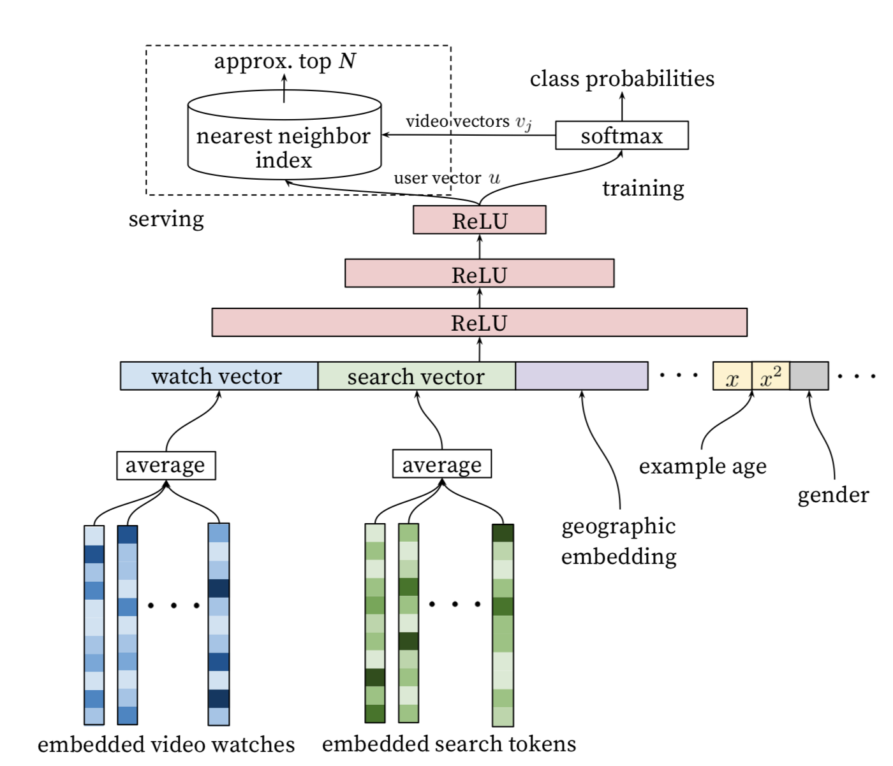

# 召回模型库

## 简介
我们提供了常见的召回任务中使用的模型算法的PaddleRec实现, 单机训练&预测效果指标以及分布式训练&预测性能指标等。实现的召回模型包括 [SR-GNN](gnn)、[GRU4REC](gru4rec)、[Sequence Semantic Retrieval Model](ssr)、[Word2Vector](word2vec)、[Youtube_DNN](youtube_dnn)、[ncf](ncf)。

模型算法库在持续添加中，欢迎关注。

## 目录
* [整体介绍](#整体介绍)
    * [召回模型列表](#召回模型列表)
* [使用教程](#使用教程)
    * [训练 预测](#训练 预测)
* [效果对比](#效果对比)
    * [模型效果列表](#模型效果列表)

## 整体介绍
### 召回模型列表

|       模型        |       简介        |       论文        |
| :------------------: | :--------------------: | :--------- |
| Word2Vec | word2vector | [NIPS 2013][Distributed Representations of Words and Phrases and their Compositionality](https://papers.nips.cc/paper/5021-distributed-representations-of-words-and-phrases-and-their-compositionality.pdf) |
| GRU4REC | SR-GRU | [2015][Session-based Recommendations with Recurrent Neural Networks](https://arxiv.org/abs/1511.06939) |
| Youtube_DNN | Youtube_DNN | [RecSys 2016][Deep Neural Networks for YouTube Recommendations](https://static.googleusercontent.com/media/research.google.com/zh-CN//pubs/archive/45530.pdf) |
| SSR | Sequence Semantic Retrieval Model | [SIGIR 2016][Multi-Rate Deep Learning for Temporal Recommendation](http://sonyis.me/paperpdf/spr209-song_sigir16.pdf) |
| NCF | Neural Collaborative Filtering | [WWW 2017][Neural Collaborative Filtering](https://arxiv.org/pdf/1708.05031.pdf) |
| GNN | SR-GNN | [AAAI 2019][Session-based Recommendation with Graph Neural Networks](https://arxiv.org/abs/1811.00855) |
| Fasttext | fasttext | [EACL 2017][Bag of Tricks for Efficient Text Classification](https://www.aclweb.org/anthology/E17-2068.pdf)  |

下面是每个模型的简介（注：图片引用自链接中的论文）

[Word2Vec](https://papers.nips.cc/paper/5021-distributed-representations-of-words-and-phrases-and-their-compositionality.pdf):
<p align="center">

<p>

[GRU4REC](https://arxiv.org/abs/1511.06939):
<p align="center">

<p>

[Youtube_DNN](https://static.googleusercontent.com/media/research.google.com/zh-CN//pubs/archive/45530.pdf):
<p align="center">

<p>

[SSR](http://sonyis.me/paperpdf/spr209-song_sigir16.pdf):
<p align="center">

<p>

[NCF](https://arxiv.org/pdf/1708.05031.pdf):
<p align="center">

<p>

[GNN](https://arxiv.org/abs/1811.00855):
<p align="center">

<p>

## 使用教程(快速开始)
### 
```shell
python -m paddlerec.run -m paddlerec.models.recall.word2vec # word2vec
python -m paddlerec.run -m paddlerec.models.recall.ssr # ssr
python -m paddlerec.run -m paddlerec.models.recall.gru4rec # gru4rec
python -m paddlerec.run -m paddlerec.models.recall.gnn # gnn
python -m paddlerec.run -m paddlerec.models.recall.ncf # ncf
python -m paddlerec.run -m paddlerec.models.recall.youtube_dnn # youtube_dnn
```

## 使用教程（复现论文）
为了方便使用者能够快速的跑通每一个模型，我们在每个模型下都提供了样例数据，并且调整了batch_size等超参以便在样例数据上更加友好的显示训练&测试日志。如果需要复现readme中的效果请按照如下表格调整batch_size等超参，并使用提供的脚本下载对应数据集以及数据预处理。

| 模型	| batch_size | thread_num | epoch_num |
| :---: | :---: | :---: | :---: |
| Word2Vec | 100 | 5 | 5 |
| GNN | 100 | 1 | 30 |
| GRU4REC | 500	| 1	| 10 |

### 数据处理
参考每个模型目录数据下载&预处理脚本。
```bash
sh data_prepare.sh
```

### 训练
```bash
cd modles/recall/gnn # 进入选定好的召回模型的目录 以gnn为例
python -m paddlerec.run -m ./config.yaml # 自定义修改超参后，指定配置文件，使用自定义配置
```

### 预测
```
# 修改对应模型的config.yaml, workspace配置为当前目录的绝对路径
# 修改对应模型的config.yaml，mode配置infer_runner
# 示例: mode: train_runner -> mode: infer_runner
# infer_runner中 class配置为 class: single_infer
# 修改phase阶段为infer的配置，参照config注释

# 修改完config.yaml后 执行:
python -m paddlerec.run -m ./config.yaml # 以gnn为例
```

## 效果对比
### 模型效果列表

|       数据集        |       模型       |       HR@10        |       Recall@20       | 
| :------------------: | :--------------------: | :---------: |:---------: |
|       DIGINETICA     |       GNN       |       --        |       0.507       |
|       RSC15        |       GRU4REC       |       --        |       0.670          |
|       RSC15        |       SSR       |       --        |       0.590          |
|       MOVIELENS        |       NCF       |       0.688        |       --          |
|       --        |       Youtube       |       --        |       --          |
|       1 Billion Word Language Model Benchmark        |       Word2Vec       |       --         |       0.54          |
