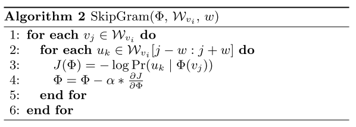

# 召回模型库

## 简介
我们提供了常见的召回任务中使用的模型算法的PaddleRec实现, 单机训练&预测效果指标以及分布式训练&预测性能指标等。实现的召回模型包括 [Word2Vector](word2vec)。

模型算法库在持续添加中，欢迎关注。

## 目录
* [整体介绍](#整体介绍)
    * [模型列表](#模型列表)
* [使用教程](#使用教程)
    * [快速开始](#快速开始)
    * [模型效果](#模型效果)
    * [效果复现](#效果复现)

## 整体介绍
### 模型列表

|       模型        |       简介        |       论文        |
| :------------------: | :--------------------: | :--------- |
| Word2Vec | word2vector | [NIPS 2013][Distributed Representations of Words and Phrases and their Compositionality](https://papers.nips.cc/paper/5021-distributed-representations-of-words-and-phrases-and-their-compositionality.pdf) |
| Deepwalk | Deepwalk | [KDD 2014][DeepWalk: Online Learning of Social Representations](https://arxiv.org/pdf/1403.6652.pdf) |
| MIND | Multi-Interest Network with Dynamic Routing | [ACM 2019][Multi-Interest Network with Dynamic Routing for Recommendation at Tmall](http://cn.arxiv.org/abs/1904.08030) |
| NCF | Neural Collaborative Filtering | [WWW 2017][Neural Collaborative Filtering](https://arxiv.org/pdf/1708.05031.pdf) |

下面是每个模型的简介（注：图片引用自链接中的论文）

[Word2Vec](https://papers.nips.cc/paper/5021-distributed-representations-of-words-and-phrases-and-their-compositionality.pdf):
<p align="center">

<p>

[Neural Collaborative Filtering ](https://arxiv.org/pdf/1708.05031.pdf)中的neumf网络结构如图所示:  
<p align="center">

<p>

[DeepWalk: Online Learning of Social Representations](https://arxiv.org/pdf/1403.6652.pdf):
<p align="center">

<p>
<p align="center">

<p>

## 使用教程

### 快速开始
```bash
# 进入模型目录
cd models/recall/xxx # xxx为任意的recall下的模型目录
# 动态图训练
python -u ../../../tools/trainer.py -m config.yaml # 全量数据运行config_bigdata.yaml 
# 动态图预测
python -u ../../../tools/infer.py -m config.yaml 

# 静态图训练
python -u ../../../tools/static_trainer.py -m config.yaml # 全量数据运行config_bigdata.yaml 
# 静态图预测
python -u ../../../tools/static_infer.py -m config.yaml 
``` 

### 模型效果

|       数据集        |       模型       |       acc        |
| :------------------: | :--------------------: | :---------: |
|       1 Billion Word Language Model Benchmark     |       Word2Vec       |       0.579         |
|       BlogCatalog     |       deepwalk       |       MacroF1: 0.295         |
|       AmazonBook     |       mind       |       Recall@50: 8.43%        |
|       MovieLens     |       ncf       |       HR@10: 0.58         |

### 效果复现
您需要进入PaddleRec/datasets目录下的对应数据集中运行脚本获取全量数据集，然后在模型目录下使用全量数据的参数运行。  
每个模型下的readme中都有详细的效果复现的教程，您可以进入模型的目录中详细查看。 
