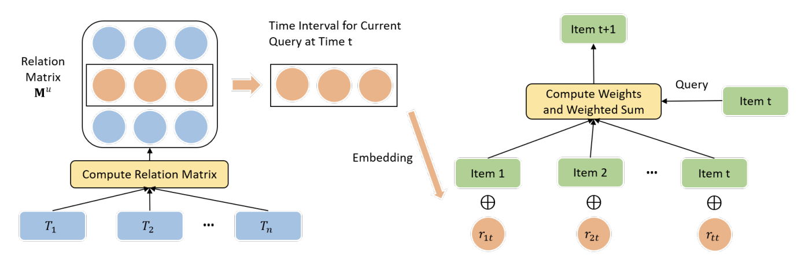

# TiSASRec-paddle召回模型

以下是本例的简要目录结构及说明： 

```
├── data #样例数据
    ├── sammple_data
        ├── small_data.csv #数据样例
├── picture #模型相关图片
├── config.yaml # sample数据配置
├── config_bigdata.yaml # 全量数据配置
├── dygraph_model.py # 构建动态图
├── infer.py # 预测脚本
├── movielens_reader.py #数据读取程序
├── net.py # 模型核心组网（动静统一）
├── readme.md #文档
├── static_model.py # 构建静态图
```

注：在阅读该示例前，建议您先了解以下内容：

[paddlerec入门教程](https://github.com/PaddlePaddle/PaddleRec/blob/master/README.md)

## 内容

- [模型简介](#模型简介)
- [数据准备](#数据准备)
- [运行环境](#运行环境)
- [快速开始](#快速开始)
- [模型组网](#模型组网)
- [效果复现](#效果复现)
- [进阶使用](#进阶使用)
- [FAQ](#FAQ)

## 模型简介
传统的序列化推荐模型都将交互历史视为一个有顺序的序列，还没有考虑这个序列中交互物品之间的时间间隔。[Time Interval Aware Self-Attention for Sequential Recommendation](https://cseweb.ucsd.edu/~jmcauley/pdfs/wsdm20b.pdf)将交互中的时间戳建模进序列模型框架中，以探索不同的时间间隔对预测下一个物品的影响。

## 数据准备
本模型使用论文中的数据集ml-1m（即MovieLens数据集）在模型目录的data目录下为您准备了快速运行的示例数据，若需要使用全量数据可以参考下方[效果复现](#效果复现)部分。   

## 运行环境
PaddlePaddle>=2.0

python 2.7/3.5/3.6/3.7

os : windows/linux/macos 

## 快速开始
本文提供了样例数据可以供您快速体验，在任意目录下均可执行。在tisas模型目录的快速执行命令如下： 
```bash
# 进入模型目录
# cd models/recall/tisas # 在任意目录均可运行
# 动态图训练
python -u ../../../tools/trainer.py -m config.yaml # 全量数据运行config_bigdata.yaml 
# 动态图预测
python -u infer.py -m config.yaml 
```
## 模型组网
模型整体结构如下：


## 效果复现
为了方便使用者能够快速的跑通每一个模型，我们在每个模型下都提供了样例数据。如果需要复现readme中的效果,请按如下步骤依次操作即可。  
在全量数据下模型的指标如下：  

| 模型 | HR@10 | NDCG@10 | batch_size | epoch_num| Time of each epoch |
| :------| :------ |:------ | :------ | :------| :------ | 
| TiSAS | 0.8031 | 0.5756 | 128 | 300 | 4s |

1. 确认您当前所在目录为PaddleRec/models/recall/tisas  
2. 进入Paddlerec/datasets/ml-1m_tisas
3. 执行脚本，会从国内源的服务器上下载我们预处理完成的movielens全量数据集，并解压到指定文件夹。

``` bash
cd ../../../datasets/ml-1m_tisas
sh run.sh
```
3. 切回模型目录,执行命令运行全量数据

```bash
cd - # 切回模型目录
python -u ../../../tools/trainer.py -m config_bigdata.yaml
python -u infer.py -m config_bigdata.yaml
```

## 进阶使用
  
## FAQ
