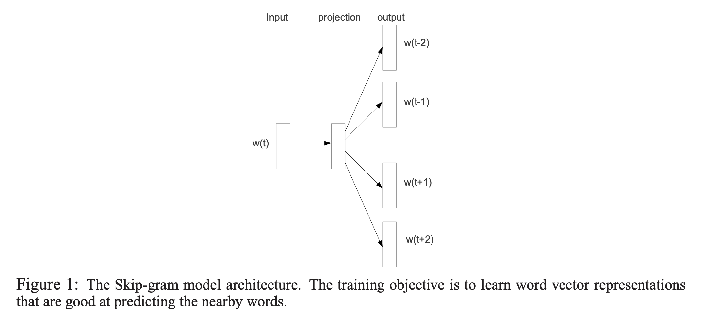
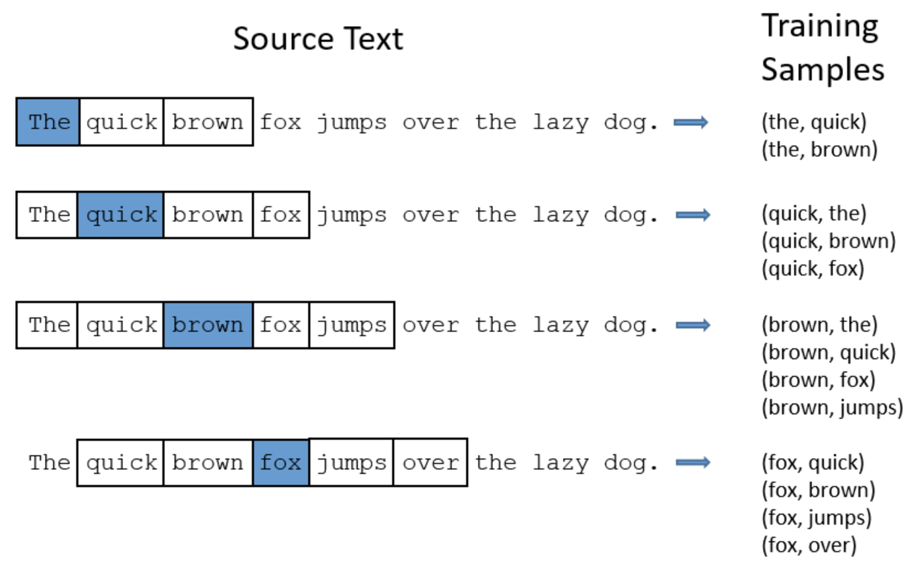

# Skip-Gram W2V

以下是本例的简要目录结构及说明： 

```
├── data #样例数据
    ├── train
      ├── convert_sample.txt
    ├── test
      ├── sample.txt
    ├── dict
      ├── word_count_dict.txt
      ├── word_id_dict.txt
├── benchmark 
    ├── benchmark_data.sh # benchmark的数据处理
    ├── benchmark_reader.py # benchmark的数据读取程序
    ├── benchmark.yaml # benchmark的配置
    ├── static_model.py # 静态图方式训练
    ├── w2v_infer.py # 预测
├── __init__.py
├── README.md # 文档
├── config.yaml # sample数据配置
├── config_bigdata.yaml # 全量数据配置
├── static_model.py # 构建静态图
├── dygraph_model.py # 构建动态图
├── net.py # 模型核心组网（动静统一）
├── infer.py # 自定义预测脚本
├── static_infer.py # 自定义预测脚本
├── w2v_reader.py #训练数据reader
├── word2vec_infer_reader.py # 预测数据reader
├── utils #自定义预测中用到的工具
    ├── __init__.py
    ├── envs.py
    ├── save_load.py
    ├── utils_single.py
    ├── static_ps
        ├── common.py
        ├── infer.py
        ├── __init__.py
        ├── program_helper.py
        ├── reader_helper.py
```

注：在阅读该示例前，建议您先了解以下内容：

[paddlerec入门教程](https://github.com/PaddlePaddle/PaddleRec/blob/master/README.md)

## 内容

- [模型简介](#模型简介)
- [数据准备](#数据准备)
- [运行环境](#运行环境)
- [快速开始](#快速开始)
- [模型组网](#模型组网)
- [效果复现](#效果复现)
- [进阶使用](#进阶使用)
- [FAQ](#FAQ)

## 模型简介
本例实现了skip-gram模式的word2vector模型，如下图所示：
<p align="center">

<p>
以每一个词为中心词X，然后在窗口内和临近的词Y组成样本对（X,Y）用于网络训练。在实际训练过程中还会根据自定义的负采样率生成负样本来加强训练的效果  
具体的训练思路如下：  
<p align="center">

<p>

推荐用户参考[ IPython Notebook demo](https://aistudio.baidu.com/aistudio/projectDetail/124377)教程获取更详细的信息。

## 数据准备
在模型目录的data目录下为您准备了快速运行的示例数据，训练数据、测试数据、词表文件依次保存在data/train, data/test, data/dict文件夹中。若需要使用全量数据可以参考下方[效果复现](#效果复现)部分。  
数据的格式如下：  
```
45 8 71 53 83 58 71 28 46 3
59 68 5 82 0 81
61
```
词表的格式如下：  
```
and 6
all 48
because 64
just 72
per 63
when 59
is 9
year 43
some 55
it 20
```

## 运行环境
PaddlePaddle>=2.0

python 2.7/3.5/3.6/3.7

os : windows/linux/macos 

## 快速开始
本文提供了样例数据可以供您快速体验，在任意目录下均可执行。在word2vec模型目录的快速执行命令如下： 
```bash
# 进入模型目录
# cd models/recall/word2vec # 在任意目录均可运行
# 动态图训练
python -u ../../../tools/trainer.py -m config.yaml # 全量数据运行config_bigdata.yaml 
# 动态图预测
python -u infer.py -m config.yaml 

# 静态图训练
python -u ../../../tools/static_trainer.py -m config.yaml # 全量数据运行config_bigdata.yaml 
# 静态图预测
python -u static_infer.py -m config.yaml 
``` 
## 模型组网
我们通过词类比（Word Analogy）任务来检验word2vec模型的训练效果。输入四个词A，B，C，D，假设存在一种关系relation, 使得relation(A, B) = relation(C， D)，然后通过A，B，C去预测D，emb(D) = emb(B) - emb(A) + emb(C)。细节见上面[模型简介](#模型简介)部分

### 效果复现
为了方便使用者能够快速的跑通每一个模型，我们在每个模型下都提供了样例数据。如果需要复现readme中的效果,请按如下步骤依次操作即可。 
在全量数据下模型的指标如下：
| 模型 | acc | batch_size | epoch_num| Time of each epoch |
| :------| :------ | :------ | :------| :------ | 
| word2vec | 0.579 | 100 | 5 | -- |

1. 确认您当前所在目录为PaddleRec/models/recall/word2vec 
2. 进入paddlerec/datasets/one_billion目录下，执行该脚本，会从国内源的服务器上下载我们预处理完成的criteo全量数据集，并解压到指定文件夹。
``` bash
cd ../../../datasets/one_billion
sh run.sh
``` 
3. 切回模型目录,执行命令运行全量数据
```bash
cd - # 切回模型目录
# 动态图训练
python -u ../../../tools/trainer.py -m config_bigdata.yaml # 全量数据运行config_bigdata.yaml 
python -u infer.py -m config_bigdata.yaml # 全量数据运行config_bigdata.yaml 
```

## 进阶使用
  
## FAQ
