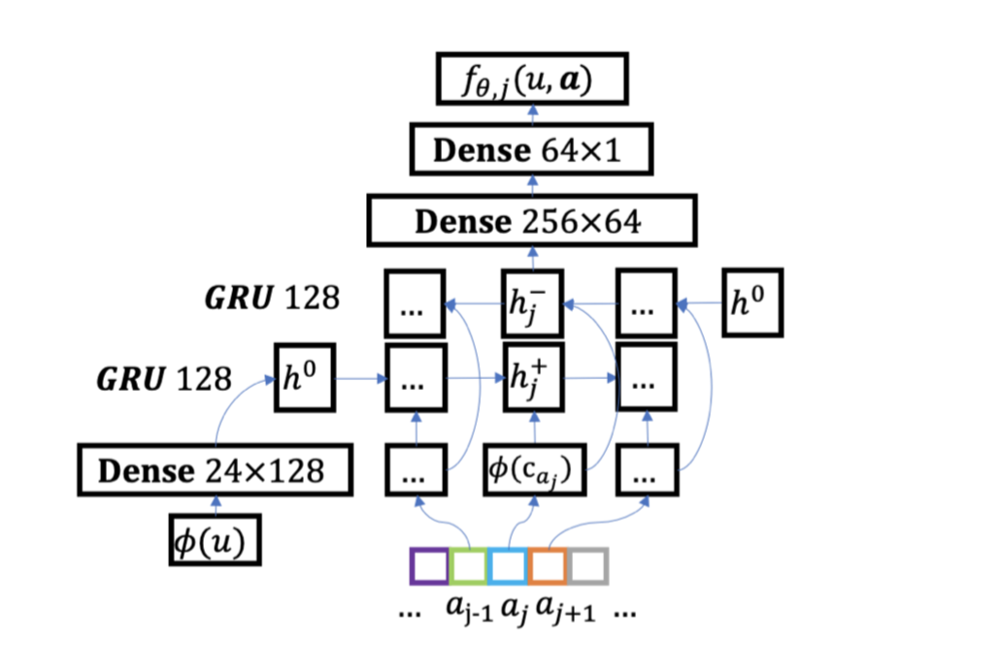

# 重排序模型库

## 简介
我们提供了常见的重排序使用的模型算法的PaddleRec实现, 单机训练&预测效果指标以及分布式训练&预测性能指标等。目前实现的模型是 [Listwise](listwise)。

模型算法库在持续添加中，欢迎关注。

## 目录
* [整体介绍](#整体介绍)
    * [重排序模型列表](#重排序模型列表)
* [使用教程](#使用教程)

## 整体介绍
### 融合模型列表

|       模型        |       简介        |       论文        |
| :------------------: | :--------------------: | :---------: |
| Listwise | Listwise | [2019][Sequential Evaluation and Generation Framework for Combinatorial Recommender System](https://arxiv.org/pdf/1902.00245.pdf) |

下面是每个模型的简介（注：图片引用自链接中的论文）


[Listwise](https://arxiv.org/pdf/1902.00245.pdf):
<p align="center">

<p>


## 使用教程(快速开始)
```shell
python -m paddlerec.run -m paddlerec.models.rerank.listwise # listwise
```

## 使用教程（复现论文）

listwise原论文没有给出训练数据，我们使用了随机的数据，可参考快速开始
