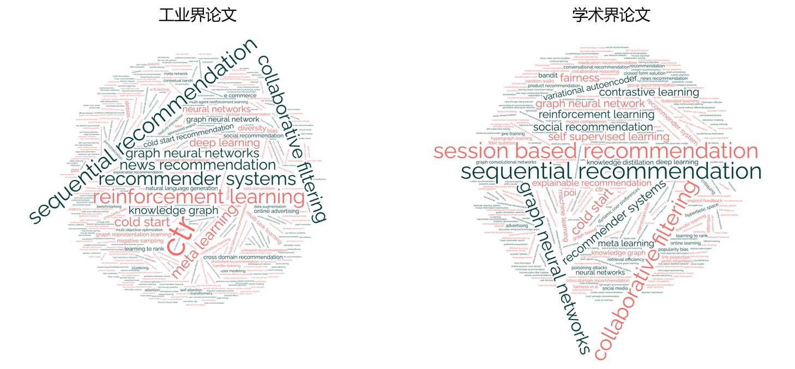
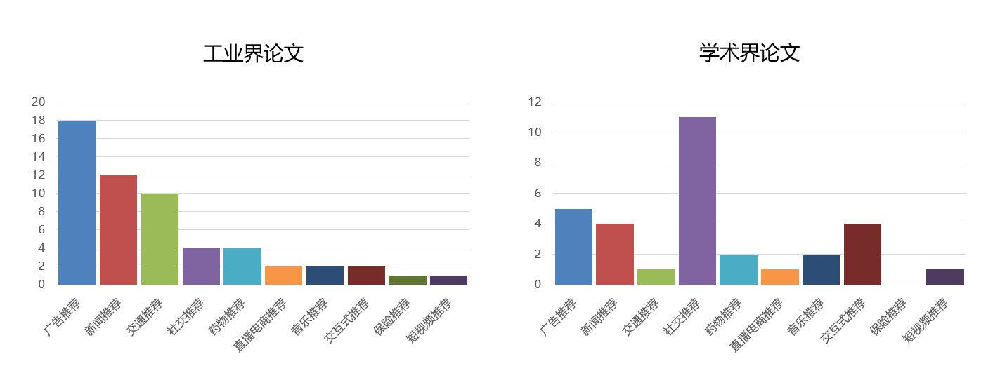
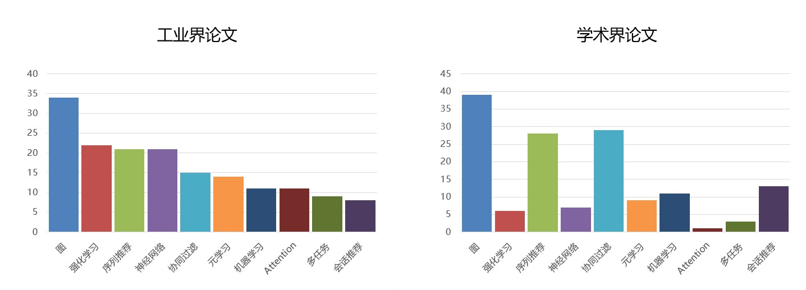
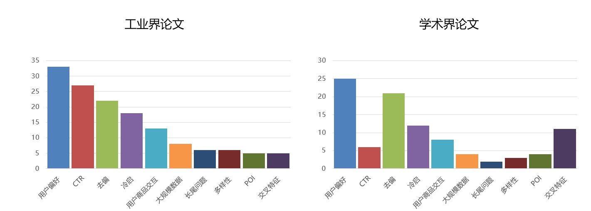
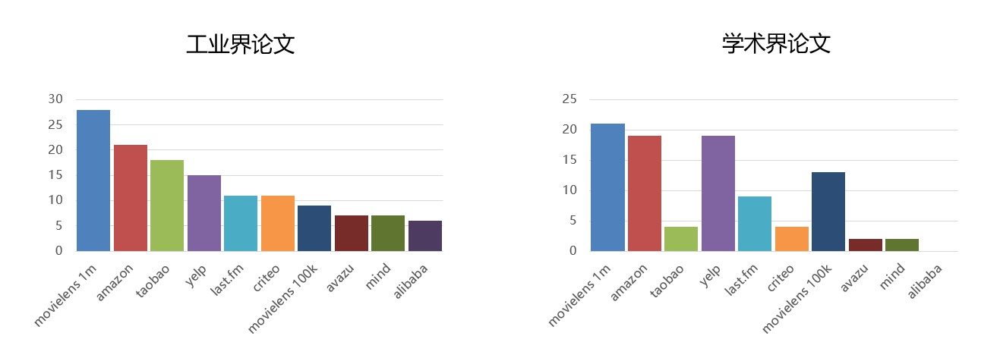
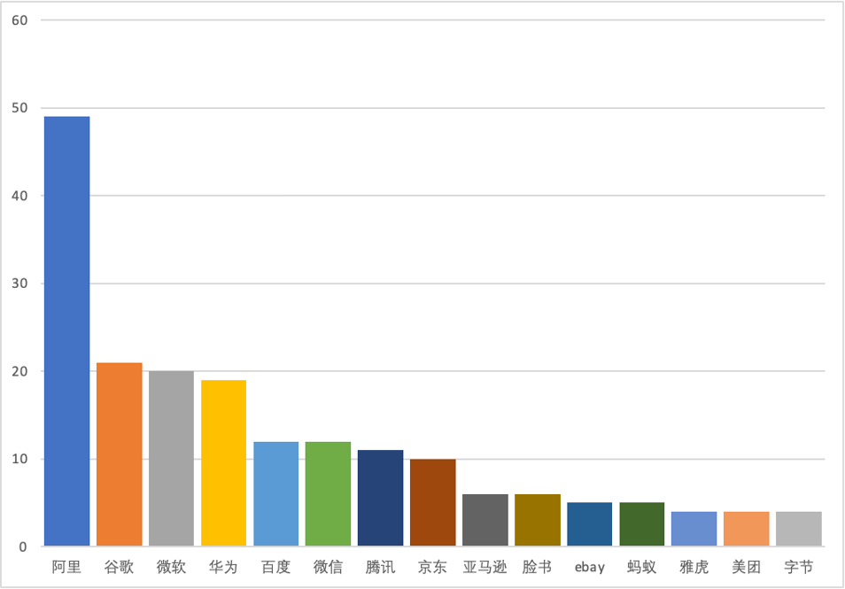

# 工业界推荐系统顶会论文综述

[知乎专栏](https://zhuanlan.zhihu.com/p/478792301)

我们长期追踪推荐系统前沿进展和最新工业实践，《工业界推荐系统顶会论文综述》系列文章总结了自2021年以来的推荐系统顶会中的论文，我们尤其关注工业界的研究方向和最新进展。欢迎更多同学讨论和指正，同时也宣传一波我们组在推荐方向的工作成果——大规模推荐算法库[PaddleRec](https://github.com/PaddlePaddle/PaddleRec)，欢迎大家点亮你们的star。

本章首先介绍我们的整体调研情况和一些统计性的结果，供大家有一个直观的印象。调研过程中可能因为各种原因会有一些误差，欢迎大家指正。

有几个概念需要明确一下：工业界和学术界其实并没有完全割裂，往往有很多合作，所以我们这里提到的工业界特指作者列表中有企业员工的就认为是工业界论文，全部作者为大学、科研机构的列为学术界论文。

## 调研内容和范围
我们将围绕主要的技术方向介绍最新的工业落地论文  
[AAAI2021](AAAI2021.md)  
[IJCAI2021](IJCAI2021.md)  
[KDD2021](KDD2021.md)  
[RecSys2021](RecSys2021.md)  
[SIGIR2021](SIGIR2021.md)  
[WSDM2021](WSDM2021.md)  
[WWW2021](WWW2021.md)  

## 统计信息

### key word

工业界和学术界论文的关键词分布略有不同

### 任务场景

（1）总得来说 广告，新闻，社交还是主流的推荐场景  
（2）工业界贴近产品的场景开始更多出现，如交通、直播电商等  
（3）学术界对社交推荐和交互式推荐更关注  

### 技术方向

（1）图和序列推荐，无论学术界还是工业界都很火  
（2）工业界更关注强化学习、NN，多任务，attention  
（3）学术界对协同过滤研究很深  

### 问题

（1）用户建模，去偏 都很火
（2）工业界：ctr
（3）学术界：特征交叉

### 数据集

（1）Movielens yyds， amazon也不差  
（2）Criteo学术界渐渐失宠  

### 企业

在推荐领域的顶会论文中，中美企业平分秋色

