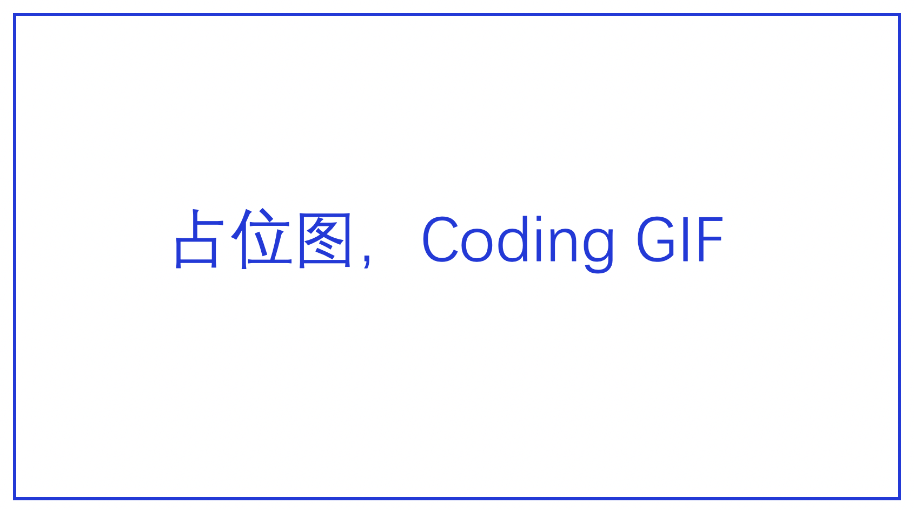

`PaddleRec`是源于飞桨生态的`搜索推荐模型`一站式开箱即用工具，无论您是初学者，开发者，研究者均可便捷的使用`PaddleRec`完成调研，训练到预测部署的全流程工作。`PaddleRec`提供了搜索推荐任务中语义理解、召回、粗排、精排、多任务学习的全流程解决方案。

`PadlleRec`以预置模型为核心,具备以下特点：
> 占位链接，分文档描述
- [易于上手，开箱即用](https://www.paddlepaddle.org.cn)
- [灵活配置，个性调参](https://www.paddlepaddle.org.cn)
- [分布式训练，大规模稀疏](https://www.paddlepaddle.org.cn)
- [快速部署，一键上线](https://www.paddlepaddle.org.cn)

# 目录
* [特性](#特性)
  * [易于上手，开箱即用](#易于上手开箱即用)
  * [灵活配置，个性调参](#灵活配置个性调参)
  * [分布式训练，大规模稀疏](#分布式训练大规模稀疏)
  * [快速部署，一键上线](#快速部署一键上线)
* [支持模型列表](#支持模型列表)
* [文档教程](#文档教程)
  * [入门教程](#入门教程)
     * [环境要求](#环境要求)
     * [安装命令](#安装命令)
     * [快速开始](#快速开始)
     * [常见问题FAQ](#常见问题faq)
  * [进阶教程](#进阶教程)
     * [自定义数据集及Reader](#自定义数据集及reader)
     * [模型调参](#模型调参)
     * [单机训练](#单机训练)
     * [分布式训练](#分布式训练)
     * [预测部署](#预测部署)
* [版本历史](#版本历史)
  * [版本更新](#版本更新)
  * [Benchamrk](#benchamrk)
* [许可证书](#许可证书)
* [如何贡献代码](#如何贡献代码)
  * [优化PaddleRec框架](#优化paddlerec框架)
  * [新增模型到PaddleRec](#新增模型到paddlerec)

# 特性
## 易于上手，开箱即用
## 灵活配置，个性调参
## 分布式训练，大规模稀疏
## 快速部署，一键上线

# 支持模型列表

# 文档教程
## 入门教程
### 环境要求
### 安装命令
### 快速开始
### 常见问题FAQ

## 进阶教程
### 自定义数据集及Reader
### 模型调参
### 单机训练
### 分布式训练
### 预测部署

# 版本历史
## 版本更新
## Benchamrk

# 许可证书

# 如何贡献代码
## 优化PaddleRec框架
## 新增模型到PaddleRec
