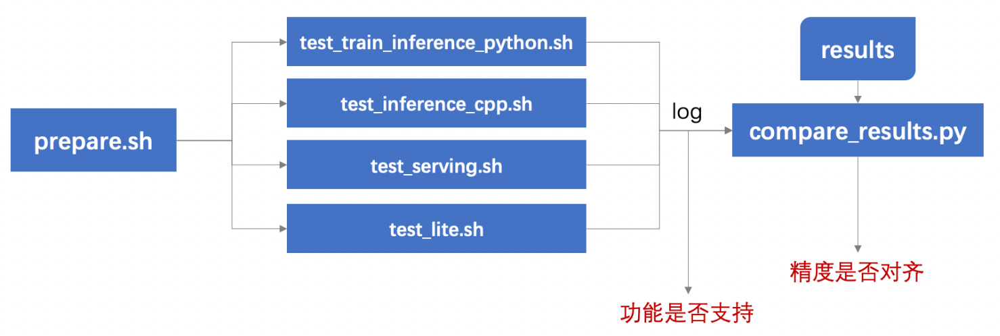

# 飞桨训推一体认证（TIPC）

## 1. 简介

飞桨除了基本的模型训练和预测，还提供了支持多端多平台的高性能推理部署工具。本文档提供了PaddleRec中所有模型的飞桨训推一体认证 (Training and Inference Pipeline Certification(TIPC)) 信息和测试工具，方便用户查阅每种模型的训练推理部署打通情况，并可以进行一键测试。

<div align="center">
    
</div>

## 2. 汇总信息

打通情况汇总如下，已填写的部分表示可以使用本工具进行一键测试，未填写的表示正在支持中。

**字段说明：**
- 基础训练预测：包括模型训练、Paddle Inference Python预测。
- 更多训练方式：包括多机多卡、混合精度。
- 模型压缩：包括裁剪、离线/在线量化、蒸馏。
- 其他预测部署：包括Paddle Inference C++预测、Paddle Serving部署、Paddle-Lite部署等。

更详细的mkldnn、Tensorrt等预测加速相关功能的支持情况可以查看各测试工具的[更多教程](#more)。

| 算法论文 | 模型名称 | 模型类型 | 基础<br>训练预测 | 更多<br>训练方式 | 模型压缩 |  其他预测部署  |
| :--- | :--- |  :----:  | :--------: |  :----  |   :----  |   :----  |
| DLRS    |wide_deep | 排序  | 支持 | 多机多卡  | - | Paddle Inference: C++ <br> Paddle Serving: Python, C++  |
| IJCAI   |deepfm | 排序  | 支持 | 多机多卡  | - | Paddle Inference: C++ <br> Paddle Serving: Python, C++  |


## 3. 测试工具简介
### 目录介绍

```shell
test_tipc/
├── configs/  # 配置文件目录
    ├── wide_deep    # wide_deep模型的测试配置文件目录
        ├── train_infer_python.txt      # 测试Linux上python训练预测（基础训练预测）的配置文件
    ├── deepfm               # deepfm模型的测试配置文件目录
        ├── ...  
    ├── ...  
├── results/   # 预先保存的预测结果，用于和实际预测结果进行精读比对
    ├── ...
├── prepare.sh                        # 完成test_*.sh运行所需要的数据和模型下载
├── test_train_inference_python.sh    # 测试python训练预测的主程序
└── readme.md                         # 使用文档
```

### 测试流程概述

使用本工具，可以测试不同功能的支持情况，以及预测结果是否对齐，测试流程概括如下：
<div align="center">
    
</div>

1. 运行prepare.sh准备测试所需数据和模型；
2. 运行要测试的功能对应的测试脚本`test_*.sh`，产出log，由log可以看到不同配置是否运行成功；
3. 用`compare_results.py`对比log中的预测结果和预存在results目录下的结果，判断预测精度是否符合预期（在误差范围内）。(待支持)

测试单项功能仅需两行命令，**如需测试不同模型/功能，替换配置文件即可**，命令格式如下：
```shell
# 功能：准备数据
# 格式：bash + 运行脚本 + 参数1: 配置文件选择 + 参数2: 模式选择
bash test_tipc/prepare.sh  configs/[model_name]/[params_file_name]  [Mode]

# 功能：运行测试
# 格式：bash + 运行脚本 + 参数1: 配置文件选择 + 参数2: 模式选择
bash test_tipc/test_train_inference_python.sh configs/[model_name]/[params_file_name]  [Mode]
```

例如，测试基本训练预测功能的`lite_train_lite_infer`模式，运行：
```shell
# 准备数据
bash test_tipc/prepare.sh ./test_tipc/configs/wide_deep/train_infer_python.txt 'lite_train_lite_infer'
# 运行测试
bash test_tipc/test_train_inference_python.sh ./test_tipc/configs/wide_deep/train_infer_python.txt 'lite_train_lite_infer'
```  


<a name="more"></a>
## 4. 开始测试
各功能测试中涉及混合精度、裁剪、量化等训练相关，及mkldnn、Tensorrt等多种预测相关参数配置，请点击下方相应链接了解更多细节和使用教程：  
- [test_train_inference_python 使用](docs/test_train_inference_python.md) ：测试基于Python的模型训练、评估、推理等基本功能。 （教程待添加）
