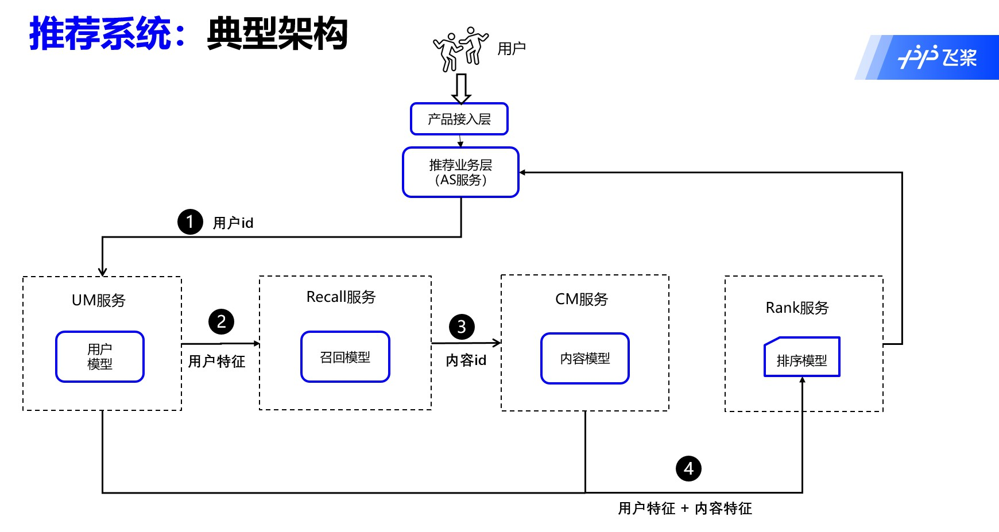

# Demo演示

## 简介
本Demo基于paddlerec/models/demo/movie_recommand项目，以及AI Studio中的公开项目[《十分钟！全流程！从零搭建推荐系统》](https://aistudio.baidu.com/aistudio/projectdetail/559336)，[《PaddleRec公开教程》](https://aistudio.baidu.com/aistudio/projectdetail/1268461)。展示了使用PaddleRec搭建的一个电影推荐系统的全部流程和效果。使用者可以通过我们构建的五种服务（用户模型服务，内容模型服务，召回服务，排序服务，还有应用服务）直观的体验到一个完整的推荐系统的运作方式。我们欢迎大家直接点击上面的链接前来AI Studio上体验。

## 目录结构
以下是本例的简要目录结构及说明： 
```
├── readme.md #介绍文档
├── __init__.py
├── get_data.sh  #下载数据集和模型的脚本
├── as.py #应用服务的实现程序
├── cm.py #内容模型服务的实现程序
├── rank.py #排序服务的实现程序
├── recall.py #召回服务的实现程序
├── um.py #用户模型服务的实现程序
├── start_server.sh #启动服务的脚本
├── test_client.py #启动客户端调用服务
├── to_redis.py #将数据加载入redis
├── proto
    ├── __init__.py
    ├── run_codegen.py #将proto转换为python格式
    ├── as.proto #protobuf信息的数据结构表示
    ├── cm.proto #protobuf信息的数据结构表示
    ├── item_info.proto #protobuf信息的数据结构表示
    ├──rank.proto #protobuf信息的数据结构表示
    ├──recall.proto #protobuf信息的数据结构表示
    ├──um.proto #protobuf信息的数据结构表示
    ├──user_info.proto #protobuf信息的数据结构表示
```

## 运行环境
linux 终端
Paddle 版本：1.8+  
Python 版本：2.7/3.6  

## 设计方案

### 推荐系统流程总览
我们提供了模型的在线服务部署，本服务部署需要在linux终端模式当中执行。这里我们给出了如图所示几种服务。
<p align="center">

<p>

### 名词解释
本demo系统一共启动了5个在线服务，分别是用户模型服务，内容模型服务，召回服务，排序服务，还有应用服务。  
**um**: 用户模型服务(User Model)  
**cm**：内容模型服务(Content Model)  
**recall**：召回服务  
**rank**：排序服务  
**as**：应用服务（application service）  
用户模型和内容模型分别是数据集当中的users.dat和movies.dat数据，经过解析之后保存在redis当中，用户模型以user_id作为key，内容模型以movie_id作为key。用户模型服务和内容模型服务的逻辑分别是从redis当中按照用户传入的key来寻找对应的value并封装成protobuf结果返回。  
召回服务目前是用离线把每个用户的召回结果计算好。  
排序服务是用PaddleRec训练好的CTR模型，用Paddle Serving启动来提供预测服务能力，用户传入一个用户信息和一组内容信息，接下来就能经过特征抽取和排序计算，求得最终的打分，按从高到低排序返回给用户。  
应用服务就是以上流程的串联，设计的流程是用户传入自己的user id，查找到对应的用户模型，再从召回服务中得到召回movie列表，接下来查询到所有的内容模型信息，最终两个结合在排序服务中得到所有候选电影的从高到低的打分，最终还原成原始的电影信息返回给用户。  

### 支持的输入范围
目前支持的输入为：  
um服务：支持查询的user_id为1-6040  
cm服务：支持查询的movie_id为1-3952  
recall服务：支持召回user_id为1-13的用户排分前100名的电影  
rank服务：默认输出user_id为1的用户的排序结果，可以支持对user_id范围内任意用户和movie_id范围内任意个数的电影的打分和排序。由于rank服务参数较多，如需定制可参考代码自行改动。  
as服务：受限于recall服务，目前只支持user_id为1-13的用户跑通全流程。  

## 如何使用
### 快速启动步骤
1. 安装相关库
```
pip install -U redis pyyaml grpcio-tools
pip install -U https://paddle-serving.bj.bcebos.com/whl/paddle_serving_server-0.0.0-py2-none-any.whl https://paddle-serving.bj.bcebos.com/whl/paddle_serving_client-0.0.0-cp27-none-any.whl https://paddle-serving.bj.bcebos.com/whl/paddle_serving_app-0.0.0-py2-none-any.whl
```
由于paddle serving最新版本还在测试，因此还需要用开发版的whl包，对于其他环境，可以参考如下链接。
```
https://github.com/PaddlePaddle/Serving/blob/develop/doc/LATEST_PACKAGES.md
```

2. redis服务启动

```
wget http://download.redis.io/releases/redis-stable.tar.gz --no-check-certificate
tar -xf redis-stable.tar.gz && cd redis-stable/src && make && ./redis-server &
```

3. 运行相关命令
```
sh get_data.sh
sh start_server.sh
```

4. 运行客户端
```
export PYTHONPATH=$PYTHONPATH:$PWD/proto
python test_client.py as 5 # 获得 5号用户的推荐信息
```

这里我们给出了几种模式。
```
python test_client.py um 5 # 查询user-id 为5的用户信息
python test_client.py cm 5 # 查询movie-id 为5的电影信息
python test_client.py recall 5 # demo召回服务预测，user id=5
python test_client.py rank # demo排序服务预测，由于rank服务参数较多，如需定制可参考代码
```

### 一键看到指定用户的推荐结果
```
python test_client.py as 5
```
as服务在经过查询用户、召回、查询电影、排序之后，根据分数降序，从大到小，把最适合该用户的电影信息返回回来，方便您一键直观的看到结果。结果中是由大到小排序的电影信息，每个电影信息包含了电影的id，电影名和影片类型。
```
item_infos {
  movie_id: "220"
  title: "Castle Freak (1995)"
  genre: "Horror"
}
item_infos {
  movie_id: "3576"
  title: "Hidden, The (1987)"
  genre: "Action, Horror, Sci-Fi"
}
item_infos {
  movie_id: "3409"
  title: "Final Destination (2000)"
  genre: "Drama, Thriller"
}
item_infos {
  movie_id: "1993"
  title: "Child\'s Play 3 (1992)"
  genre: "Horror"
}
```

### 查看每个步骤的结果
您也可以分步查看每一个环节后的输出  

python test_client.py um 5 # 查询user-id 为5的用户信息  
um服务用于查询用户的信息，您可以选择一名用户，通过该服务获得用户的id，性别，年龄，工作，邮政编码。其中error=200为HTTP状态码，200表示请求已成功，请求所希望的响应头或数据体将随此响应返回。出现此状态码是表示正常状态。示例结果如下：  
```
error {
  code: 200
}
user_info {
  user_id: "5"
  gender: "M"
  age: 25
  job: "20"
  zipcode: "55455"
}

```
python test_client.py cm 3878 # 查询movie-id 为3878的电影信息  
cm服务用于查询电影信息，您可以选择一个电影的id，通过该服务获得电影的id，电影名和影片类型。示例结果如下：  
```
error {
  code: 200
}
item_infos {
  movie_id: "3878"
  title: "X: The Unknown (1956)"
  genre: "Sci-Fi"
}
```
python test_client.py recall 5 # demo召回服务预测，user id=5  
recall服务用于根据您选择的用户id召回排分前100名的电影，显示每一个电影的id和预估分值。示例结果如下：  
```
score_pairs {
  nid: "3878"
  score: 4.4319376945495605
}
score_pairs {
  nid: "1971"
  score: 4.392200469970703
}
score_pairs {
  nid: "3375"
  score: 4.370407581329346
}
score_pairs {
  nid: "1973"
  score: 4.357224464416504
}
```
python test_client.py rank # demo排序服务预测，由于rank服务参数较多，如需定制可参考代码。示例结果如下：  
```
error {
  code: 200
}
score_pairs {
  nid: "1"
  score: 3.7467310428619385
}
```

## 如何二次开发
您如果需要使用demo展示自己的模型和数据，需要根据自己的数据格式自行更改相关的代码。  
1. 首先，您需要了解自己的数据。了解用户侧的数据结构，和内容侧的数据结构，并且找到与他们产生关联的数据结构和服务。  
比如在我们电影推荐项目的demo展示中，我们用户侧数据包含user_id，性别，年龄，工作，我们将这些信息使用proto格式写在user_info.proto中。我们内容侧的数据包含电影id，电影名，电影类别，我们将这些信息使用proto格式写在item_info.proto中。您需要根据自己的数据，定义自己的数据结构。  
2. 我们在电影推荐项目的demo展示中，在to_redis.py中将数据集存储入redis当中，您在使用自己的数据集时，需要自行更改其中的数据处理逻辑，将您的数据输入redis中。  
3. 我们在电影推荐项目的demo展示中，共定义了五种服务，分别是用户模型，内容模型，召回模型，排序模型，和应用服务。提供了查询用户的信息，查询电影信息，召回电影，按打分排序和一键跑通流程的功能。功能的实现分别在um.py，cm.py，recall.py，rank.py，as.py中定义。您在实现自己的服务时，可以参考这几个服务，定义自己的服务的逻辑实现。  
4. 定义各种服务请求获得数据的数据结构，如电影推荐项目的五种服务请求的数据结构放在um.proto，cm.proto，recall.proto，rank.proto，as.proto当中。您可以根据您的数据和服务实现，定义服务中每次发出请求获得怎样的数据。  
5. 最后在test_client.py中定义在客户端中，如何调用服务，传递参数。  
